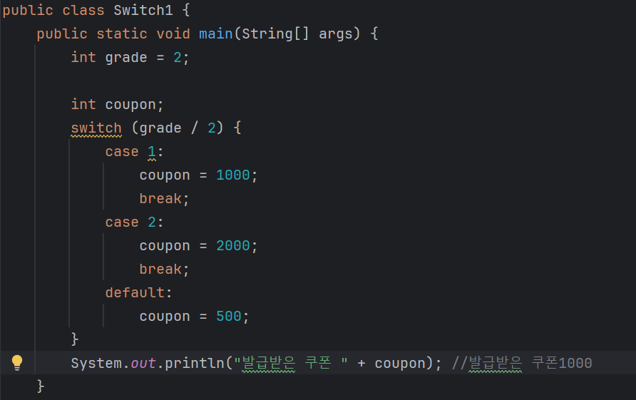
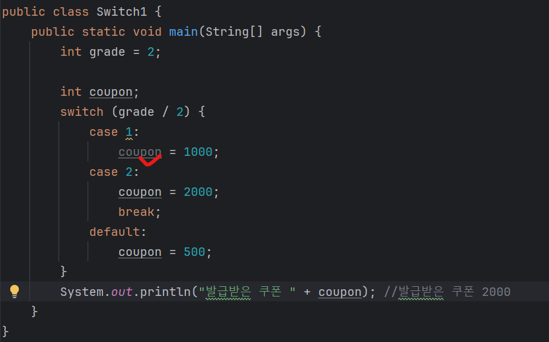
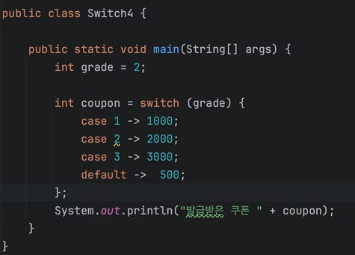
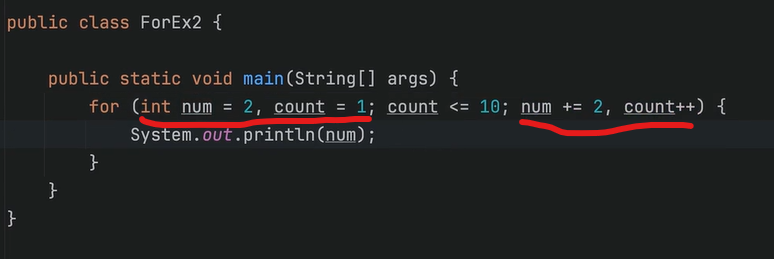
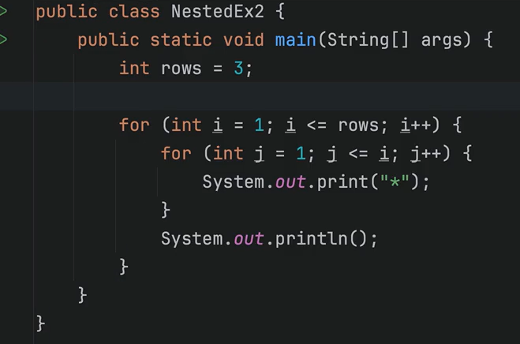
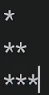
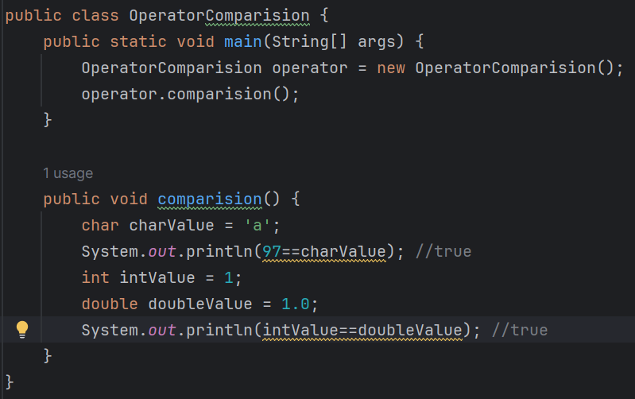
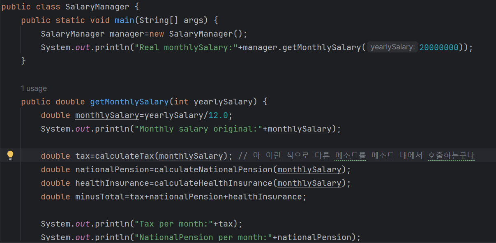
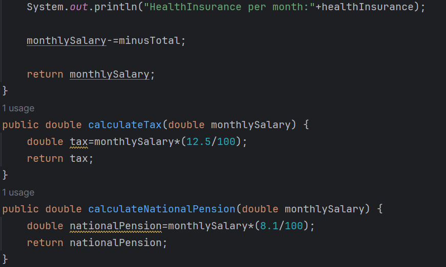
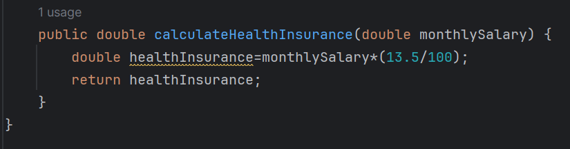

# 1129 TIL

## 잡다한 것

- else if를 사용하지 않고 if문으로만 작성을 한다면??
  
  - 불필요한 조건 검사 - 만족을 위에서 했으면 끝내야 하는데 밑의 것까지 다 검토함.
  
  - 관련된 조건 중복 체크..
    
    - else if는 이미 검토한 조건들을 인지하고 있는다.

- switch문
  
  - if문은 비교 연산자를 사용할 수 있지만, switch문은 단순히 값이 같은지만 비교할 수 있다.
    
  
  - 장점: 바로바로 매칭이 잘 됨. (직관적)
  
  - 만약에 break문이 빠진다면?
    
    
    - 빠져나오지 않아서 다음 break를 만날 때까지 코드가 실행이 되어서 계속 값이 덮어써지고 있음.
  
  - switch문의 조건식을 넣는 부분을 잘 보면 x > 10과 같은 참 거짓의 결과가 나오는 조건이 아니라, 단순히 값만 넣을 수 있다.
    
    - 쉽게 말해서 값이 같은지 확인하는 연산만 가능하다.(문자도 가능.)
  
  - switch문은 if문이 할 수 있는 것의 일부분만 가능.
    
    - 그렇지만 해당 값일때는 이거, 또 이 값일땐 이거와 같은 경우일 때는 if문 보다 switch문을 사용하면 좀 더 간결한 코드를 작성 가능하다는데?? 그닥....
      
      - 그래서 새로운 switch문이 탄생(참고.)
        

- for문 참고
  
  
  - 이렇게 여러개 선언도 가능. 그리고 여러개 증감도 가능.
  
  - 근데 권장하지는 않음.

- while 보단 for이 가독성이 좀 더 Good.

- 꿀팁
  
  - Class명과 파일명이 다르면 빨간줄이 뜬다.
    
    - Class명을 원하는대로 바꾸고 거기에 alt + enter를 누른 뒤에 rename file을 눌러주면 파일명이 바뀐다.

- for문 풀이
  
  

## 5장. 계산을 하고 싶어요.

- 기본 자료형을 제외한 참조 자료형은 지금 배울 연산자를 사용할 수 없지만, 항상 예외가 되는 String이라는 클래스만이 +연산이 가능

- 계산을 위한 산술 연산자는 기본 자료형 중에서 boolean을 제외한 나머지 타입에서 사용할 수 있다.

- 자바는 계산하는 두 값이 정수형이더라도 결과가 소수형이라면 알아서 소수형으로 결과가 나오지 않는다.

- 모든 비교 연산자의 결과는 반드시 boolean이다.

- 등가 비교 연산자(==, !=)는 모든 기본 자료형과 참조 자료형에서 사용가능.
  
  - 기본 자료형은 같은 종류끼리 비교 가능
    
    - ex) char == int, double == int, boolean == boolean
    
    - 안 되는 예) boolean == int, boolean == char
  
  - 참조 자료형은 그 주소 값이 같은지 확인한다.
  
  
  
  - 이와 같이 비교 연산자는 실제 타입이 다르다고 하더라도, 숫자끼리 비교는 가능!!!

- 삼항 연산자
  `변수 = (boolean조건식) ? true일때의 값 : false일때의 값`
  
  - 여기 괄호 안의 값은 반드시 boolean 결과를 제공해야만 한다.

- 형 변환
  
  - 서로 다른 타입 사이에 변환하는 작업.
  
  - 자바의 형 변환은 기본 자료형과 참조 자료형 모두 괄호로 묶어주면 된다.
    
    - ex) byteValue = (byte) shortValue;
  
  - 기본 자료형 중에서 형 변환이 전혀 되지 않는 것이 있다.
    
    - 바로 boolean
    
    - 해당 타입은 숫자로 변환할 수 없기 때문에 형 변환 불가.
  
  - 기본 자료형-> 참조 자료형, 참조 자료형-> 기본 자료형으로의 형 변환은 절대 안됨
    
    - 그렇다고, 숫자 값을 참조 자료형으로 변경할 수 있는 방법은 전혀 없는 것은 아님.
  
  - 범위가 큰 타입에서 범위가 작은 타입으로 변환할 때는 소괄호 안에 범위가 작은 타입을 명시해주어야만 한다. 그렇지 않으면 컴파일이 안 된다.  
    
    - 그리고 큰 범위에서 작은 범위로 될 때, 앞의 비트들을 그냥 버린다.
      
      - short(16비트) -> byte(8비트)로 형변환 된다면 앞의 8비트를 버린다.
      
      - 즉, 형 변환을 할 때 범위가 더 큰 타입으로 변환하면 아무런 문제가 없지만 범위가 작은타입으로 형 변환을 하면, 여러분들이 생각지도 못한 값이 나올 수도 있으므로 꼭 생각해보고 형 변환을 할 것!!

- 참고: double과 float는 소수형이기 때문에 비트 연산이 불가능. 

- 연습
  
  
  

- 정리해 봅시다.
  
  1. 값을 할당할 때 사용하는 연산자의 기호는 무엇인가요?
     
     - =
  
  2. 기본적인 덧셈, 뺄셈, 곱셈, 나눗셈, 나머지를 계산할 때 사용하는 연산자의 기호는 무엇인가요?
     
     - +, -, *, /, %
  
  3. +=는 무엇을 할 때 사용하는 연산자인가요?
     
     - 왼쪽 변수에 오른쪽 값을 더한 후 할당할 때 사용하는 복합대입연산자이다.
  
  4. 여러분들이 연산의 순서를 모르거나 확실히 하고 싶을 때에는 어떤 기호를 사용해야 하나요?
     
     - () - 소괄호
  
  5. ==와 !=의 차이는 무엇인가요?
     
     - 값이 같은지, 값이 다른지 비교한다.
  
  6. <와 <=의 차이는 무엇인가요?
     
     - 미만, 이하이다.
  
  7. !연산자는 어떤 타입에 사용할 수 있나요?
     
     - boolean
  
  8. ? :로 표시하는 삼항 연산자의 ?와 : 뒤에 명시해 주는 값은 무엇을 의미하나요?
     
     - true일 때 값, false일 때 값
  
  9. 자바는 형 변환을 한다고 했는데, short의 값을 long에 할당할 때에는 어떤 것을 해 주어야 하나요?
     
     - (long)
  
  10. 반대로 long 값을 short에 할당할 때에는 어떤 것을 해 주어야 하나요?
      
      - (short)
  
  11. 9와 10의 경우 주 어떤 경우가 기존 값이 사라지고, 엉뚱한 값으로 바뀔 수 있나요?  
      
      - 10번이다. 즉, 범위가 큰 타입에서 작은 타입으로 변환할 경우이다. 
