# 1202 TIL

## 잡다한 것

- 스코프 존재 이유
  
  - 비효율적인 메모리 사용
  
  - 코드 복잡성 증가(변수 계속 생각해줘야 됨.)

- while문은 어쩔 수 없이 밖에다가 변수를 선언해야 함..
  
  - 스코프 범위 넓어짐...(ㅜ)
  
  - 따라서 for문 안에서만 사용되는 카운터 변수가 있다면 while문 보다는 for문을 사용하는 것이 더 좋다.

- 원하는 클래스 빨리 찾아갈 수 있는 단축키: Ctrl + N

- 기존에 내가 했던 것 보여주는 단축키 : Ctrl + E
  
  - 이걸 치고 바로 Enter를 누르면 바로 이전으로 들어감.

- 형변환
  
  - 작은 범위에서 큰 범위로는 당연히 값을 넣을 수 있다. (자동 형변환)
    
    - ex) `int` -> `long` -> `double`
  
  - 큰 범위에서 작은 범위는 다음과 같은 문제가 발생할 수 있다. (명시적 형변환 필요)
    
    - 소수점 버림
    
    - 오버플로우

- 나누기 참고(조심!!!!)
  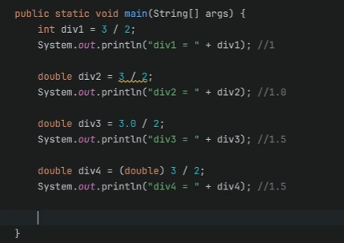
  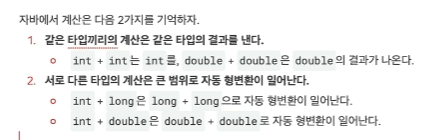

- 사용자의 입력 받기
  
  - ~~System.in을 이용해서 사용자의 입력을 받으려면 여러 과정을 거쳐야해서 복잡하고 어렵~~
  
  - 그래서 Scanner이라는 클래스를 제공한다.
    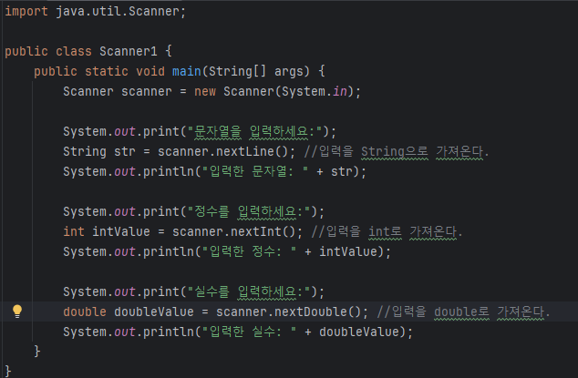

- 참고
  

- 코드 완성 단축키 : Ctrl + 스페이스바

- 변수명 한번에 다 바꾸는 단축키 : Shift + F6

- 변수 값 교환
  
  - 파이썬과 다르게 제 3자의 변수가 필요.
    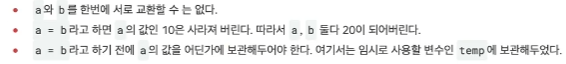

- 참고(기억하기!!)
  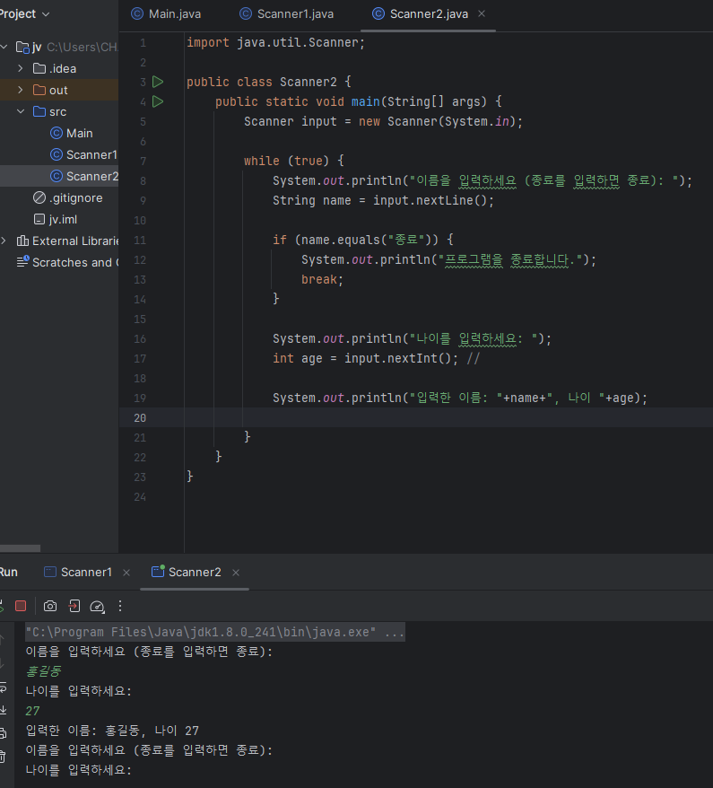
  
  - 위를 보면 아직 이름을 입력하지 않았는데 \n이 들어가서 바로 넘어감..
    
    - 왜냐하면, nextInt는 숫자만 가져감, 그래서 다음 반복문때 남은 \n이 nextLine에 들어가게 되어 실제로 따로 입력하지도 않았는데 넘어가버림.
  
  - 해결법
    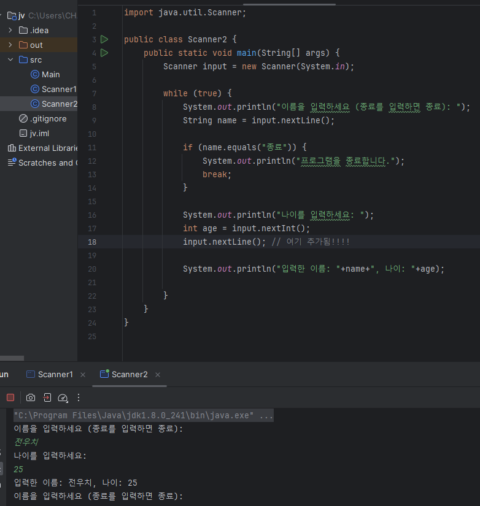
    
    - 남아있던 \n을 따로 버리는 용도로 쓸 nextLine 추가

- 참고(이렇게도 가능하구나 정도.)
  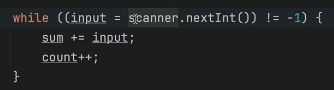

- 배열은 **같은 타입의 변수**를 사용하기 편하게 묶어둔 것이다. 
  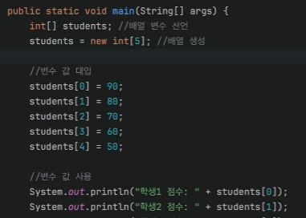
  
  - 위의 것 아래처럼 할 수도 있음.(개선)
    
    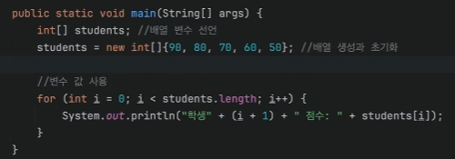
  
  - 더 압축
    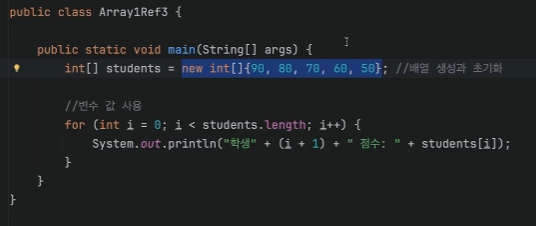
  
  - 더더욱 압축
    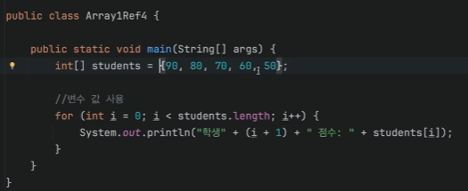
    
    - 단 이때(더더욱 압축)는, 선언과 초기화를 동시에 할 때만 이렇게 생략 가능.
      
      - 동시에 안 하면 자바가 이게 int형 배열인지 알 수 없으므로 알아서 판단 못함 
  
  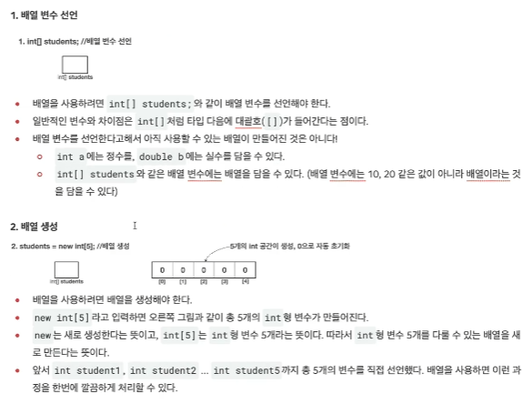
  
  

- 참고
  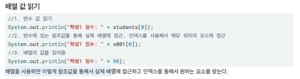
  
  - students의 참조값이 x001이라고 가정했을 때.

- 참고
  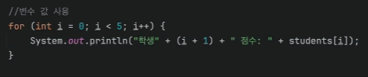
  
  - (i+1)을 i+1로 해서 괄호를 안 친다면?
    
    - 학생 1, 학생 2 ~ 로 나오는 것이 아니라 학생 01, 학생 11~ 이런 식으로 나옴.

- 2차원 배열
  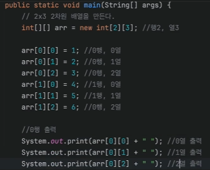
  
  - 위의 것 아래와 같이 가능(개선)
    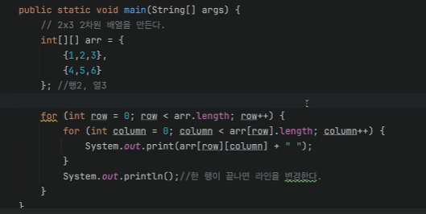

- 인덱스에 따라 값이 1씩 증가하는 배열 만들기
  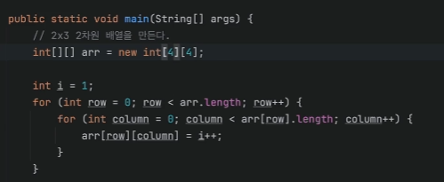

- 향상된 for문
  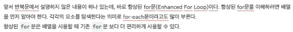
  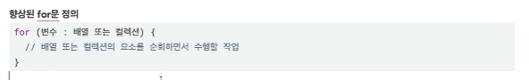
  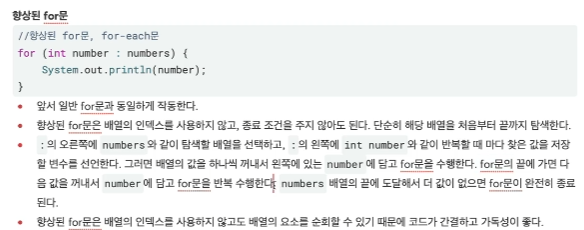
  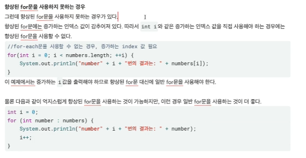

- 향상된 for문 단축
  
  - iter

- 이런 것도 되구나
  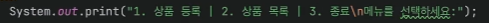

- 제거하는 단축키
  
  - Ctrl + X

- 메소드 정의 예시
  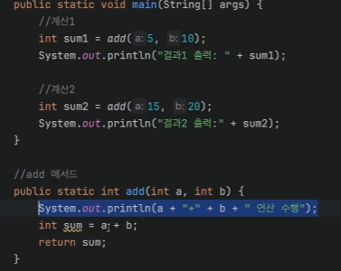
  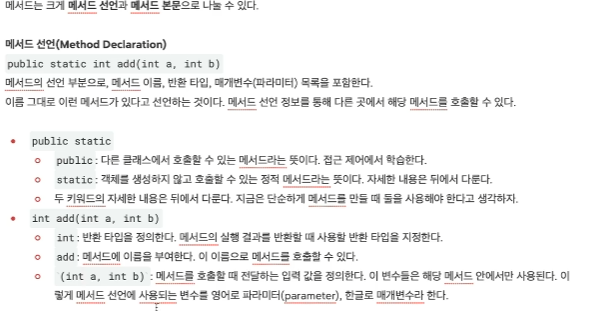
  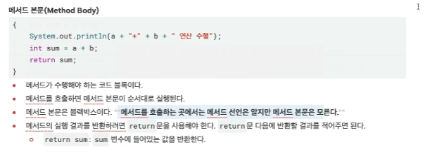

- 메소드에서 리턴 안 써도 되는 경우
  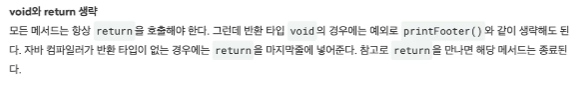

- 중요하다는데 ?
  
  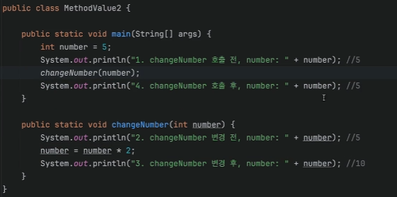
  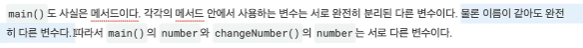
  
  - 그러면 정말로 number 값이 2배로 곱한 값이 나오게 하려면 어떻게 해야할까?
    
    - 리턴을 활용!
      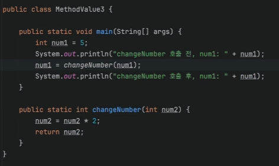

- 메소드에도 형변환 룰이 동일하게 적용됨.
  

- 메소드 오버로딩
  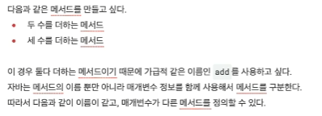
  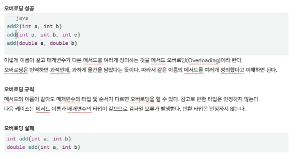
  
  - 추가(메소드 오버로딩 + 자동 형변환)
    
    - 본인의 타입에 가장 적합한 메소드를 먼저 호출하고 그게 없으면 자동 형변환을 해서 호출할 수 있는 메소드를 찾는다.

- 메소드를 적적하게 사용해서 분류하면 구조적으로 읽기 쉽고 유지보수 하기 좋은 코드를 만들 수 있다.
  
  - 특징에 따라 메소드를 뽑아내고 이름을 잘 지어주면 가독성 up

## 6장. 제가 조건을 좀 따져요.

- 참고
  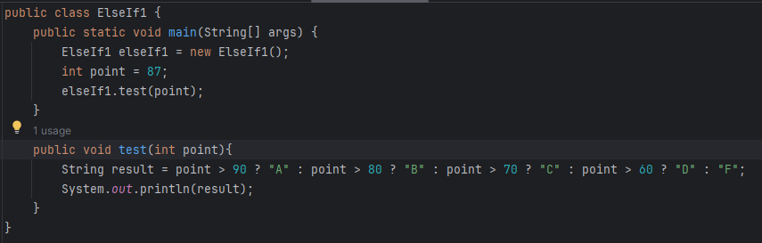
  
  - 결과로 B가 출력된다.

- Switch 문
  
  - switch 문장에서는 그 한번 조건을 만족시켜 줬다면, 그 다음에 break가 올 때까지, 어떤 case가 오든지 상관 안하고 무사 통과하면서 실행하라는 것들을 실행 한다.
  
  - 따라서 switch를 쓸 때에는 반드시 case에 대한 처리가 끝나면 break; 를 붙여주는 습관을 들여줘야 한다.
  
  - 도대체 왜 이렇게 귀찮게 break를 쓰도록 만들었을까?
    

- do - while 문
  
  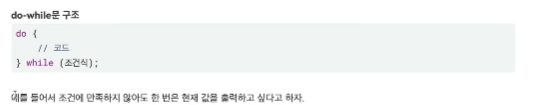
  
  - 조건이 틀리더라도 한 번은 반드시 실행하고 싶을 때 이용
  
  - 주의사항
    
    - while의 소괄호 뒤에 세미클론을 반드시 입력해줘야 한다!!

- 많이 사용안하는 label
  
  - for 루프를 두개 이상 쓰거나, while 루프를 두개 이상 사용할 경우 바깥쪽 루프의 시작점으로 이동하려고 할 때에 label을 쓰면 된다.
    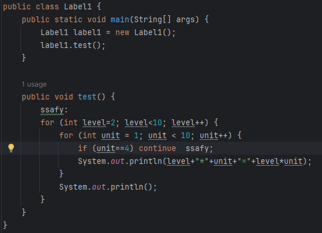
    
    - 여기서 ssafy가 label 역할.
    
    - `if unit==4`일때 아래의 `System.out.println();`을 거치고 싶지 않아서 label 이용.

- 연습
  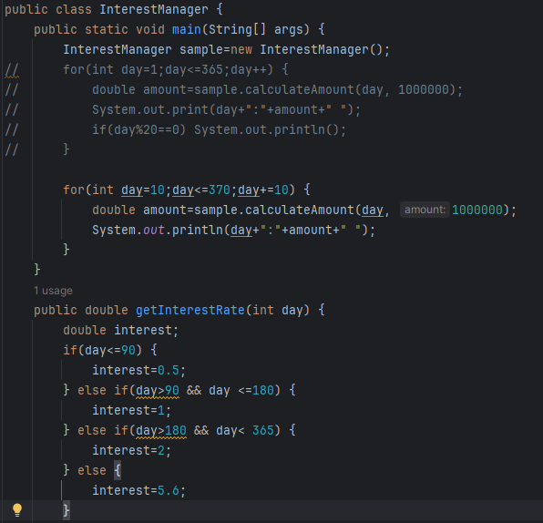
  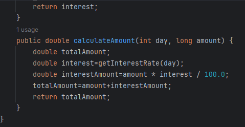

- 정리해 봅시다.
  
  1. if 문장의 소괄호 안에는 어떤 형태의 결과가 제공되어야 하나요?
     
     - boolean
  
  2. if 조건에 맞지 않는 모든 경우를 처리할 때 사용하는 예약어는 뭔가요?
     
     - else
  
  3. switch를 사용할 수 있는 기본 자료형의 타입에는 어떤 것들이 있나요?
     
     - long을 제외한 정수 및 Enum이 사용가능, JDK 7부터는 String도 사용 가능
  
  4. switch 블록 안에서 비교 대상값 앞에 사용하는 예약어는 무엇인가요?
     
     - Case
  
  5. switch 조건을 빠져나가도록 하는 예약어는 무엇인가요?
     
     - break
  
  6. switch 조건들에 맞지 않을 때 기본 처리를 하기 위한 예약어는 무엇인가요?
     
     - default
  
  7. while문의 소괄호 안에는 어떤 형태의 결과가 제공되어야 하나요?
     
     - boolean
  
  8. while문을 무조건 한번은 실행하게 하려면 어떻게 해야 하나요?
     
     - do-while 문 사용
  
  9. while문을 마음대로 빠져나가게 하려면 어떤 예약어를 사용하면 되나요?
     
     - break
  
  10. while문의 중간에 while무의 소괄호 점검 구문으로 건너뛰도록 할 때 사용하는 예약어는 무엇인가요?
      
      - continue
  
  11. for 루프의 소괄호안의 가장 첫 구문(첫 세미 클론 앞의 문장)은 for 루프가 수행되는 동안 몇 번 수행되나요?
      
      - 1번
  
  12. for 루프의 소괄호 안의 중간에 있는 구문은 어떤 타입의 결과가 제공되어야 하나요?
      
      - boolean
  
  13. for 루프의 소괄호 안의 마지막에 있는 구문에서는 어떤 작업을 수행하나요?
      
      - index를 증가하거나 감소하는 작업을 수행
