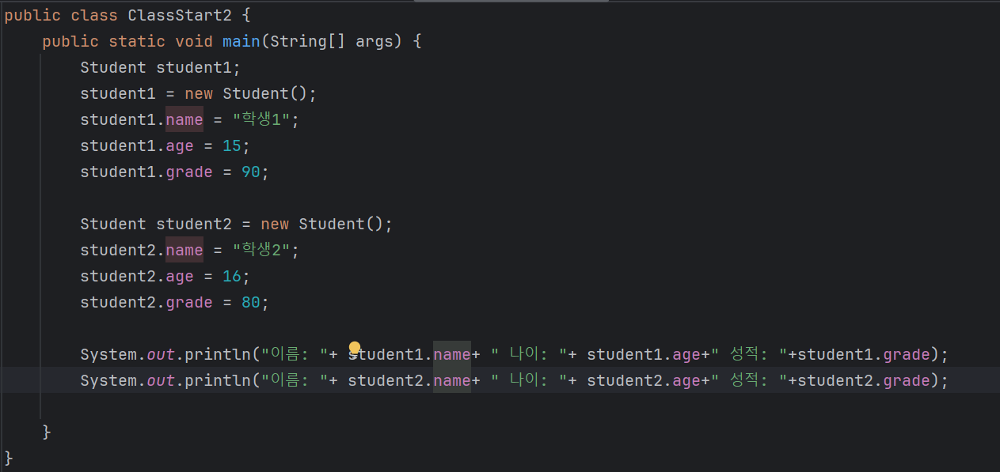

# 1204 TIL

## 잡다한 것

- char 배열의 기본값은 '\u0000'이며 화면에 출력될 때에는 한 칸의 공백으로 보인다.

- boolean의 기본값은 false이다.

- 자바에서 null이라는 것은 무소유의 개념을 의미.

- 클래스가 필요한 이유
  
  - 배열의 한계
    
    - 데이터를 변경할 때 매우 조심해서 작업해야 한다. 
      
      - ex) 학생 2의 데이터를 제거하려면 각각의 배열(나이, 이름, 성적 등.)마다 학생 2의 요소를 정확하게 찾아서 제거해주어야 한다.
    
    - 한 학생의 데이터가 여러군데의 배열에 나누어져 있기 때문에 여러개의 배열을 각각 변경해야 한다.
    
    - 그리고 한 학생의 데이터를 관리하기 위해 여러개의 배열의 인덱스 순서를 항상 정확하게 맞추어야 한다. (실수 확률 high)
  
  - 한 학생에 대한 정보를 하나로 묶고 싶다. (관리 용이) - 클래스

- 클래스에 대해서
  
  
  
  
  

- 위의 것 기억하기!!!
  
  
  
  - 참조 느낌.. -> new
  
  
  
  
  

- 객체와 인스턴스의 미묘한 차이
  

- Student(클래스) 타입을 사용하는 배열을 도입해보자
  
  
  

- 기본형과 참조형
  
  
  

- 기본형 과 참조형(메소드 호출 part)
  
  
  - 참조형과 메서드 호출
    
    
    
    - 기본형과 달리 메서드 호출 후 값이 바뀜
      
      - 변수에 들어 있는 참조값을 복사해서 대입했으므로.

- 참조의 특성과 메서드 활용(참고)
  
  
  - 위의 것 더 깔끔하게
    
    
    - 이제 메소드 하나로 객체의 생성과 초기값 설정을 모두 처리
      
      - 다만 리턴을 해서 돌려줘야 겠지??

- 변수와 초기화
  
  
  

- 참고
  

- NullPointException
  
  
  - 참조형의 초기값은 null이다.

- 단축키
  
  - Ctrl + Alt + V 하고 enter
    
    - 툴이 스스로 추정을 해서 메소드 명까지 보고 알아서 변수 선언해줌.
    
    - 잘 모르겠으면 김영한 실전 자바 기본편 19번째 강의 참고. (문제도 나쁘지 않은 듯.)

## 7장. 여러 데이터를 하나에 넣을 수는 없을까요?

- 배열 선언
  
  - 예시
    
    - `int [] lottoNumbers;` (권장)
    
    - `int lottoNumbers[];`
  
  - 여기서 가장 중요한 것은 "배열 변수를 정의할 때 대괄호 안에는 아무것도 써주면 안 된다"는 점이다. 그냥 대괄호를 열고 닫아야 한다.

- 배열 생성
  
  - 예시
    
    - `int [] lottoNumbers = new int[7];`
  
  - 이와 같이 배열을 선언 할 때는 new를 써 준 후 타입 이름을 명시해 주고, 대괄호 안에 해당 배열의 크기를 지정해준다.
    
    - **참조 자료형의 객체를 생성할 때는 반드시 new를 사용해야 함**을 기억할 것!
    
    - 참고로 꼭 new를 사용하여 정의하는 방법만 있는 것은 아니다.
  
  - 위와 같이 꼭 한 줄로 선언해야 하는 것은 아니고, 다음과 같이 선언해도 무방
    
    - `int [] lottoNumbers;` (배열 선언)
      `lottoNumbers = new int[7];` (배열 생성)
  
  - **이렇게 각 배열의 크기만 잡아주면, 초기화를 하지 않아도 각 배열의 기본값이 할당된다.**

- 배열의 위치는 0부터 시작

- 모든 참조 자료형은 초기화(new라는 예약어를 써서 생성자를 부르는 작업)를 하지 않으면 "null"이다.
  
  - 추가 설명
    

- 그리고 String의 경우 굳이 new String();와 같이 생성자를 사용하지 않고, 쌍 따옴표만으로 정의가 가능. 그 외의 대부분의 참조 자료형은 new를 사용해서 생성자를 불러야만 객체를 생성할 수 있다.

- 배열을 선언하는 또 다른 방법
  
  
  - 중괄호를 사용하여 초기화를 할 때에는 반드시 한번에 변수 선언 및 초기화가 이루어져야 한다.
  
  - 중괄호를 닫은 다음에는 반드시 `;`빼먹지 말기!!
  
  - 어? 이 방법이 가장 쉽네?? (애용해야지???)
    
    - 모든 배열에 들어가는 값들이 이렇게 처음부터 정할 수 있는 상황이 되지 않는다. 배열에 들어가는 값이 계속 바뀔 수도 있고, 언제든지 변경이 가능하기 때문에 보통 "절대 변경되지 않는 값"을 지정할 때 이렇게 중괄호로 선언하여 사용한다.

- static에 관하여...
  
  - 얼마나 자주 사용하는지, 어디에서 사용하는지를 확인하여 메소드에서 선언하여 사용할지, 클래스의 인스턴스 변수로 선언하여 사용할 지 결정.
    
    - 이러한 단점을 해결하기 위해서 존재하는 자바의 예약어 static.
      
      
    
    - 이렇게 하면 Array2 클래스의 객체를 생성할 때마다 month 배열을 새로 생성하지 않는다.
      
      - 앞서 배웠지만, 클래스에 변수를 선언할 때 static이라고 선언하면 "클래스 변수"가 되기 때문
  
  - static 남용하면 심각한 문제 야기 가능..

- 2차원 배열
  
  - twoDim[][]에서
    
    - twoDim[0]=int 배열
    
    - twoDim[0][0]= int 값

- 2차원 배열은 다음과 같이 선언 가능
  
  - twoDim = new int[2][];
  
  - 다만, 아래는 불가!
    
    - twoDim = new int[][];
    
    - twoDim = nwe int[][2];

- 이런것도 가능해!
  
  - int twoDim[][];
    twoDim[0]=new int[3];
    
    twoDim[1]=new int[2];
    
    - 이와 같이 선언하면 2차원 배열의 공간의 크기를 서로 다르게 지정할 수 있다.

- 배열을 위한 for 루프
  
  - for(타입이름 임시 변수명 : 반복대상객체){
    
    }
  
  - 값만을 처리하기 위한 배열은 위의 방식을 이용, 배열의 위치(index) 정보도 같이 필요한 배열은 기존의 방식을 이용.

- 배열은 무조건 선언할 때 크기가 지정되어야만 한다. 다시 말해서 여러분들이 중간에 마음이 바뀌어 배열의 크기를 증가나 감소시킬 수가 없다.
  
  - 따라서, 이러한 단점을 보완하기 위해서 자바에서는  Collection이라는 것이 존재한다.

- 연습
  
  

- 정리해 봅시다.
  
  1. 배열을 선언할 때 어떤 키워드를 타입 앞이나 뒤에 사용해야 하나요?
     
     - []
       
  
  2. 배열의 첫번째 위치는 0인가요? 1인가요?
     
     - 0
  
  3. 배열을 선언할 때 boolean 배열의 크기만 지정했다면 boolean 배열의 [0] 위치에 있는 값은 무엇인가요?
     
     - false
  
  4. ArrayIndexOutOfBoundsException이라는 것은 언제 발생하나요?
     
     - 선언한 배열의 크기를 벗어나는 index에 접근하려고 했을 때
  
  5. 중괄호를 이용하여 배열을 초기화할 때 중괄호 끝에 반드시 어떤 것을 입력해 주어야 하나요?
     
     - `;`
  
  6. 2차원 배열을 정의할 때에는 대괄호를 몇 개 지정해야 하나요?
     
     - 2개
  
  7. 배열을 쉽게 처리해주는 for문의 문법은 어떻게 되나요?
     
     
  
  8. 자바 프로그램에 데이터를 전달해 주려면 클래스 이름 뒤에 어떻게 구분하여 나열하면 되나요?
     
     - 공백으로 구분하면 된다.
       
  
  9. 자바 프로그램이 시작할 때 전달 받는 내용은 어떤 타입의 배열인가요?
     
     - String[]
