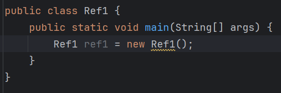
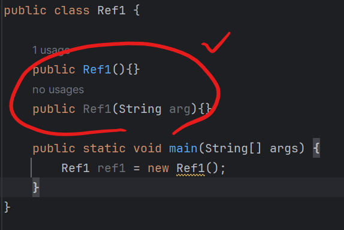
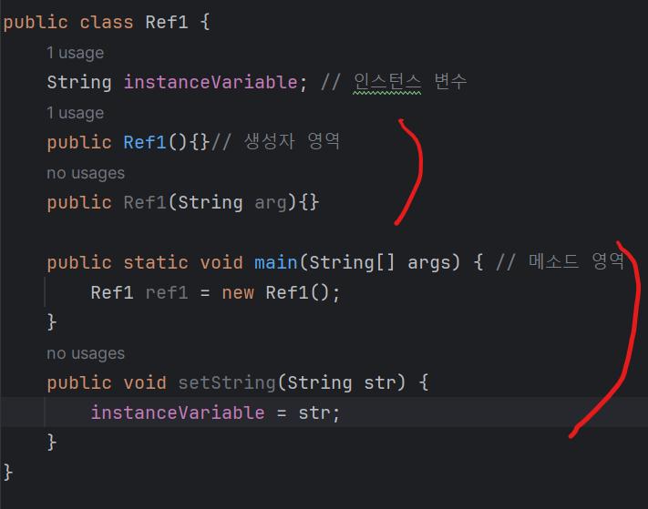
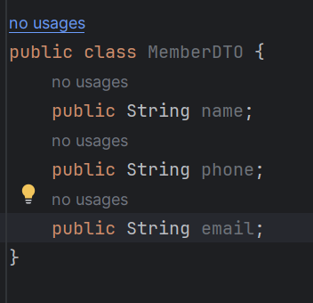
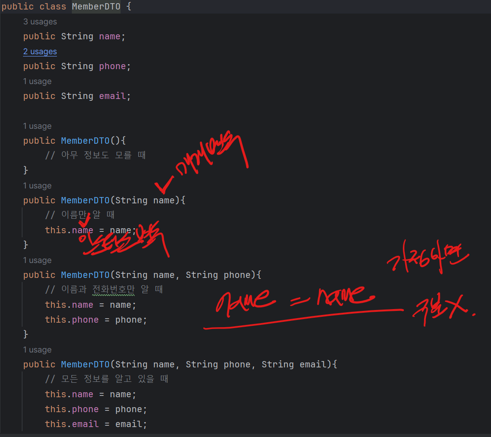
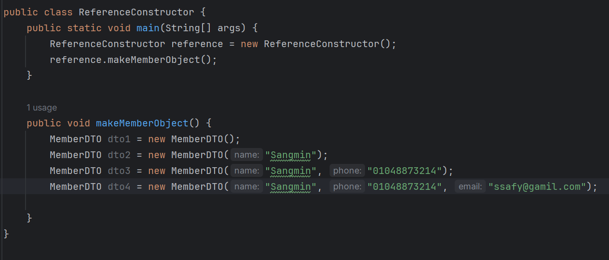
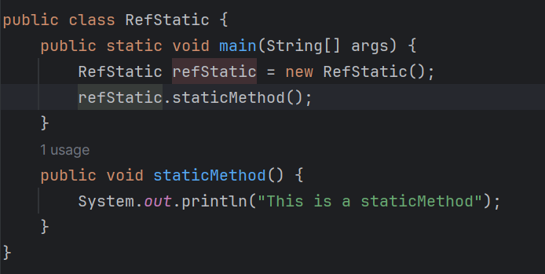
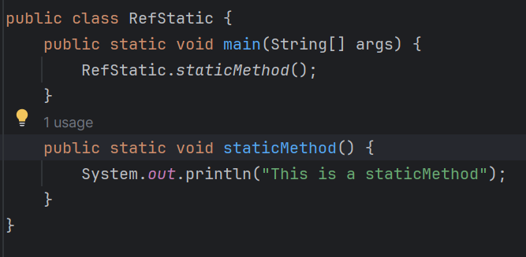
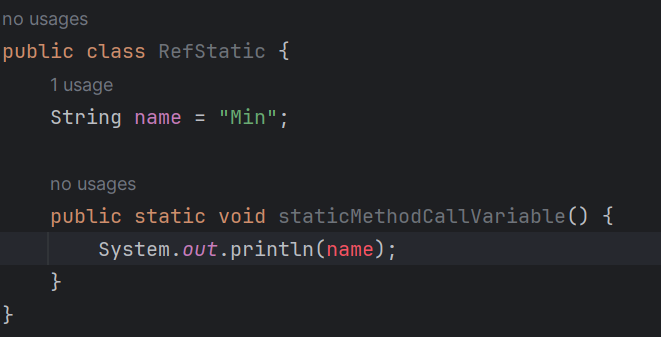
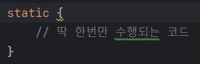

# 1205 TIL

## 잡다한 것

- 자바에서는 모든 타입을 한 개만 리턴 타입으로 넘겨 줄 수 있다. 모든 기본 자료형과 참조 자료형 중 하나를 리턴할 수 있다.   
  
  - 여러분들이 배열도 넘겨 주고 싶고, 문자열도 넘겨주고 싶고, 기본 자료형도 넘겨주고 싶을 때 자바에서는 한 개만 넘겨줄 수 있기 때문에 이 DTO를 리턴 타입으로 선언해주면, 여러 개의 데이터를 하나의 타입에 넣어서 넘겨줄 수 있다.

- 리턴 타입이 void인 메소드에서 더 이상 실행하고 싶지 않을 때 우짬?
  
  - return뒤에 아무것도 없이 바로 `;`을 적어주면 메소드 "수행을 종료해라"라고 인식.  

## 8장. 참조 자료형에 대해서 더 자세히 알아봅시다.

- 기본 자료형과 참조 자료형의 가장 큰 차이는 new를 사용해서 객체를 생성하는지 여부의 차이
  
  - new 없이도 객체를 생성할 수 있는 참조 자료형은 String 뿐이다.

- 참조 자료형은 new를 사용하여 객체를 사용한다고 했는데 new 뒤에 나오는것이 바로 생성자다.  
  
  
  
  new 옆에 있는 Ref1()이 생성자, 그런데 아무리 찾아봐도 Ref1()이라는 생성자는 보이지 않는다.
  
  - 이와 같이 아무런 매개 변수가 없는 Ref1()라는 생성자는 **다른 생성자가 없을 경우** 기본으로 컴파일할 때 만들어진다.
  
  - 만약에 다른 생성자가 있다면??  -> 자동으로 만들어지지 않아서 매개 변수가 없는 생성자를 사용하고 싶다면 따로 만들어 줘야 한다.
    

- 자바에서 생성자는 왜 필요할까?
  
  - 자바의 생성자는 자바 클래스의 객체(또는 인스턴스)를 생성하기 위해서 존재한다.

- 생성자와 메소드는 선언 방식이 유사
  
  - 생성자는 선언부에 리턴 타입이 없고, 메소드 이름 대신 클래스 이름과 동일하게 이름을 짓는다.
  
  - 생성자에 리턴 타입이 없는이유는 생성자의 리턴 타입은 클래스의 객체이기 때문
  
  - 클래스와 이름을 동일해야 컴파일러가 "아 얘가 생성자구나"하고 알아 차릴 수 있기 때문.  

- 생성자의 위치
  
  - 인스턴스 변수 아래, 메소드 영역 위가 생성자의 영역
    
    
    - 다르게 해도 문제가 되지는 않지만 누가 보더라도 시간을 허비하지 않도록 하자!

- DTO(Data Transger Object)
  
  - 어떤 속성을 갖는 클래스를 만들고, 그 속성들을 쉽게 전달하기 위해 DTO라는 것을 만듬
    
    - 예시
      
  
  - 이렇게 DTO를 만들면 무슨 장점이 있을까?
    
    - 자바의 메소드를 선언할 때 리턴 타입은 한 가지만 선언 가능. (복합적인 데이터를 리턴하려면 hard)
    
    - 이처럼 DTO를 만들어 놓으면 메소드의 리턴 타입에 MemberDTO로 선언하고, 그 객체를 리턴해 주면 된다.

- 추가
  
  
  - 이렇게 네 가지 생성자를 모두 활용하여 객체를 생성할 수 있다.
  
  - this
    
    - 이 예약어를 변수에 사용할 때에는 객체의 변수와 매개 변수의 이름이 동일할 때, 인스턴스의 변수를 구분하기 위해서 사용. 
    
    - 만약에 this라는 것을 쓰지 않았다면, 컴파일러는 인스턴스 변수인 name과 매개 변수로 넘어온 name을 모두 매개 변수로 넘겨준 name으로 판단..
    
    - 해결법으로 매개변수의 이름을 name 말고 paramName으로 바꾸던가, this라는 예약어를 이용.   
      
      - this.name이라고 지정해 주면, 매개변수 안에 있는 name이 아닌 "이 객체의 name"이라고 명시적으로 지정해 주는 것이다.
        
        - 이제 컴파일러나 여러분들도 쉽게 구분 가능~

- 메소드 overloading
  
  - 매개 변수의 개수가 같아도 타입의 순서가 다르면 다른 메소드처럼 인식
  
  - 여기서 중요한 것은 매개 변수의 이름이 아니라 매개 변수의 타입이다.

- Static 메소드와 일반 메소드의 차이
  
  - Static은 객체를 생성하지 않아도 메소드를 호출할 수 있는 마법의 메소드이다.
  
  - 기존
      
  
  - static 적용
    
    
    - 클래스 메소드 느낌.
  
  - 이러면 무조건 모든 메소드에 static을 붙이면 좋지 않을까???
    
    - No!!, static 메소드는 클래스 변수만 사용할 수 있다는 단점이 존재 
      
      
      - Min 선언할 때 static을 달아줘야 클래스 변수가 되어서 접근가능. 
      
      - 또는 메소드에서 static을 빼면 가능
  
  - 만약에 name을 static으로 선언하게 되면 이 name은 인스턴스 변수가 아닌 클래스 변수가 되는데, 이렇게 아무 생각 없이 인스턴스 변수에 static을 붙이면 예상치도 못한 상황이 발생할 수 있다.
    
    - **왜냐하면, 모든 객체에서 하나의 값을 바라보기 때문!!!**
    
    - 까먹으면 자바의 신 Page 242~243 참조

- Static 블록
  
  - 객체는 여러 개를 생성하지만, 한 번만 호출되어야 하는 코드가 있다면 "Static 블록"을 사용하면 된다.
    
  
  - 이 static 블록은 객체가 생성되기 전에 한 번만 호출되고, 그 이후에는 호출하려고 해도 호출할 수 없다. 그리고 클래스 내에 있어야 하며, 메소드 내에서는 선언할 수가 없다. 즉, 인스턴스 변수나 클래스 변수와 같이 어떤 메소드나 생성자에 속해 있으면 안 된다.
  
  - 이와 같은 static 블록은 클래스를 초기화할 때 꼭 수행되어야 하는 작업이 있을 경우 유용하게 사용될 수 있다.
  
  - 추가로, static 블록 안에는 static한 것들만 호출할 수있다.   
