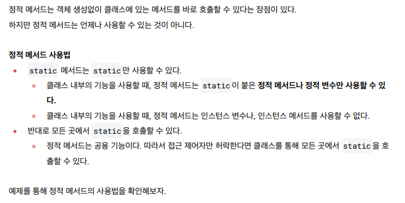
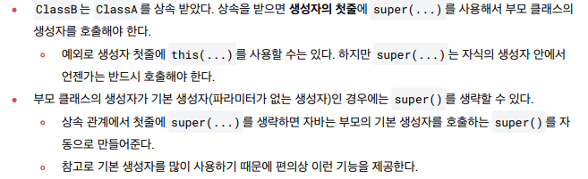

# 1206 TIL

## 잡다한 것

- 자바 메모리 구조
  
  
  
  - 메서드는 붕어빵 틀, 힙은 붕어빵 느낌...

- 스택: 후입 선출
  큐: 선입 선출

- 단축키
  
  
  - 마우스로 더블 클릭 안해도 Ctrl + w를 누르면 위와 같이 가능.
    
    - 한 번 더 누르면 "main start"가 모두 선택 됨.

- static 변수
  
  - 주로 멤버 변수와 메서드에 사용된다.
  
  - static을 쓰는 이유를 예시를 들어서 설명
    
    
    
    - 생성된 객체의 수를 세고 싶은데 인스턴스가 생성될 때마다 count 변수도 새로 만들어져서 객체의 수를 셀 수가 없다.....
    
    - static을 써서 count를 클래스 변수로 만들어주자!!
  
  - static 키워드를 사용하면 특정 클래스에서 공용으로 사용할 수 있는 변수를 만들 수 있다.
    
  
  - 이렇게 static을 붙이게 되면 static 변수, 정적 변수 또는 클래스 변수라 한다.
  
  - 클래스 변수에 접근하는 방법은 클래스 명에 `.`(dot)을 사용.
  
  - 추가(참고)
    
    
    
    - 참고, this는 인스턴스
  
  
  
  

- 단축키
  
  - 노란줄(경고) 알아서 바꿔줘
    
    - Alt + enter
  
  - 빨간줄도 해줌
  
  - static import도 해줌
  
  - 다 해주네 뭐...

- static 메소드 사용 이유
  
  - 기존
    
  
  - 그래서 static 메소드를 써보자!!
    
    
    - 이렇게 하면 인스턴스 거칠 필요 없이 그냥 Static이 붙으면 클래스 소속이 되어버리는거다.
    
    - 객체를 생성해봐야 아무런 의미가 없으면(객체에 따른 로직 차이가 없으면) 이렇게 정적 메소드를 이용..
  
  
  
  
  - 반대로 인스턴스는 정적 접근 쌉 가능.
  
  
  
  

- 참고(static import)
  

- 참고
  
  

- 인스턴스 생성을 막고 싶을 때 이런 식으로..(private) (이런 것도 있다 정도.)
  

- final 변수와 상수
  
  
  
  
  
  - 그리고 가독성을 위해서라도 숫자로 냅두지 말고 상수로 정의해주자!

- final 변수와 참조
  
  

- 이렇게 미리 제약을 주면 다른 개발자가 내 코드를 보고 왜 막아놨지라고 생각하게 되고 건드리면 안 되겠다고 판단해 큰 오류를 막을 수 있다!!

- 상속
  
  
  - ex
    
  
  
  
  - 단일 상속만 가능
    
    - 부모가 두 명 이상이면 안된다!!
    
    - 부모가 또 다른 부모를 하나 가지는 것은 괜찮다.
    
    

- 상속과 메모리 구조(중요!!)
  
  
  

- 상속과 메서드 오버라이딩
  
  
  
  
  - @override를 안 써줘도 정상 동작하지만 안 써주면 오타를 잡아주지 못함.
  
  
  
  
  

- super - 부모 참조
  
  

- super - 생성자
  
  
  
  
  - 생성자의 실행 순서
    
  
  

- 단축키
  
  - 오버라이드 할거야
    
    - Ctrl + O 해서 오버라이드 할 것 고르기

- 클래스와 메서드에 사용되는 final
  

## 9장. 자바를 배우면 패키지와 접근 제어자는 꼭 알아야 해요

- 패키지가 필요한 이유
  
  - 클래스들을 분류하지 않으면 이름이 중복되거나, 어떤 클래스가 어떤 일을 하는지 혼동되는 일이 발생한다. 그래서 존재하는 것이 바로 "패키지"

- `import c.*;`와 같이  c에 존재하는 모든 클래스를 import하면 c 패키지 밑에 있는 모든 패키지를 import하지 않을까?
  
  - No!!, `*`를 사용하면 그 패키지에 선언한 클래스만 import한다. 즉, `c.*`으로 import하면 package c로 선언한 클래스들만 import하고, 그 하위 패키지에 선언한 클래스들은 import하지 않는다.

- import static (JDK 5부터 추가 됨) (참고)
  
  - import static은 static한 변수(클래스 변수)와 static 메소드를 사용하고자 할 때 용이.
  
  - import static으로 static한 변수나 메소드를 지정하면 굳이 클래스 이름을 지정하지 않아도 packageStatic 클래스에 선언된 것처럼 사용 가능. 

- 같은 패키지에 있으면 import 할 필요가 전혀 없다!!

- 정리해 봅시다
  
  1. 패키지를 선언할 때 사용하는 예약어는 무엇인가요?
     
     - package
  
  2. 패키지 선언은 클래스 소스 중 어디에 위치해야 하나요?
     
     - 맨 윗 줄
  
  3. 패키지를 선언할 때 가장 상위 패키지의 이름으로 절대 사용하면 안 되는 단어는 무엇인가요?
     
     - java
  
  4. 패키지 이름에 예약어가 포함되어도 되나요?
     
     - X
  
  5. import는 클래스 내에 선언해도 되나요?
     
     - X
  
  6. 같은 패키지에 있는 클래스를 사용할 때 import를 해야 하나요?
     
     - X, 같은 패키지의 클래스 및 java.lang 패키지에 있는 클래스는 import를 할 필요가 없다.
  
  7. 특정 패키지에 있는 클래스들을 모두 import 할 때 사용하는 기호는 무엇인가요?
     
     - `*`
  
  8. 클래스에 선언되어 있는 static한 메소드나 변수를 import하려면 어떻게 선언해야 하나요?
     
     - import static
       
  
  9. 접근 제어자 중 가장 접근 권한이 넓은 (어떤 클래스에서도 접근할 수 있는) 것은 무엇인가요?
     
     - public
  
  10. 접근 제어자 중 가장 접근 권한이 좁은 (다른 클래스에서는 접근할 수 없는) 것은 무엇인가요?
      
      - private
  
  11. 접근 제어자 중 같은 패키지와 상속관계에 있는 클래스만 접근할 수 있도록 제한하는 것은 무엇인가요?
      
      - protected
        
  
  12. "Calculate.java라는 자바 소스가 있을 경우, 그 소스 내에는 Calculate라는 클래스외에는 (   )으로 선언된 클래스가 있으면 안 된다. " 여기서 괄호 안에 들어가야 하는 것은 무엇인가요?  
      
      - public
