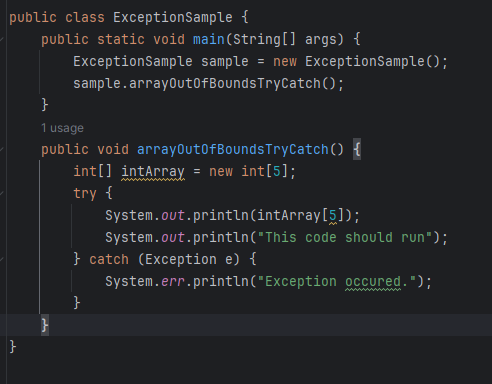
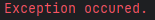
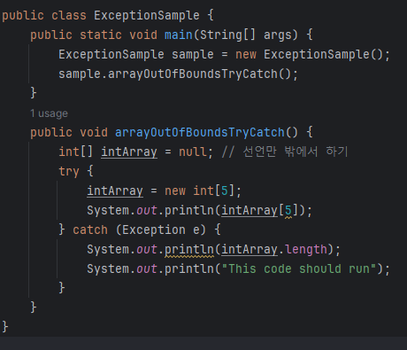
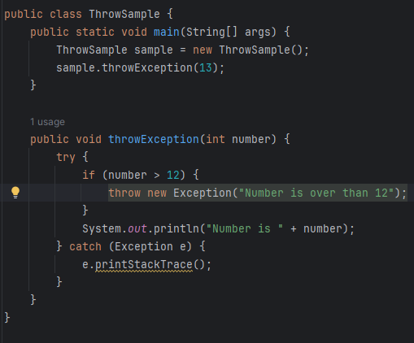
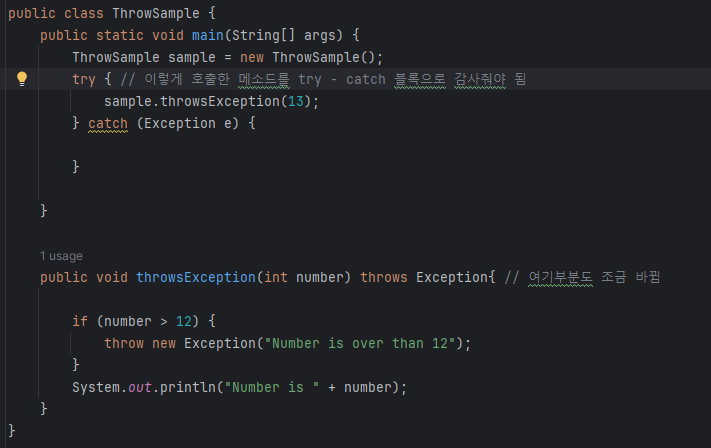
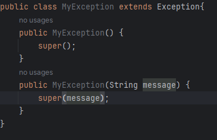
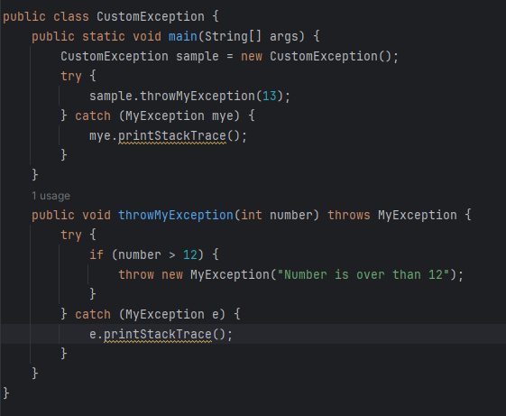
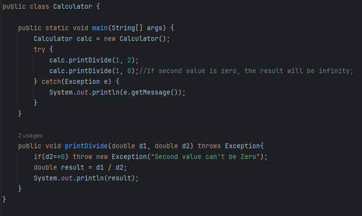

# 1208 TIL

## 잡다한 것

## 14장. 다 배운 것 같지만 예외라는 중요한 것이 있어요

- try - catch 블록
  
  
  - 결과
    
  
  - 메소드 괄호 안에 if문 처럼 try를 쓰고 중괄호로 감싸고, catch라고 쓰고 메소드 호출하는 것처럼 소괄호 안에 Exception이라는 클래스 이름과 매개 변수 이름 같은 e라는 것을 써 주었다.
  
  - try 뒤에 중괄호로 예외가 발생하는 문장들을 묶어주고, catch 괄호 안에 예외가 발생했을 때 처리를 해준다.
  
  - 반드시 모든 문장을 묶어줄 필요는 없고, **예외가 발생하는 부분만 묶어주면 된다.**
  
  - 결과를 보면 나와야 할 것 같은 코드가 하나 빠진 것 같아보인다.
    
    - **자바의 try-catch의 try 블록 안에서 예외가 발생되면 그 이하의 문장은 실행되지 않고 바로 catch 블록으로 넘어간다.**
  
  - 오류가 발생하는 부분에는 System.err를 사용하는 것이 좋다.
    
    - 개발 도구인 IDE에서는 출력 결과가 다른 색으로 표시된다. 
    
    - 결과를 보면 빨간색이지!
  
  - try - catch에서 예외가 발생하지 않을 경우
    
    - try 내에 있는 모든 문장이 실행되고 try - catch 문장 이후의 내용이 실행된다.
  
  - try - catch에서 예외가 발생하는 경우
    
    - try 내에서 예외가 발생한 이후의 문장들은 실행되지 않는다.
    
    - catch 내에 있는 문장은 반드시 실행되고, try - catch 문장 이후의 내용이 실행된다.
  
  - 실수하기 쉬운 점
    
    - try 블록은 말 그대로 중괄호로 쌓여 있는 블록이다. 그래서 try 블록 내에서 선언한 변수를 catch에서 사용할 수 없다.
    
    
    
    - 이렇게 선언만 밖에서 해놓아도 catch에서 사용 가능함
    
    - 예외가 발생하여 catch 블록이 실행된다고 해서 try 블록 내에서 실행된 모든 문장이 무시되는 것은 전혀 아니다. 위의 예제에서 예외는 intArray[5]를 호출하는 순간 발생한다. 그렇기 때문에 그 앞에서 실행된 intArray의 크기를 5로 지정한 문장은 전혀 문제 없이 실행된다.
    
    - **반드시 catch에서 사용하는 변수는 try 블록 앞에 선언해야 한다!!!!**

- finally
  
  - 자바에서 예외를 처리할 때의 finally는 "어떠한 경우에도 넌 반드시 실행해~"라는 의미를 가진다.
  
  - try - catch 구문에 추가로 붙을 수 있는 블록이다.
  
  - finally 블록은 예외 발생 여부와 상관 없이 실행된다.
  
  - 이걸 어따 써??
    
    - 코드의 중복을 피하기 위해서 반드시 필요하단다.

- 2개 이상의 catch
  
  - 다만 catch 블록은 순서를 따진다.
  
  - 먼저 선언한 catch 블록의 예외 클래스가 다음에 선언한 catch 블록의 부모에 속하면, 자식에 속하는 catch 블록은 절대 실행될 일이 없으므로 컴파일 되지 않는다.
    
    - 예외는 부모 예외 클래스가 이미 catch를 하고, 자식 클래스가 그 아래에서 catch를 하도록 되어 있을 경우에는 자식 클래스가 예외를 처리할 기회가 없다.
    
    - ex) Exception 클래스가 ArrayIndexOutOfBoundsException 클래스보다 위에 존재하면 컴파일 조차 안됨..
      
      - Exception 클래스가 모든 클래스의 부모 클래스이고, ArrayIndexOutOfBoundsException은 Exception 클래스의 자식 클래스이기 때문에 절대로 Exception 클래스로 처리한 catch 블록 이후에 선언한 블록은 처리될 일이 없다. 그래서 "왜 필요 없는 것을 만들고 그래?" 라면서 컴파일러가 친절하게 에러를 날려준다.
  
  - 하나의 try 블록에서 예외가 발생하면 그 예외와 관련이 있는 catch 블록을 찾아서 실행한다.
  
  - catch 블록 중 발생한 예외와 관련있는 블록이 없으면, 예외가 발생되면서 해당 쓰레드는 끝난다. 따라서, 마지막 catch 블록에는 Exception 클래스로 묶어주는 버릇을 들여 놓아야 안전한 프로그램이 될 수 있다.
    
    - 만약에 없다면 예외 로그가 발생될 수도 있다....

- 예외의 종류는 세 가지다.
  
  1. checked exception
  
  2. error
  
  3. runtime exception 혹은 unchecked exception
  - Exception 클래스는 에러가 아니다. 뭔가 자바 프로그램에 오류가 발생했을 때, 오류의 이름이 Error로 끝나면  에러이고, Exception으로 끝나면 예외다.
  
  - Error와 Exception으로 끝나는 오류의 가장 큰 차이는 프로그램 안에서 발생했는지, 밖에서 발생했는 지 여부이다. 하지만, 더 큰 차이는 프로그램이 멈추어 버리느냐 계속 실행할 수 있느냐의 차이다. 더 정확하게 말하면 Error는 프로세스에 영향을 주고, Error는 프로세스에 영향을 주고, Exception은 쓰레드에만 영향을 준다.
  
  - 런타임 예외(runtime exception)는 예외가 발생할 것을 미리 감지하지 못했을 때 발생한다.

- 모든 예외의 할아버지는 Java.lang.Throwable 클래스다.
  
  - Exception 과 Error의 공통 부모 클래스는 당연히 Object 클래스다. 그리고 공통 부모 클래스가 또 하나 있는데, 바로 java.lang 패키지에 선언된 Throwable 클래스다.
  
  - 다시 말해서 Exception과 Error 클래스는 Throwable 클래스를 상속받아 처리하도록 되어 있다. 그래서 Exception나 Error를 처리할 때 Throwable로 처리해도 무관하다.
    
    - 상속 관계가 이렇게 되어 있는 이유는 Exception나 Error의 성격은 다르지만, 모두 동일한 이름의 메소드를 사용하여 처리할 수 있도록 하기 위함이다.
  
  - Throwable에는 어떤 생성자가 선언되어있을까?
    
    - Throwable()
    
    - Throwable(String message)
    
    - Throwable(String message, Throwable cause)
    
    - Throwable(Throwable cause)
  
  - 아무런 매개 변수가 없는 생성자는 기본적으로 제공한다. 그리고 예외 메시지를 String으로 넘겨줄 수도 있다. 그리고, 별도로 예외의 원인을 Throwable 객체로 넘겨 줄 수도 있다.
  
  - Throwable 클래스에 선언되어 있고, Exception 클래스에서 Overriding한 메소드는 10개가 넘지만, 그중에서 가장 많이 사용되고 이 3개만 알아도 웬만한 예외를 처리하는데 문제 x
    
    1. getMessage()
    
    2. toString()
    
    3. printStackTrace()
  
  - getMessage()
    
    - 예외 메시지를 String 형태로 제공 받는다.
    
    - 예외가 출력되었을 때 어떤 예외가 발생되었는지를 확인할 때 매우 유용
    
    - 즉, 여러분들이 그 메시지를 활용하여 별도의 예외 메시지를 사용자에게 보여주려고 할 때 좋다.
  
  - toString()
    
    - 예외 메시지를 String 형태로 제공 받는다.
    
    - 그런데, getMessage() 메소드 보다는 약간 더 자세하게, 예외 클래스 이름도 같이 제공한다.
  
  - printStackTrace()
    
    - 가장 첫 줄에는 예외 메시지를 출력하고, 두번째 줄부터는 예외가 발생하게 된 메소드들의 호출관계(스택 트레이스)를 출력해준다.
    
    - 매우 자세한 메시지를 볼 수 있다. 하지만 이 메소드는 개발할 때에만 사용하길 바란다.
      
      - 여러분들이 운영할 시스템에 이 메소드를 사용하면 엄청나게 많은 양의 로그가 쌓일 것이다. 따라서 꼭 필요한 곳에만 이 메소드를 사용할 것을 권장한다.

- 난 예외를 던질 거니까 throws라고 써 놓을게
  
  - 지금까지는 예외를 처리하는 방법을 배웠다면, 이제부터는 예외를 발생시키는 방법을 배워보자
  
  
  
  - 1년 12달을 처리하는 로직이 필요하다고 할 때, 13이상인 숫자가 월로 들어오면 안된다. 그래서 우리는 그 이상의 월은 정의도 불가능하니 예외를 발생시킨다고 정의할 수도 있다.
  
  - try 블록 내에서 throw라고 명시한 수 개발자가 예외 클래스의 객체를 생성하면 된다.
  
  - 만약에 해당하는 예외가 없다면 발생된 예외는 메소드 밖으로 던져버린다. 즉, 다시 말해서 예외가 발생된 메소드를 호출한 메소드로 던진다는 의미다. 이러 때 사용하는 것이 throws 구문이다.
  
  - 그리고 이렇게 메소드 선언을 해놓으면, 예외가 발생했을 때 try - catch로 묶어주지 않아도 그 메소드를 호출한 메소드로 예외 처리를 위임하는 것이기 때문에 전혀 문제가 되지 않는다. - 다만 비추!
    
    - 이렇게 throws로 메서드를 선언하면 개발 hard
      
      - 왜냐하면, 이 throwsException()이라는 메소드는 Exception을 던진다고 메소드 선언부에 throws 선언을 해놓았기 때문에, throwsException()메소드를 호출한 메소드에서는 반드시 try - catch 블록으로 throwsException() 메소드를 감싸주어야만 한다.
        
        - ~~이 방법 말고도 다른 방법 하나가 더 있는데 비추라 안 쓸거야.~~
    
    - 예제
      
  
  - 정리
    
    - 메소드를 선언할 때 매개 변수 소괄호 뒤에 throws라는 예약어를 적어 준 뒤 예외를 선언하면, 해당 메소드에서 선언한 예외가 발생했을 때 호출한 메소드로 예외가 전달된다.
      
      만약 메소드에서 두 가지 이상의 예외를 던질 수 있다면, implements 처럼 콤마로 구분하여 예외 클래스 이름을 적어주면 된다.
    
    - try 블록 내에서 예외를 발생시킬 경우에는 throw라는 예약어를 적어 준 뒤 예외 객체를 생성하거나, 생성되어있는 객체를 명시해준다.
      throw한 예외 클래스가 catch 블록에 선언되어 있지 않거나, throws 선언에 포함되어 있지 않으면 컴파일 에러가 발생한다.
    
    - ~~catch 블록에서 예외를 throw할 경우에도 메소드 선언의 throws 구문에 해당 예외가 정의되어 있어야만 한다.~~

- 내가 예외를 만들 수도 있다구?
  
  - Error와 관련된 클래스는 개발자가 손댈 필요도 없고, 손대어서도 안 된다. 하지만 Error가 아닌 Exception을 처리하는 예외 클래스는 개발자가 임의로 추가해서 만들 수 있다.
    
    - 단 한 가지 조건이 있다.
    
    - Throwable이나 그 자식 클래스의 상속을 받아야만 한다는 것이다.
    
    - Throwable 클래스의 상속을 받아도 되지만, Exception을 처리하는 클래스라면 java.lang.Exception 클래스의 상속을 받는 것이 좋다.
    
    
    
    - 이렇게 예외 클래스가 되기 위한 조건은 간단하다.
      
      - 예외 관련 클래스를 확장하면 된다.
      
      - 이걸 써 묵으면 된다.
        
        
        - 여기서 반드시 MyException으로 catch할 필요 x
          
          - MyException의 부모 클래스인 Exception클래스로 catch 해도 무방하다.

- 자바 예외 처리 전략
  
  - 예외가 항상 발생하지 않고, 실행시에 발생할 확률이 매우 높은 경우에는 런타임 예외로 만드는 것이 나을 수도 있다. 즉, 클래스 선언시 extends Exception 대신에 extends RuntimeException으로 선언하는 것이다.
    
    - 이렇게 되면, 해당 예외를 던지는 메소드를 사용하더라도 try - catch로 묶지 않아도 컴파일시에 예외가 발생하지 않는다.
    
    - 다만, 이 경우에는 예외가 발생할 경우 해당 클래스를 호출하는 다른 클래스에서 예외를 처리하도록 구조적인 안전 장치가 되어 있어야만 한다.
    
    - 즉, 임의의 예외 클래스를 만들 때에는 반드시 try - catch로 묶어줄 필요가 있을 경우에만 Exception 클래스를 확장한다.
      일반적으로 실행시 예외를 처리할 수 잇는 경우에는 RuntimeException 클래스를 확장하는 것을 권장한다.
  
  - catch 문 내에 아무런 작업 없이 공백을 놔두면 예외 분석이 어려워지므로 꼭 로그 처리와 같은 예외 처리를 해줘야만 한다.

- 연습
  
  - 내 방식
    
  
  - 정답
    

- 정리해 봅시다
  
  1. 예외를 처리하기 위한 세 가지 블록에는 어떤 것이 있나요?
     
     - try-catch, finally, throws
  
  2. 1의 답 중에서 "여기에서 예외가 발생할 것이니 조심하세요"라고 선언하는 블록은 어떤 블록인가요?
     
     - try
  
  3. 1의 답 중에서 "예외가 발생하든 안하든 얘는 반드시 실행되어야 됩니다"라는 블록은 어떤 블록인가요?
     
     - finally
  
  4. 예외의 종류 세 가지는 각각 무엇인가요?
     
     - checked exception, error, unchecked exception
  
  5. 프로세스에 치명적인 영향을 주는 문제가 발생한 것을 무엇이라고 하나요?
     
     - error(이하 에러)
  
  6. try나 catch 블록 내에서 예외를 발생시키는 키워드는 무엇인가요?
     
     - throw
  
  7. 메소드 선언시 어떤 예외를 던질 수도 있다고 선언할 때 사용하는 키워드는 무엇인가요?
     
     - throws
  
  8. 직접 예외를 만들 때 어떤 클래스의 상속을 받아서 만들어야만 하나요?
     
     - Exception

