# 1209 TIL

## 잡다한 것

- 상속 part
  
  - 모든 조상은 Object이다.

- 단축키
  
  - Ctrl + Shift + O (자동 import)

- 배열 원소 몽땅 지우기
  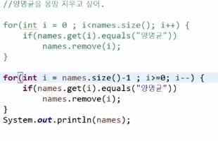
  
  - 위의 방식(주석처리)과 아래 방식 모두 되는 것 아님
    
    - 위의 방식은 되다가 말음
    
    - 위의 방식 잘 생각해보면 안 되는 이유를 알 수 있을 것이다.

- List는 배열에 기능이 추가 된 느낌
  
  - 배열의 최대 장점: 속도 (기능보단 속도에 충실했다.)

## Generic

- Collection을 배우기 위한 도입느낌, 깊게 파고들 필요는 없다고 함.

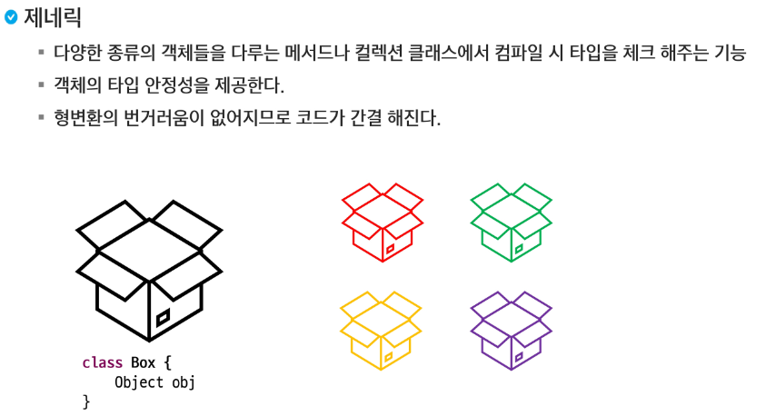

- Object는 무엇이든지 담을 수 있다는 장점이 있다.
  
  - 다만, 이로 인해 문제가 생길지도? (꺼낼 때)
  
  - 이 Object 안에 로봇, 사람 과 같은 것이 들어있다고 해도 꺼냈을 때는 그냥 Object이다...
  
  - 너 사람이지, 너 로봇이지? 이걸 확인해줘야 함. (instanceof)
  
  - 이를 보완하기 위해 이 뭐든지 담을 수 있는 박스(Object)를 빨간색만 담을 수 있는 박스, 로봇만 담을 수 있는 박스 이런 식으로 지정해주자!!
    
    - 넣을 때는 살짝 불편하지만 꺼낼 때는 편리
    
    - 어차피 이 안에 들어있는 것은 빨간색이야 (꺼내기 용이)

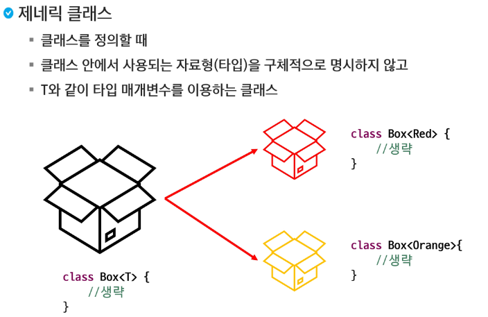
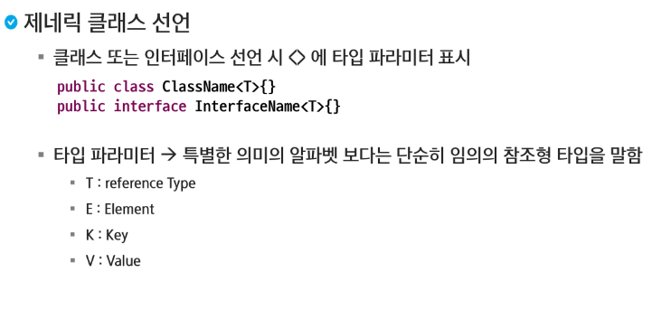
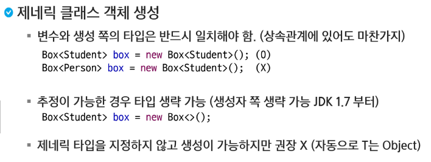
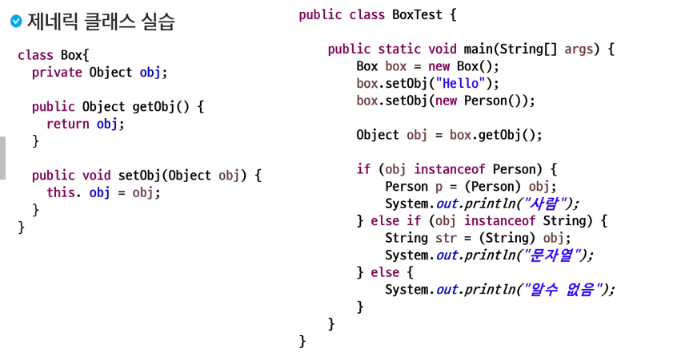

- Obj가 사람이니??

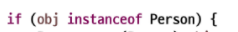  
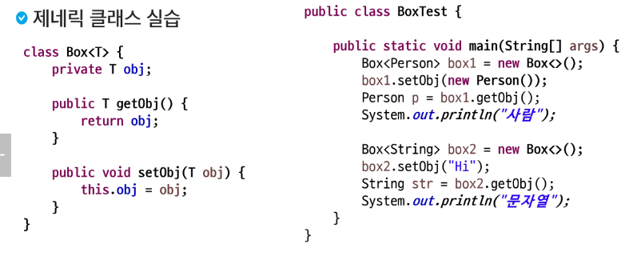

- 음... 넣을 때만 신경써주면 되네 (참고: box1, box2)

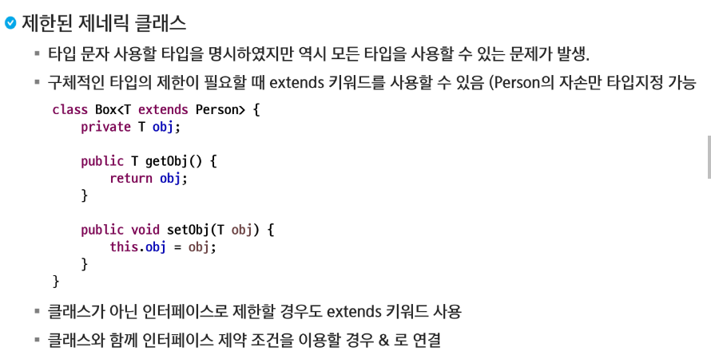
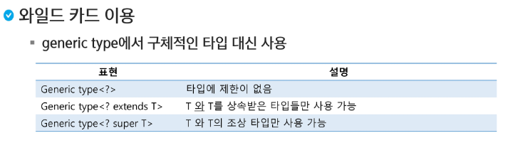

- 원래 자기 박스에는 자기 밖에 못 넣었는데 좀 더 확장해서 허용해주는 느낌.

## Collection Framework

- 3번은 선언과 동시에 이루어져야만 한다는 점이 있다.
  
  - 그래야 툴이 이게 뭔지 알 수 있으므로

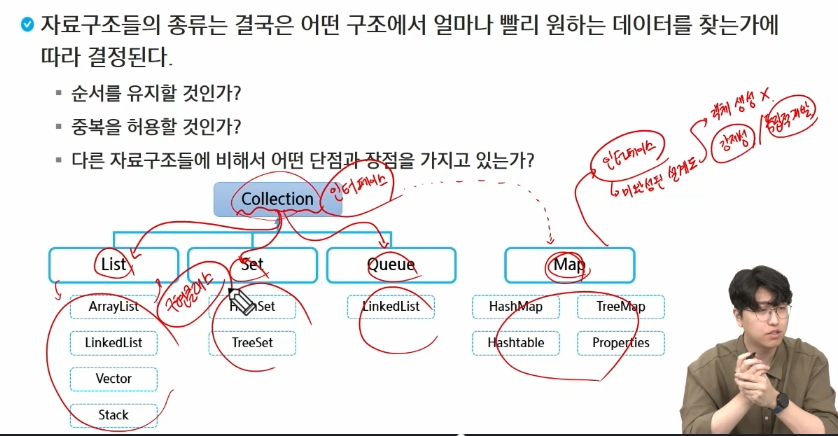

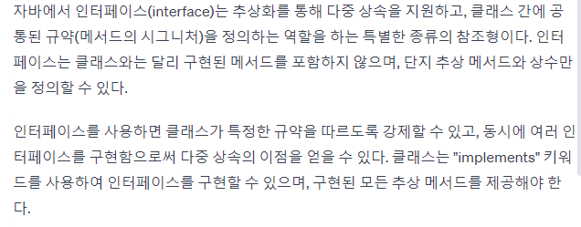

### List

- 왼쪽에 있는 것들은 기본적으로 쓸 수 있고 오른쪽에 있는 것들은 +알파 느낌

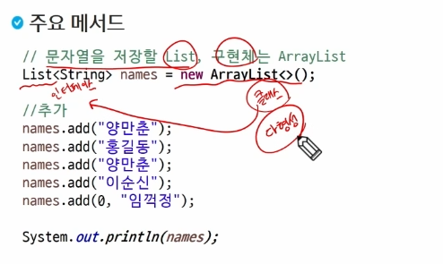
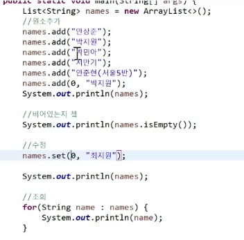
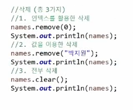

- 이런 것들이 가능한 이유(인터페이스랑 클래스???): 다형성 덕분
- 그리고 오른쪽 <>에 값을 안 넣어두면 알아서 왼쪽 <>의 값을 넣어준다.(여기선 String)

- 접근 속도 빠른 이유: 연속된 메모리 공간에 할당이 되어있으니 이곳의 위치를 바로 계산해서 접근이 가능하므로

- ArrayList란?
  
  - 컴퓨터가 알아서 배열의 크기를 조절(관리)해줌.

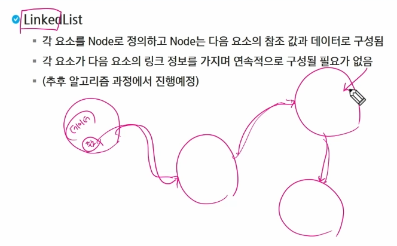

- 메모리의 어디에 생성되는지를 모르지만 연결은 되어있다.

- 각 요소는 데이터와 주소를 가지고 있고, 그 주소는 다음 주소를 가리키고 있다.
  
  - 그래서 중간 중간 값 바로 못 가져옴.
  
  - 무조건 처음부터 해서 연결된 곳으로 이어서 찾아가다가 만나면 가져옴

### Set

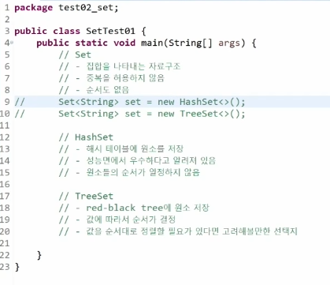

- TreeSet은 이진검색트리로 되어있다.

- HashSet
  
  - 모든 문자열은 각각 해시 코드를 가지고 있다.
  
  - 해시 코드로 바로 비교하면 equals 메소드로 비교하는 것보다 빠르게 연산 가능!
  
  - 해시 코드가 같으면 문자열이 같은 지 equals 메소드로 비교하고 다르면 set에 추가된다.
    
    - 해시 코드 값이 동일하다고 해서 무조건 같은 문자열인 것은 아니다.(그래서 비교 작업을 추가로 해주는 듯)
  
  - 즉, 해시 값이 다르면 무조건 다른 것, 같으면 내부적으로 다시 한 번 돌려봐야 됨.
    
    - 내 생각: 해시 값 계산 과정 속에서 같아지는 것이 나올 수 있나봄
  
  - 어라라?
    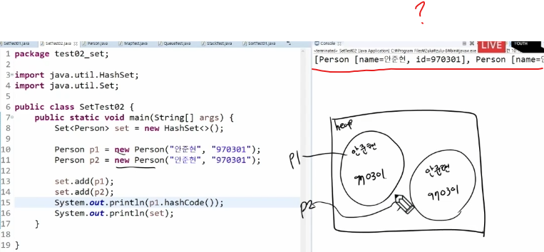
    
    - 참고로 다형성에 의해서 아래와 같이 쓴 것이지
      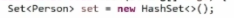
      
      - Set을 HashSet으로 바꿔도 된다.
    
    - 내가 봤을 때는 동일해서 set에 하나만 나와야 될 것 같은데...
    
    - 실제 메모리에선 다르다.
      
      - 우리가 **hashcode와 equals를 재정의** 하지 않으면 컴파일러가 봤을 때 다른 객체로 판단하고 set에 넣어버림??
      
      - 그럼 재정의란 것을 우예 하는데??
        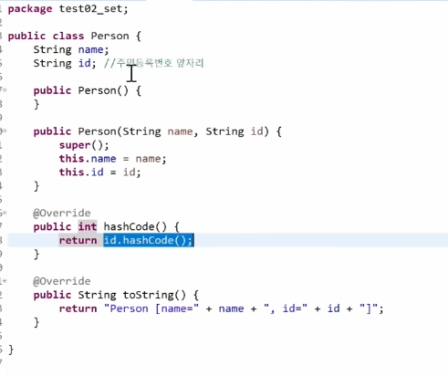
        
        - 이렇게 하면 해시코드는 같아지게 됨(근데 또 내용은 다르다고 판단해서 여전히 set에 값 2개 들어감...) (우짜란겨..., equals도 해줘야지!)
          
          - 방식 1
            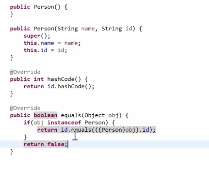
          
          - 방식 2
            
            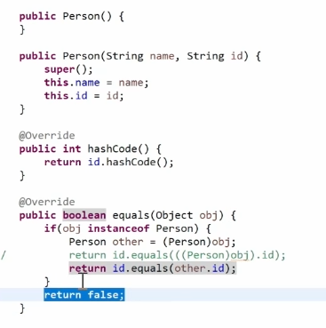
          
          - 이거까지 해주란다...

### Map

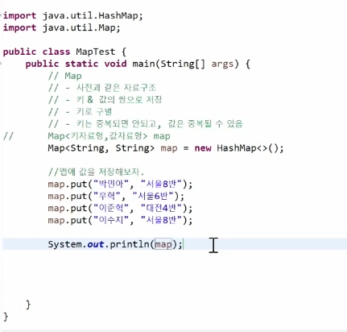
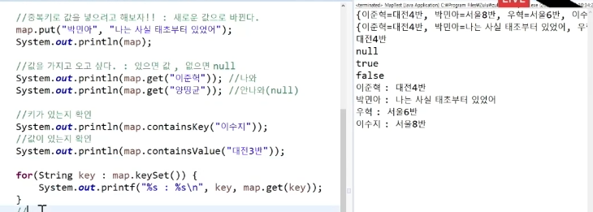

### Queue

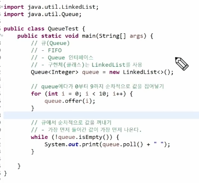

### Stack

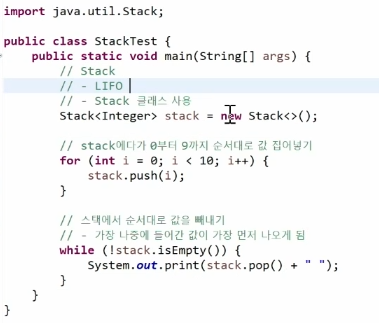

## 정렬

---

## Collection Framework (전공자 버전)

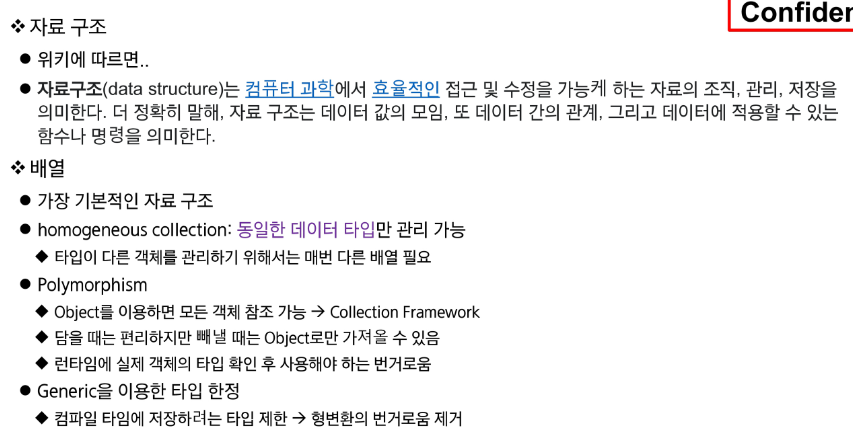
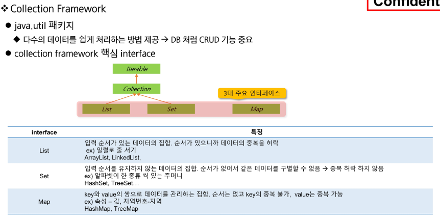
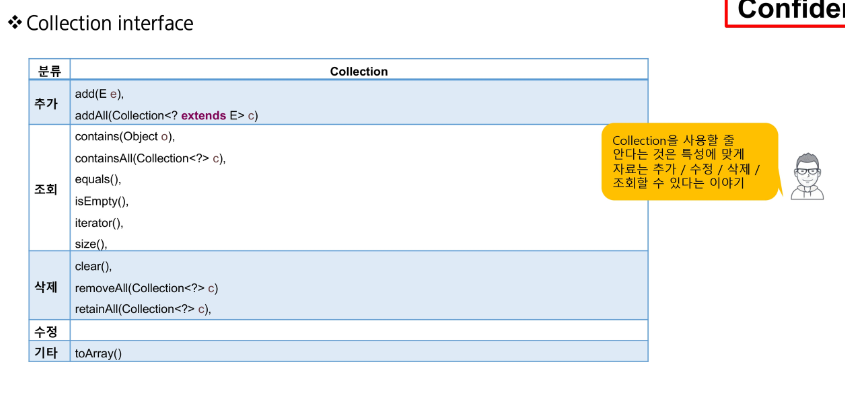

- equals
  
  - 주소가 아닌 값
  
  - 즉, 내용을 비교해주는 메소드
  
  - `==`: 두 개가 같은 객체를 참조하고 있니? 를 의미.

- iterator
  
  - 컬렉션이 가지고 있는 요소들을 순회해주기 위해 사용되는 메소드

- retainAll
  
  - 여기에 있는 것 빼고 다 지워

### 1. List 계열

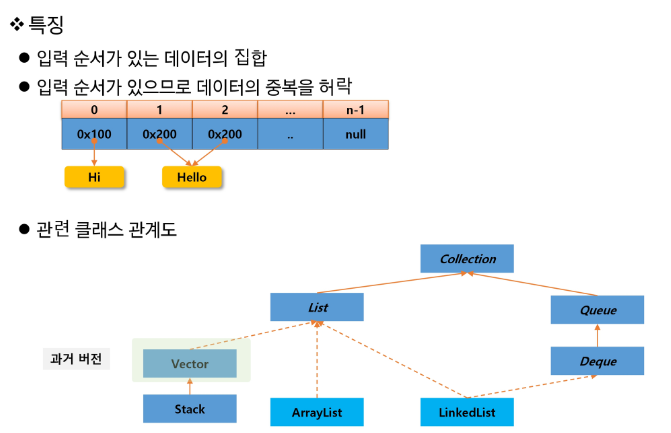
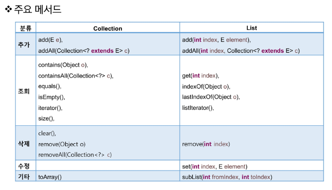

- 컬렉션 보다 한 칸 더 깊이 있는 List는 이제 **인덱스**에 대해 이야기 가능(접근 가능)

- lastIndexOf
  
  - 이 객체가 있는 마지막 index가 어디야? (중복 되므로)
  
  - indexOf는 앞에서 부터 lastIndexOf는 뒤에서 부터

- 컬랙션의 iterator은 단반향으로 순회가 가능했는데 listIterator는 양방향으로 순회 가능한 장점이 있다.

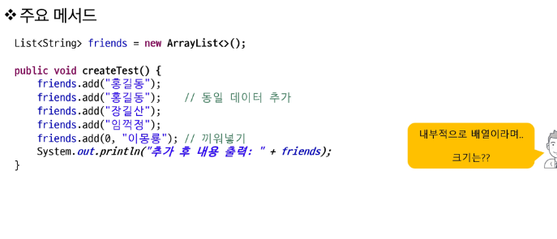

- CRUD

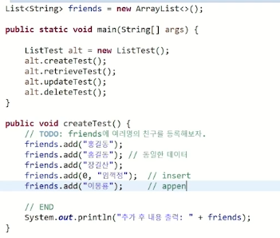

- 없으면 -1 출력

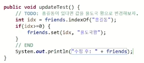
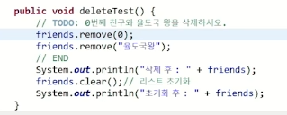

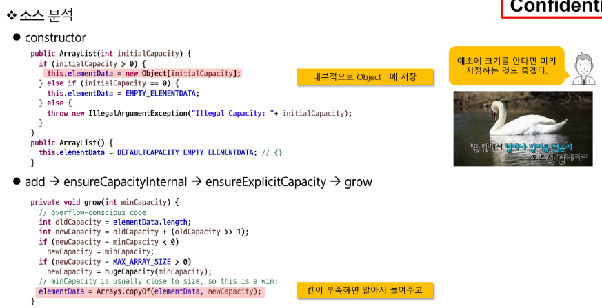
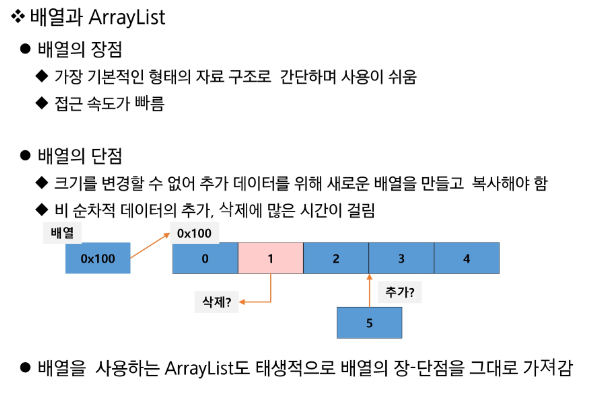
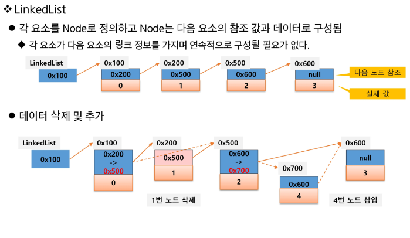

- 삭제와 추가 때 빠름

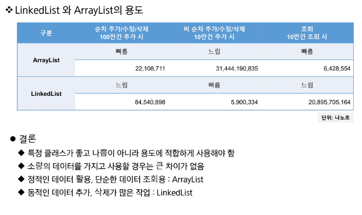

- 위에서 배울 때 ArrayList로만 배웠는데 LinkedList 우예 써??
  
  - 객체 생성 때 ArrayList를 LinkedList로 바꿔주기만 하면 끝

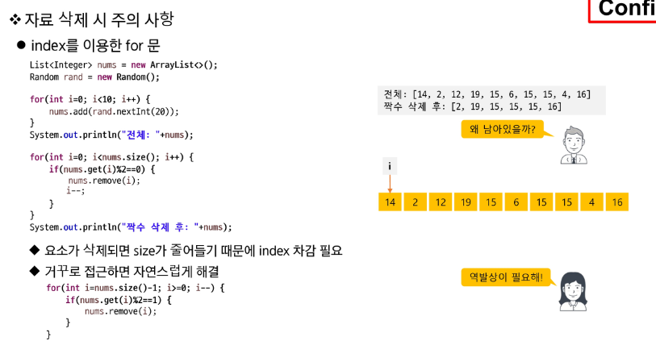

- 추가 설명
  
  - 하나 지우고 나서 앞으로 쫙 땡겨지는데 인덱스는 한칸 뒤로 전진.
  
  - 그러다 보니 덜 지워지게 됨

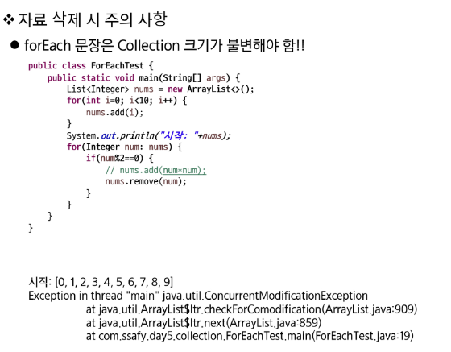

- 그래서 forEach 문에서 추가 및 삭제를 하려고 하면 오류가 발생할 것이다.

### 2. Set 계열

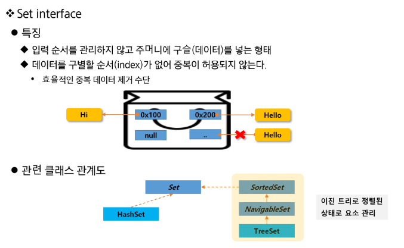

- CRUD
  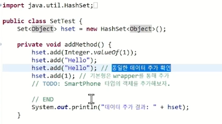
  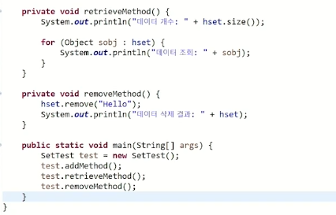
  
  - update는 없다.

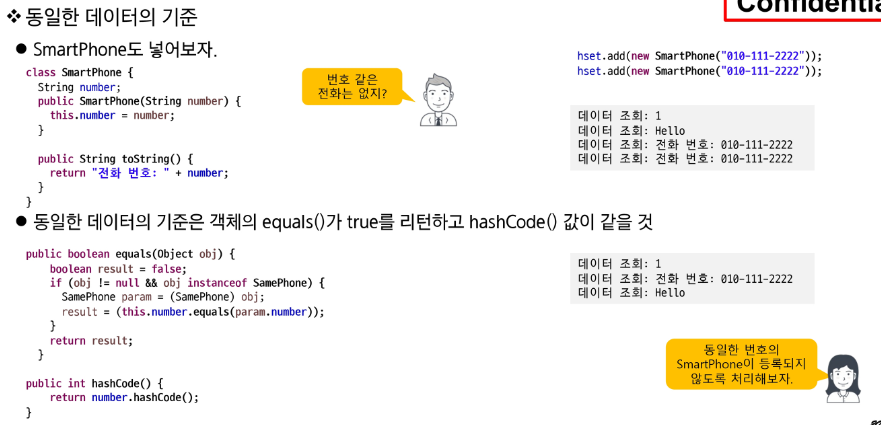
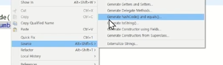

### 3. Map 계열

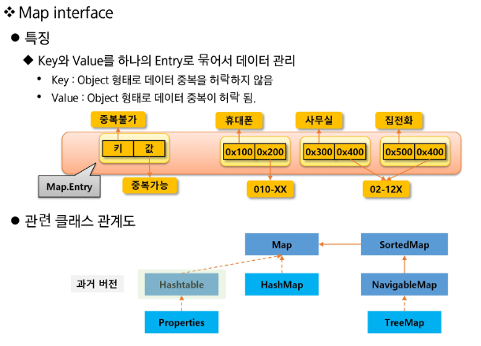
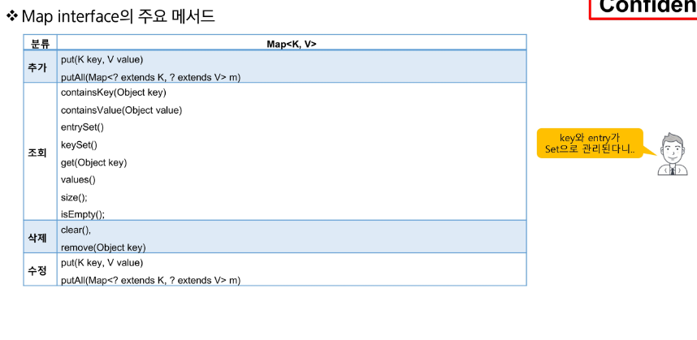
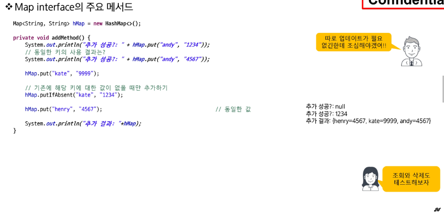

- CRUD
  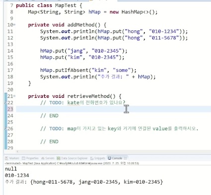
  
  - putIfAbsent
    
    - 없을 때만 넣어라
  
  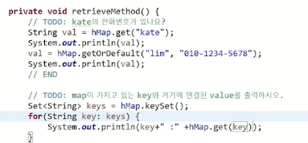
  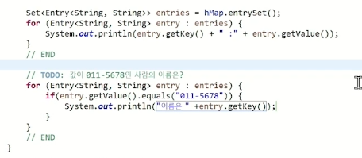
  
  - getOrDefault
    
    - 값이 없으면 기본값으로 넣어줘라
  
  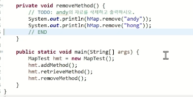

### 4. 정렬

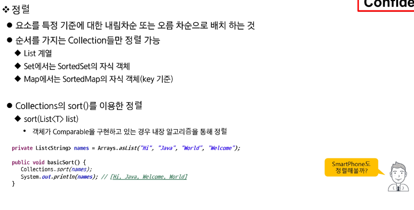
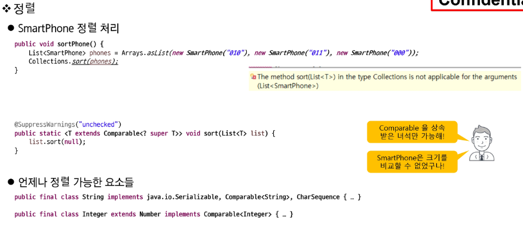

- 객체는 비교 기준이 모호
  - 그래서 스마트폰 객체 관련 class로 가서 조치를 취해줘야 됨

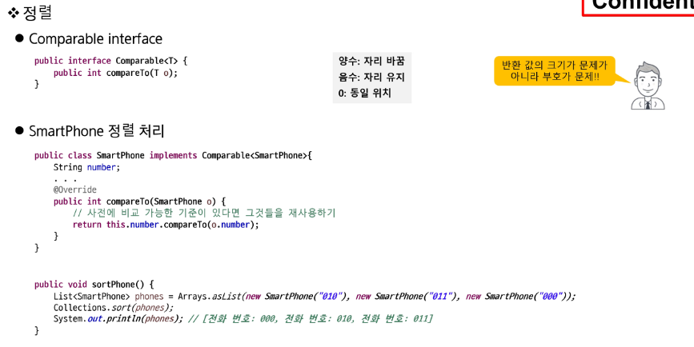

- 위의 것에서 방향을 바꾸고 싶다면?? (역방향)
  
  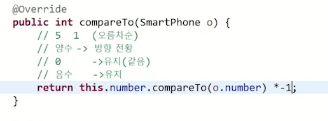

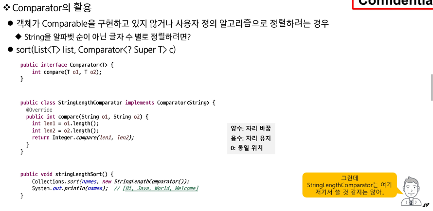
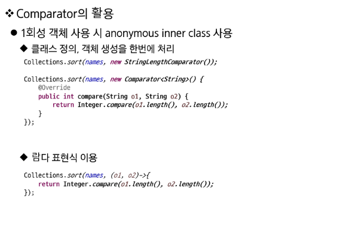
