# 1128 TIL

## 잡다한 것

- 콘솔 출력
  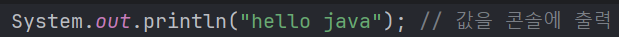

- 자바의 리턴 타입 중void는 '이 메소드는 아무것도 돌려주지 않아요'를 의미

- Ctrl + d : 현재 줄 삭제

- 단축 : 
  
  - psvm
  
  - sout

- 변수
  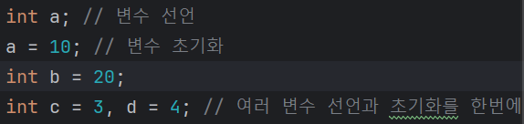

- 변수 초기화 필수인 이유? (참고)
  
  - 변수를 선언하면 메모리(여러 시스템이 함께 사용하는 공간)의 어떤 공간에 빈 공간을 차지, 근데 그 공간은 원래 어떤 다른 애가 쓰고 있던 것.
  
  - 따라서 그 공간에 뭐가 들어있을 지 모른다. 따라서 초기화를 하지 않으면 이상한 값이 출력될 수 있다.
    
    - 이런 문제를 예방하기 위해 자바는 변수를 초기화 하도록 강제.

- 변수 타입
  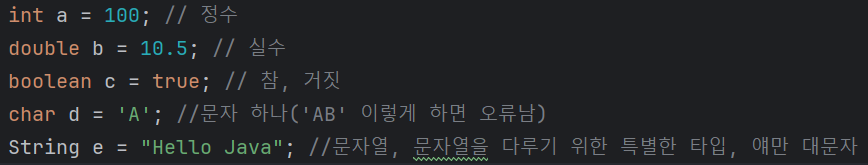
  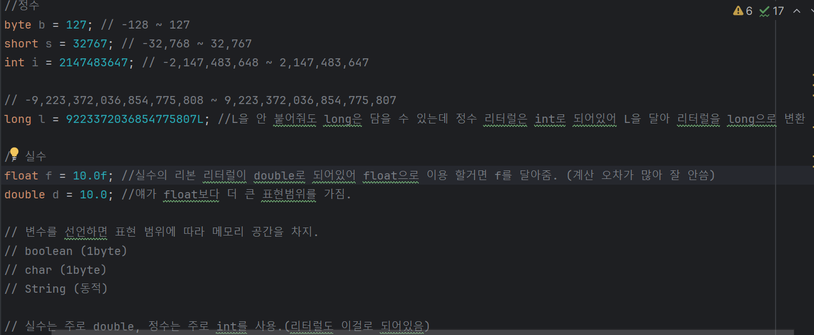
  
  - 20억 넘을 것 같으면 long 이용
  
  - 이렇게 변수 타입들이 있는데 `byte`, `short`,`float`, `char`과 같은 것은 거의 사용 x
    
    - `char`을 사용하지 않고, `String a = "a"` 와 같이 사용
    
    - 메모리 용량은 매우 저렴, 따라서 메모리 용량을 약간 절약하기 보다는 개발 속도나 효율에 초첨을 맞추는 것이 더 효과적

- Ctrl + D : 해당 줄 아래에 복사.

- 자바에서는 클래스의 첫 글자 이름은 대문자로 그리고 나머지는 모두 첫 글자를 소문자로 시작. (Camel Case)
  
  - 예외 : 상수는 전부 대문자, 패키지는 전부 소문자.

- 참고
  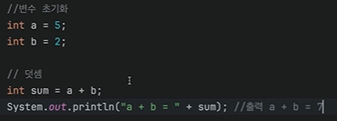
  
  - 변수를 문자열로 바꾸고 더해버림.

- 또한, 문자열 끼리 더하는 것 가능.
  
  - 문자열에 더해지는 것은 다 문자열이 된다!!!

- 약간 복잡해지는 연산이면, 괄호를 안 넣어도 되는 연산이더라도 괄호를 넣어줘서 가독성을 올려주자!
  
  - 애매하면 괄호 이용.

- 증감 연산자
  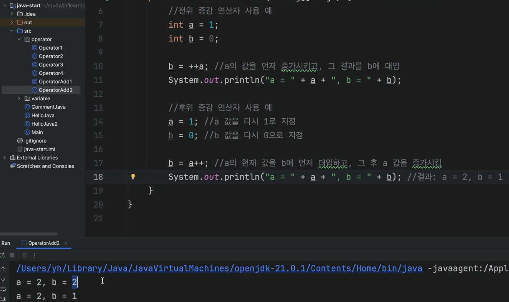
  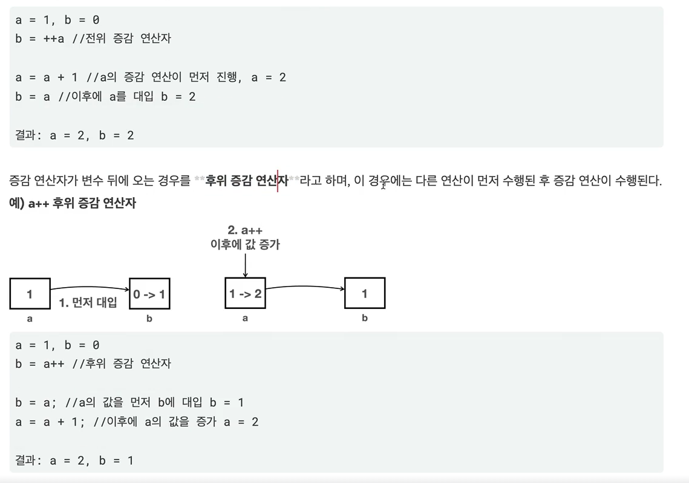
  
  - 단독은 다른 연산이 없기 때문에, 본인의 값만 증가
    
    - 따라서 전위이든 후위이든 둘 다 결과 동일.

- 문자열이 같은지 비교할 때는 `==`이 아니라 `.equals()` 메서드를 사용.
  
  - `==`을 사용하면 성공할 때도 있고 실패할 때도 있다.

- Ctrl + Shift + Enter : 현재 문장 완성 단축키

## 1장. 프로그래밍이란 무엇인가?

- 자바의 가장 작은 단위는 클래스
  
  - 자바 프로그램의 메소드는 무소속으로 존재할 수 없다.

- 클래스는 상태(state)와 행동(behavior)이 있어야만 한다.
  
  - 꼭 그런 것은 아니다.
  
  - 지금까지 알아본 '메소드'가 바로 '행동'
  
  - 상태: 그 클래스의 특성을결정짓는 것을 말함

- 자바에서는 컴파일러라는 것이 세미클론이 나올 때 까지는 한 줄이라고 생각한다.

- 자바에서는 인덴트(indent)를 별로 신경 쓰지 않는다. 
  
  - 인덴트: 코드 앞의 공백
  
  - 단, 들여쓰기를 해야 가독성 Up

- 기본 틀
  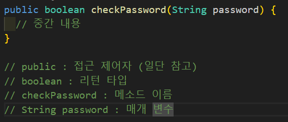

- 정리해봅시다.
  
  1. 클래스가 뭔가요?
     
     - 자바의 가장 작은 단위이자, 일반적으로 상태(state; 변수)와 행동(behavior; 메소드)를 가지고 있다.
  
  2. 메소드가 뭔가요?
     
     - 어떤 값을 주고 결과를 넘겨주는 특정한 작업을 수행하는 단위이다.
  
  3. 메소드의 매개 변수는 어디에 적어주나요?
     
     - 메소드의 소괄호 안에 적어준다.
  
  4. 메소드의 이름 앞에 꼭 적어줘야 하는 건 뭐죠?
     
     - 리턴 타입
  
  5. 클래스가 갖고 있어야 한다고 한 두 가지가 뭐죠?
     
     - 상태(변수) 와 행동(메서드)이다.
  
  6. 메소드에서 결과를 돌려주려면 어떤 예약어를 사용해야 하나요?
     
     - return

---

## 2장. Hello God of Java

- Java 명령으로 실행하는 자바프로그램의 진입점(시작점)은 main()메소드이기 때문에 반드시 필요.
  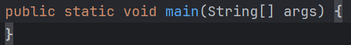 
  
  - 반드시 위와 같이 선언 필요.
  
  - public : "접근 제어자"라는 것
  
  - static : 자바의 예약어 중 하나, 이렇게 메소드를 static으로 선언하면 객체를 생성하지 않아도 호출 가능
  
  - void : 리턴값을 넘겨 주지 않을 때 이용
  
  - main : 메소드(method)이름, 반드시 이 이름을 써야 한다. 대/소문자 구분도 하니 반드시 이 이름을 사용해야 함
  
  - (String[] args) : 메소드 이름 옆에 소괄호 안에 있는 것들은매개 변수라고 한다. 
    
    - main() 메소드에 전달되는 매개 변수는 반드시 String[] args여야만 한다.
      
      - 여기서 String 옆에 대괄호를 열었다 닫은 것은 args라는 변수가 배열이라는 말임. (args는 딴 거 써도 되긴 함...)

- 주석
  
  - 한줄 주석
    `//`
  
  - 블록 주석
    `/* */`
  
  - 문서용 주석
    `/** */`

- 메소드
  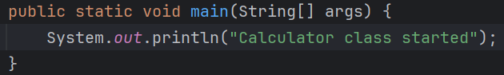
  
  1. 제어자(modifier): main() 메소드에 있는 public static과 같은 메소드의 특성을 정하는 부분
     
     - public static
  
  2. 리턴 타입(return type): 메소드가 끝났을 때 돌려주는 타입을 말함
     
     - void
  
  3. 메소드 이름(method name): 소괄호 앞에 있는 메소드 이름을 말함
     
     - main
  
  4. 매개 변수 목록(parameter list): 소괄호 안에 있는 매개 변수의 목록을 말함
     
     - String [] args
  
  5. 예외 목록(exception list): 메소드의 소괄호가 끝나는 부분과 중괄호가 시작하는 부분 사이에 예외 목록이라는 것을 선언할 수 있다.
     
     - 여기선 없음
  
  6. 메소드 내용(method body): 중괄호 안에 있는 내용들을 말함 
     
     - System.out.println("Calculator class started");

- 정리해 봅시다.
  
  1. main() 메소드의 메소드 이름 앞에는 어떤 예약어들이 들어 가나요?
     
     - public static void
  
  2. main() 메소드의 매개 변수에는 어떤 값이 들어가나요?
     
     - String [] args
  
  3. 만약 여러분들이 만든 클래스에 main() 메소드가 없다면, java 명령어로 그 클래스를 수행할 수 있나요?
     
     - 불가능
  
  4. System.out.printIn() 메소드는 어떤 용도로 사용하나요?
     
     - 행(한 줄)을 바꾸며 메세지를 출력하는 용도로 사용된다. 
  
  5. System.out.print() 메소드는 System.out.printIn() 메소드와 어떤 차이가 있나요?
     
     - 행을 바꾸지 않고 출력한다.
  
  6. //는 무엇을 하는 데 사용하는 기호인가요?
     
     - 주석처리 할 때 사용하는 기호이다. 즉, 메세지 출력을 하지 않는다. 
  
  7. /*로 시작하고 */로 끝나는 사이에 있는 소스들은 어떻게 되나요?
     
     - 블럭 주석 처리 된다. 즉, 해당부분 전체가 주석처리가 된다. 
  
  8. 메소드를 선언할 때 반드시 꼭 있어야 하는 세가지는 무엇인가요?
     
     - 리턴 타입, 메소드 이름, 메소드 내용이다.

---

## 3장. 자바를 제대로 알려면 객체가 무엇인지를 알아야 해요.

- 자바는객체 지향 언어. 

- 생성자
  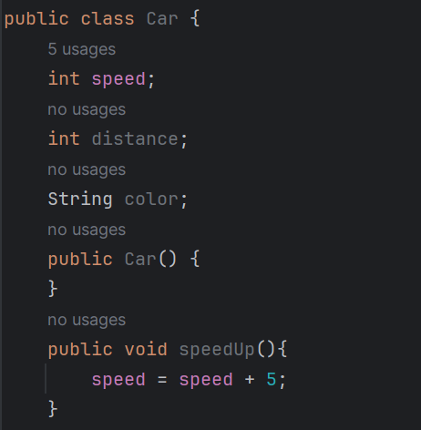
  
  - 여기에서
    
    
    - 이것을 생성자라고함.
    
    - 생성자는 객체를 생성하기 위한 거의 유일한 도구
    
    - Car() 처럼 매개 변수가 없는 생성자는 우리가 만들지 않아도 괜찮다.
      
      - 매개 변수가 없는 생성자를 "기본 생성자(default constructor)"라고 하며, 기본 생성자는 우리가 클래스를 컴파일 할 때 javac를 실행하면 클래스 파일 안에 자동으로 만들어진다.   
      
      - 즉, 아래의 것 생략 가능!!
        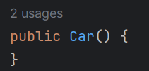

- 객체 or 인스턴스
  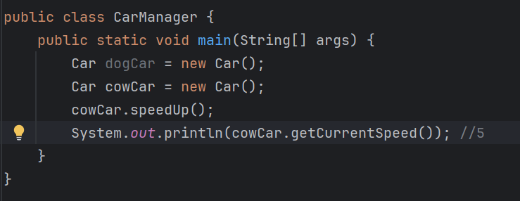
  
  - 이렇게 각각의 실제 사물을 나타내기 위한 것을 객체(Object) 혹은 인스턴스(instance)라고 한다.
  
  - 이 new라는 단어 뒤에 우리가 만든, 혹은 다른 사람이 만든 클래스의 생성자를 지정하면 된다.

- 연습
  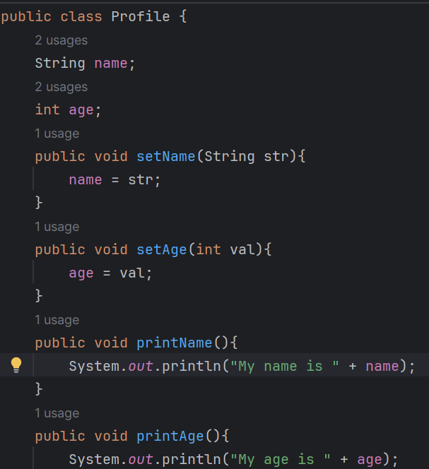
  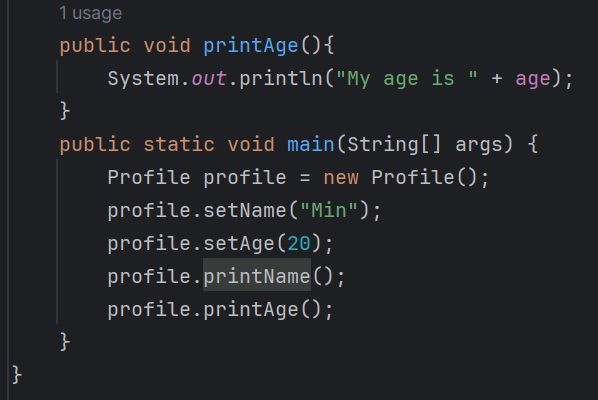
  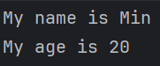

- 위의 것 정답
  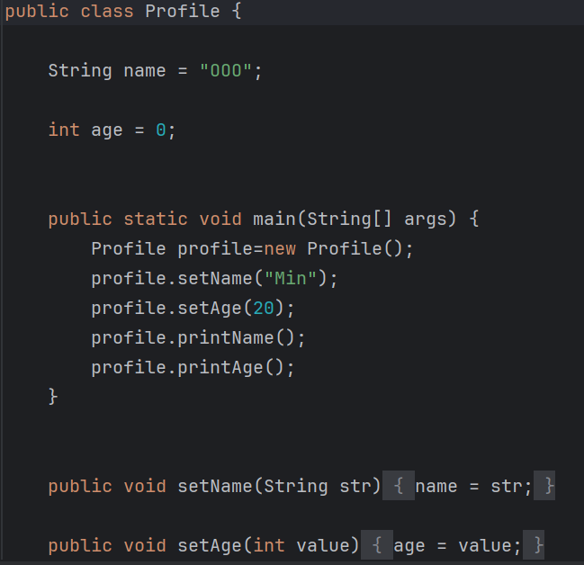
  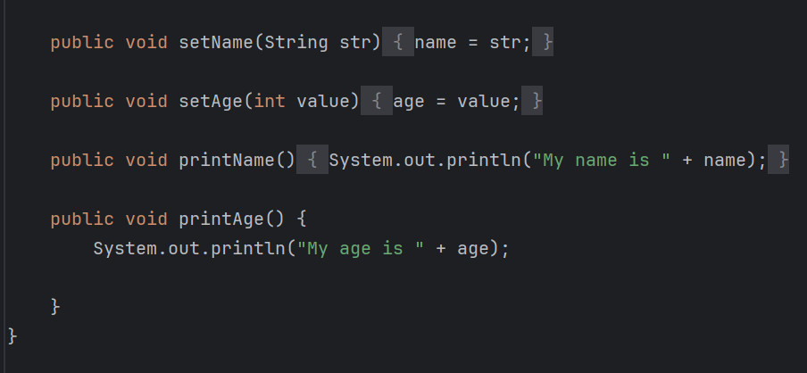
  
  - 그냥 임의로 초기화 값을 넣어주는구나.....(안 넣어줘도 나오긴 하던데.. )
  
  - 그리고 객체 지향이라 순서를 타지 않는 구나? (아닌가 컴파일 때문인가?)

- 정리해 봅시다.
  
  1. 클래스와 객체의 차이점을 말해 주세요.
     
     - 클래스는 그 자체로 어떤 작업을 수행하지 않는 틀이며, 객체를 생성하여 구체적인 작업을 수행할 수 있다.
  
  2. 객체를 생성하기 위해서 꼭 사용해야 하는 예약어는 뭐라고 했죠?
     
     - new
  
  3. 객체를 생성하기 위해서 사용하는 메소드 같이 생긴 클래스 이름에 소괄호가 있는것을 뭐라고 하나요?
     
     - 생성자
  
  4. 객체의 메소드를 사용하려면 어떤 기호를 객체 이름과 메소드 이름사이에 넣어주어야 하나요?
     
     - .
  
  5. 여러분들이 메소드를 사용하기 위해서는 어떤 것을 만들어야 하나요?
     
     - 객체(인스턴스)
  
  6. 5번 문제에서 만들어야 하는 것은 어떤 예약어를 사용하고, 클래스의 무엇을 사용해야 하나요?
     
     -  new, 생성자

---

## 4장. 정보를 어디에 넣고 싶은데

- 자바에는 4가지의 변수가 있다.
  
  - 지역 변수
    
    - 중괄호 내에서 선언된 변수
  
  - 매개 변수
    
    - 메소드에 넘겨주는 변수
  
  - 인스턴스 변수
    
    - 메소드 밖에, 클래스 안에 선언된변수
    
    - 앞에는 static이라는 예약어가 없어야 한다.  
  
  - 클래스 변수
    
    - 인스턴스 변수처럼 메소드 밖에, 클래스 안에 선언된 변수 중에서 타입 선언 앞에 static이라는 예약어가 있는 변수
  
  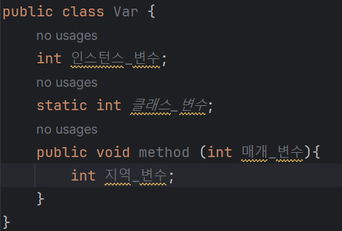

- 변수에 따른 수명
  
  - 지역 변수
    
    - 지역 변수를 선언한 **중괄호** 내에서만 유효
      
      - 중괄호 내에 똑같은 이름의 변수가 있으면 오류 발생 
  
  - 매개 변수
    
    - 메소드가 호출될 때 생명이 시작되고, 메소드가 끝나면 소멸된다.
  
  - 인스턴스 변수
    
    - 객체가 생성될 때 생명이 시작되고, 그 객체를 참조하고 있는 다른 객체가 없으면 소멸된다.
  
  - 클래스 변수
    
    - 클래스가 처음 호출될 때 생명이 시작되고, 자바 프로그램이 끝날 때 소멸된다.

- 자바의 타입(자료형)은 크게 기본 자료형과 참조 자료형으로 나뉜다.
  
  - 참조 자료형은 여러분이 마음대로 만들 수 있지만, 기본 자료형은 여러분들이 추가로 만들 수 없다.
    
    - 클래스도 참조 자료형.
  
  - 먼저 초기화란?
    
    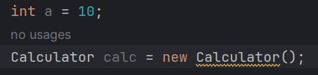
    
    - int 초기화는 바로 값을 적어줌
    
    - Calculator를 초기화 할 때는 new라는 예약어로 생성
    
    - 자바에서는 이렇게 new를 사용해서 초기화하는 것을 참조 자료형, 그렇지 않고 바로 초기화가 가능한 것을 기본 자료형이라고 한다.
      
      - 참조 자료형 중에서 딱~ 하나 초기화할 때 예외적인 것이 있다. (String)
        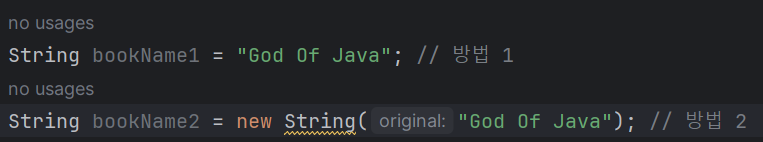
      
      - String만이, 참조 자료형이지만 new를 사용해서 객체를 생성하지 않아도 되는 유일한 타입
    
    - 참고:
      
      - 변수를 선언할 때에는 초기화를 해 줘야 변수가 사용할 수 있는 상황이 된다고 기억!

- 기본 자료형 8개
  
  - 정수형 : byte, short, int, long, char
  
  - 소수형 : float, double
  
  - 기타 : boolean

- byte는 8비트의 부호가 있는(signed)타입이다.

- 정수형 중에서 unsigned인(부호가 없는)것은 단지 char뿐이다. 

- 참고: 최소값에서 1을 더 뺀 것은 최대값이 나오고, 최대값에서 1을 더한 것은 최소값이 나온다.
  
  -  최소값에서 1을 빼고, 다시 1을 더한다면? 당연히 최소값이 나온다.

- 기본적으로 자바에서는 숫자를 명시하면 int로 생각하기 때문에, 여러분이 long 타입의 숫자를 명시적으로 지정해 줄 때는 반드시 숫자 가장 뒤에 L을 붙여줘야 한다.
  
  - 만약 이 숫자가 int 범위 내에 있다면 전혀 문제가 없지만, int 범위를 넘어 섰을 때에는 x

- 참고:
  
  - float: 부호(1자리) + 지수(8자리) + 가수(23자리) = 32비트
  
  - double: 부호(1자리) + 지수(11자리) + 가수(52자리) = 64비트

- char의 값을 지정하는 방법은 크게 3가지
  
  1. 홑따옴표 안에 직접 'a'와 같이 그 값을 집어넣기
  
  2. '\u0000'과 같이 홑따옴표 안데 \n와 16진수 값을 넣기
  
  3. 형 변환 이용
     
     - 해당 값의 유니코드 번호를 지정(단, 그 번호는 char 범위 내의 숫자, 즉 0~65,535사이여야 함)
     
     - ex) `char castValue = 44032;`

- 잘못 정의한 char 찾기
  
  - char a = 'a'; (O)
  
  - char b = 'ab'; (X)
    
    - 홑따옴표 안에 \u로 시작하지 않는 이상 두 개의 문자가 올 수 x
  
  - char c = '가'; (O)
    
    - 한글은 대부분 2바이트로 표현하며 유니코드에 포함되어 있어 사용가능.
  
  - char d = '\u97'; (X)
    
    - \u 뒤에는 반드시 4개의 16진수 값이 와야만 한다.
  
  - char e = '\u1188'; (O)
  
  - char f = -1; (X)
    
    - char은 정수형 중 유일하게 부호가 없는 값, 따라서 음수는 표현 불가
  
  - char g = 999; (O)

- 자바의 모든 자료형은 값을 지정하지 않으면 기본값을 사용한다.
  
  - 그런데 지역 변수로 기본자료형을 사용할 때는 기본 값이 자동으로 적용되지 않고, 반드시 값을 지정해야만 한다.
  
  - 즉, 메소드 안에 서 정의한 변수에 값을 지정하지 않고 사용하려고 하면, 컴파일이 되지 않는다.
    
    - 만약에 해당 지역변수가 사용이 되지 않는다면 컴파일이 됨.
    
    - 그래도 반드시 변수를 초기화 해줘라!!!
  
  - 인스턴스 변수, 클래스 변수, 매개 변수는 값을 지정하지 않아도 컴파일이 되기는 한다.
    
    -  하지만, 이렇게 값을 지정하지 않고 개발하는 것은 매우 안 좋은 습관 
  
  - char을 제외한 모든 숫자의 기본값은 0이다.
    
    - char은 아무것도 없는 것 같아 보이지만, `\u0000`으로 빈칸이다.

- 연습
  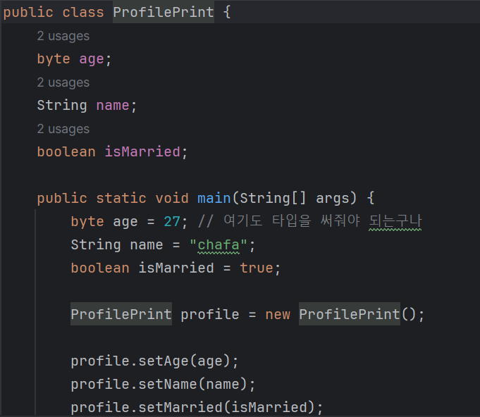
  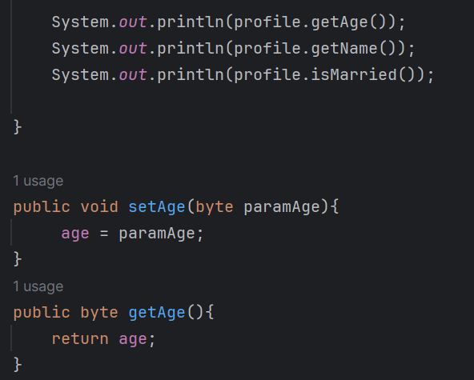
  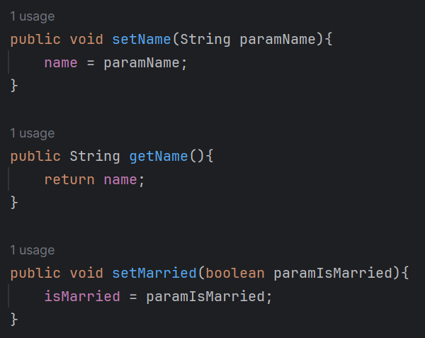
  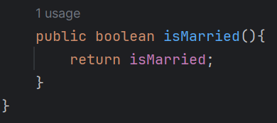

- 위의 것 (this 이용버전)
  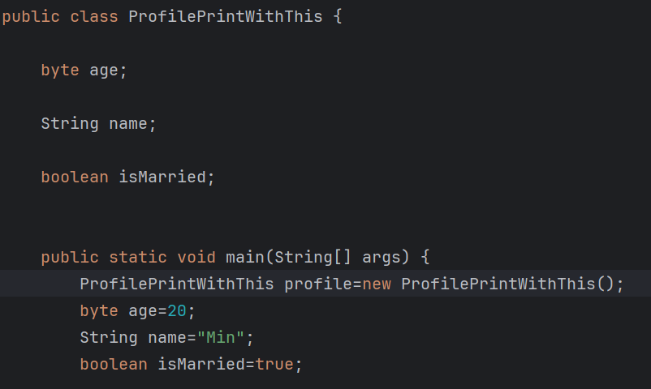
  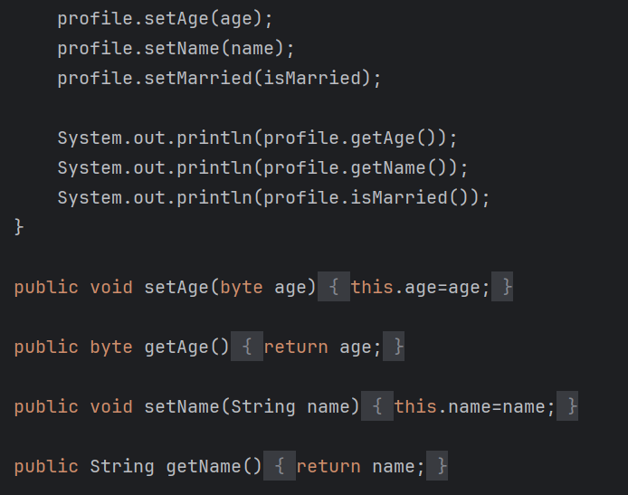
  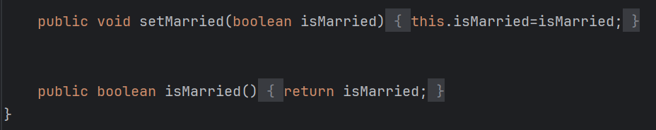

- 정리해봅시다.
  
  1. 네 가지 종류의 변수는 어떻게 구분할 수 있나요?
     
     - 위치와 예약어로 구분한다.
       
       1. 지역 변수 : 중괄호 안에서 선언되는 변수
       
       2. 매개 변수: 메소드에 넘겨주는 변수
       
       3. 인스턴스 변수: 메소드 밖에, 클래스 안에 선언된 변수
       
       4. 클래스 변수: 인스턴스 변수 중 static 예약어를 사용한 변수
  
  2. 변수의 이름을 지을 때 대문자로 시작해도 되나요?
     
     - x
  
  3. 자료형에는 기본 자료형과 어떤 자료형이 있나요?
     
     - 참조 자료형
  
  4. 기본 자료형에는 몇가지가 있나요?
     
     - 8가지
       
       - byte, short, int, long, char, float, double, boolean
  
  5. 기본 자료형 중 정수형에는 어떤 것들이 있나요?
     
     - 5가지
       
       - byte, short, int, long, char
  
  6. byte는 몇 비트(bit)로 되어 있나요?
     
     - 8비트
  
  7. byte는 왜 만들었을까요?
     
     - 보다 효율적으로 메모리 공간을 사용하기 위해서
  
  8. int와 long 중 어떤 타입이 더 큰 숫자를 처리할 수 있나요?
     
     - long
  
  9. 소수점을 처리하는 타입은 어떤 것이 있나요?
     
     - float, double
  
  10. char는 정수형인가요?
      
      - O
  
  11. a라는 것을 char로 정의할 때 어떤 기호로 감싸주어야 하나요?
      
      - `''`(홑 따옴표)
  
  12. ture와 false 두 개의 값만을 가지는 타입은 어떤 것인가요?
      
      - boolean

---
