# 1210 TIL

## 잡다한 것

- 좋은 객체 지향 설계의 5가지 원칙(SOLID)
  
  - PDF 참고

- 객체 지향 설계와 스프링
  
  - PDF 참고

- 단축키 직접 찾는 법
  
  - settings에 keymap에서 검색

- 단축키
  
  - Ctrl + Shift + enter : 바로 다음 줄로 내려오기
  
  - shift + F6 : 변수명 동시에 rename
  
  - shift + alt + 방향키: 원하는 곳으로 이동
  
  - F2 : 오류 난 곳으로 바로 이동
  
  - Ctrl + shift + t : test 틀 만들어주기
  
  - Ctrl + e 하고 enter: 이전 창으로 돌아가기
  
  - Ctrl + Alt + M : 함수 추출
  
  - Ctrl + Alt + B : 상속된 함수 찾아들어가기
  
  - Ctrl + P : 안에 뭐가 들어가야하는지 알려줌
  
  - soutm, soutv

- 사실 정적 컨텐츠 방식을 제외하면 크게 2가지만 기억하면 된다.
  
  - MVC 방식에서 뷰를 찾아가지고 템플릿 엔진을 통해서 어떤 화면을 렌더링해서 HTML를 웹 브라우저에 넘겨주는 방식 (HTML 방식)
  
  - API를 쓰는 방식
    
    - 데이터를 바로 내리는 방식??

- 참고
  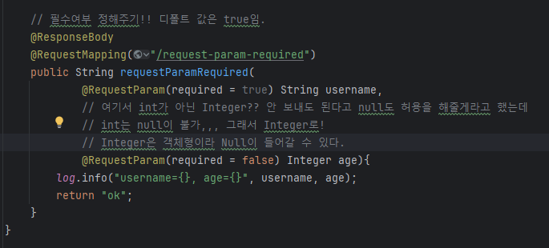

#### 정적 컨텐츠

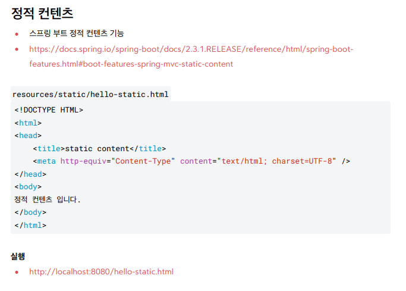

#### MVC와 템플릿 엔진

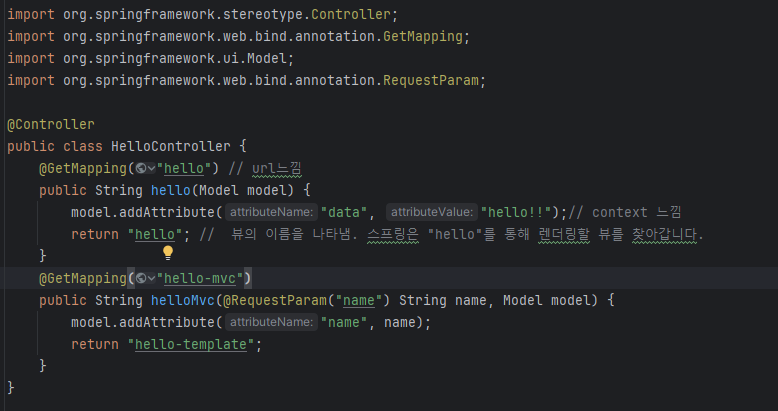
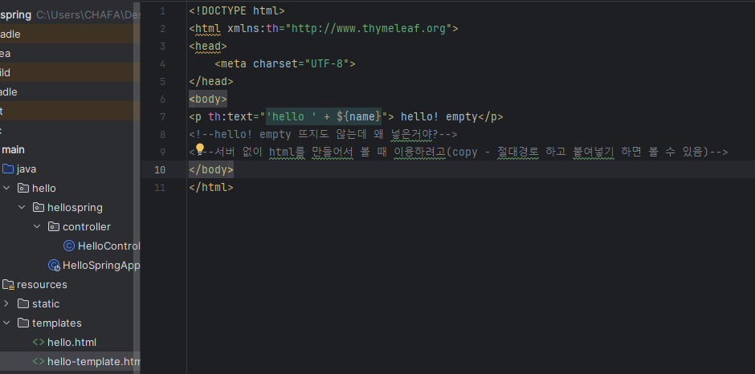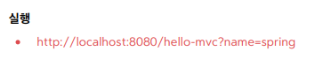

- 실행을 다음과 같이 한다면 파라미터 name에 spring이 들어감.

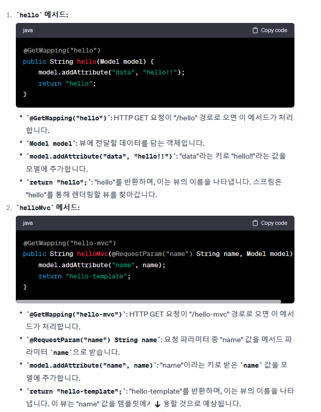

#### API

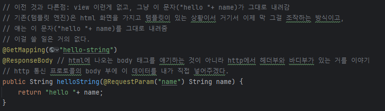
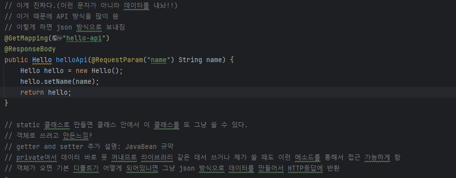
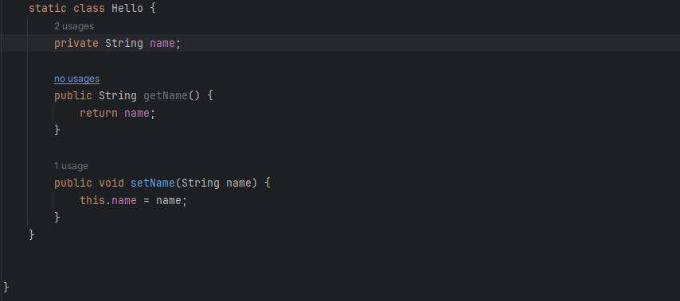

- Optional
  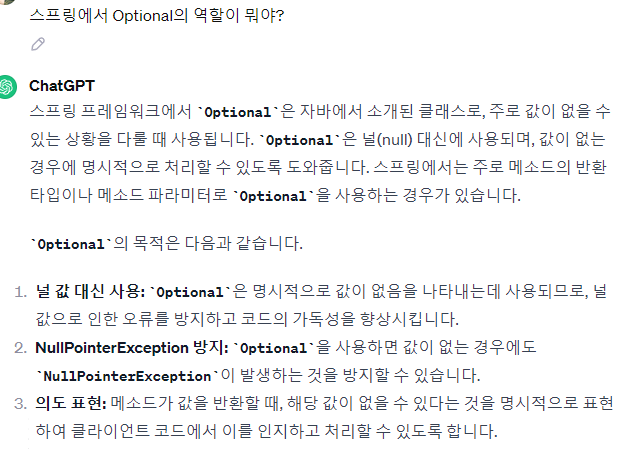
  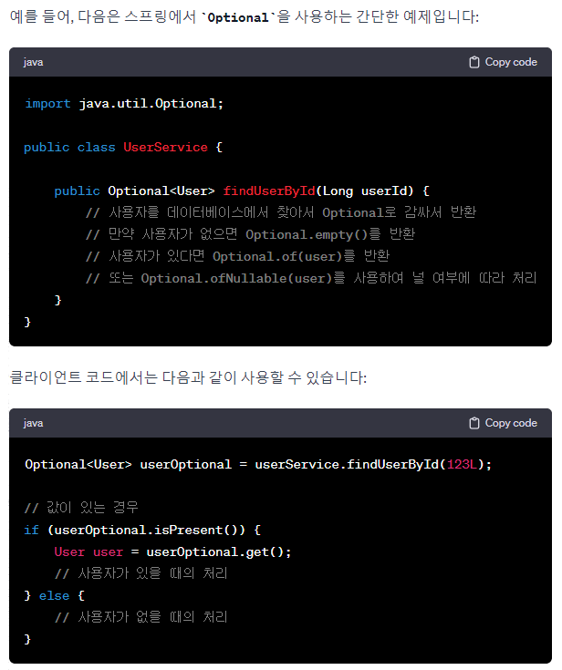
  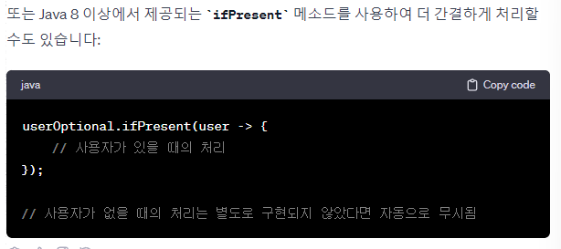

- 참고
  
  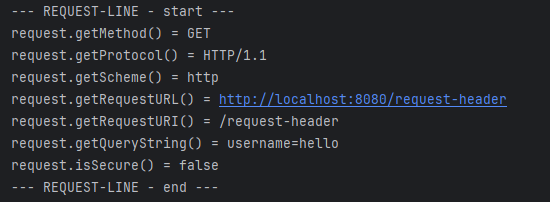

#### 
