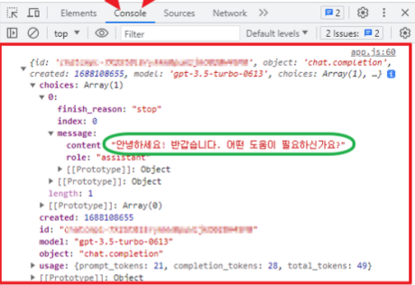
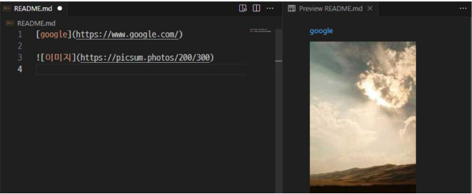
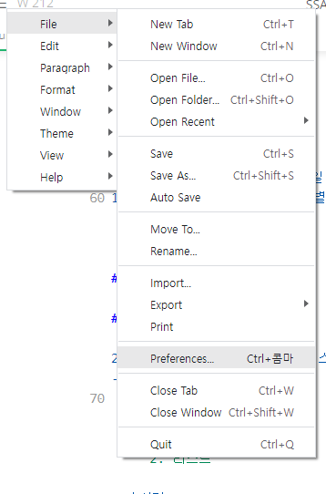
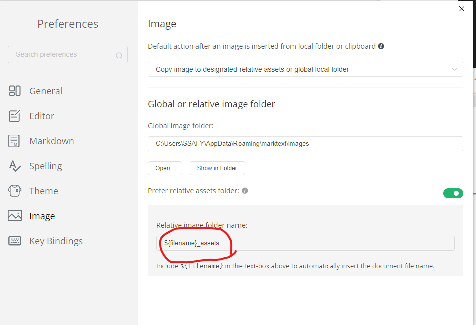
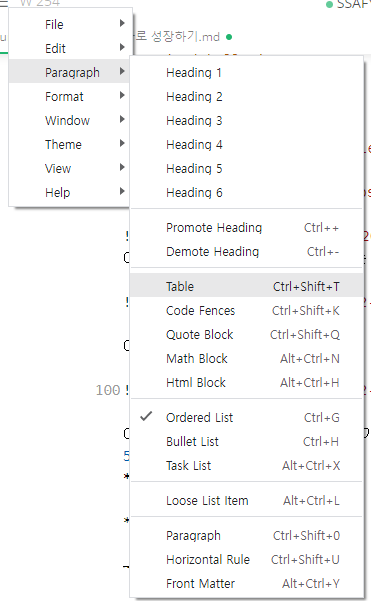

# TIL(Today I learned)

### 1. ChatGPT API관련 (javascript)

### 2. MARKDOWN 해보기

---

### 1. ChatGPT API관련 (javascript)

- cf ) [공용 문서](https://abit.ly/pb-document)
  API 키 발급 및 사용법 참조
1. API 키 발급받기 (Chatgpt 사이트), 반드시 복사해두기

2. 자바스크립트 파일 열고
   
   ```javascript
   const OPEN_API_URL = ''
   ```

        이 안에다가 [chatGPT 문서 참고 링크]([OpenAI Platform](https://platform.openai.com/docs/api-reference/chat)) 에서 찾은 링크 대입
        (https://api.openai.com/v1/chat/completions)

3. ```javascript
   const API_KEY = ""
   ```
   
    다음으로 이 안에다가 키 발급 받은 것 대입

4. index.html 파일 열기
   cf) 개발자 도구 여는 법 = F12키 누르기



5. 자바스크립트 내에서

```javascript
// 1. 응답 데이터에서 응답 메세지를 가져온다.
    console.log(res.data.choices[0].meaasge.
    content)
    response = res.data.choices[0].meaasge.content


    // 2. 챗팅창에 메세지를 등록한다.
    // addChat("receive", 응답받은메세지)
    addChat('receive', response)

    // 3. 챗팅의 연속성을 위해 이전 메세지를 oldMsg 변수에 저장
    // messages 에서 system 메세지의 content 값으로 설정됨
    oldMsg = response
```

이렇게 대입해보는 연습을 해봄

---

### 2. MARKDOWN 해보기

- cf) 개발자로 성장하기.md 파일 참조, CTRL+E를 눌러 모드 변경하면서 파악가능
1. #개수에 따라 제목의 수준 구별

# 헤딩1

## 헤딩2

### 헤딩3

2. 순서가 있는 리스트와 없는 리스트
- 1. 순서가
     
     1. 있는
     
     2. 리스트

- 순서가
  
  - 없는
    - 리스트

- 리스트
3. 코드 블록과 인라인 코드 블록
   **개발에서 마크다운을 사용하는 가장 큰 이유!!**
   
   ```python
   print('hello')
   ```

4. 링크 및 이미지
   [google](https://www.google.com/)



여기서 이미지 저장 위치를 설정하는 방법!



여기에 들어가서



이것을 쳐야만 파일 근처?에 이미지가 저장 된다.
5. 텍스트 관련 문법
**굵게**

*기울임*

~~취소선~~

~~**굵게취소선**~~  <- 동시에도 가능하다.

6. 수평선

---

7. 부연설명, 참조관련
   
   > 부연설명
   > 
   > > 참고

8. 테이블 관련
   
   | No. | 이름  | 성별  |
   | ---:| ---:| ---:|
   | 1   | 전우치 | 남   |
   | 2   |     |     |
   | 3   |     |     |

테이블은 일일이 치기 힘드므로 아래와 같이 하길 권장



여기를 들어가서 테이블을 만들면 된다.

--- 
