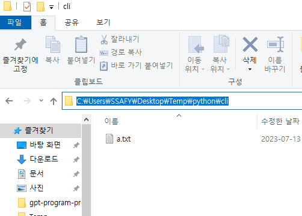
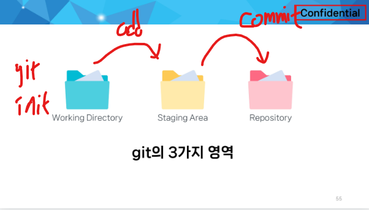
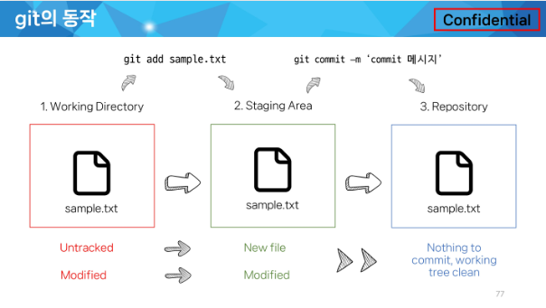
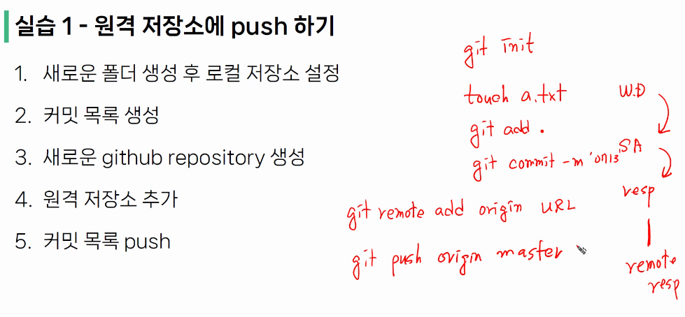

# 잡다한 것(자바 스크립트)

- 괄호 있는 것은 대부분 함수, 값 같은 것은 괄호 없음

- 명사=> 변수, 동사=>함수

- `const`=> 바꿀 수 x, `let`=> 변수

- 배열([])은 같은 타입만을 넣을 수 있다. <-파이썬에는 []이걸 리스트 라고 하고 다른 타입도 넣을 수 있게 함 
  즉, 모양([])은 같아도 다른거다.

- api 키가 필요한 이유: 서버 과부화 방지(정해진 사람만 사용가능하게)

---

# 잡다한 것(Vs code)

- `Ctrl+L`: 지우기

- `ls` 치면 그 폴더안에 어떤 것이 있는 지 알려줌

- `Tab` : 자동 완성

- `ls -al`: 좀 더 자세히(숨겨진 것들)

- `Ctrl+ ~` : 터미널 단축 키

- `.` :현재 디렉토리

- `..` :현재의 상위 디렉토리

- **`cd ..` : 상위 디렉토리로 이동**  

- `pwd`: 내가 현재 작업하고 있는 디렉토리

- cf) 휴지통 비우기 한다고 완전히 지워지는 건 아님=> 파일 경로 연결만 끊음, 그 파일 경로에 다른 파일이 들어와서 덮어쓰기 전까지는 복구가 가능 , 디스크 정리를 하면 덮어쓰기 됨

- 잘못 썻으면 `Ctrl+c` 누르기

- 디렉토리 만들때 한글이나 공백 넣는 것 비추

- 
  폴더 모양 누르면 절대 경로 알려줌 그거 드레그 해서 터미널에 집어넣어도 됨(`cd` 한칸 뛰우고) 

- `cd ~`: 맨 앞 경로로 가짐

- `cd -`: 아까 있었던 경로로 감

- 파일 정리하는 문서 하나 만들기(변경사항 같은 거)

---

# git(잡다한 것)

- `git init` 남발해서 여러 폴더에 (.git) 만들지 말 것!!!(`init` 해둔 폴더 안에 또 만들지 말라!)

- `git status` 해서 빨간 것은 Staging Area에 올라가 있지 않다는 뜻, 또 수정 된 것도 빨간색 표기

- `git add * . *`  : 이렇게 하거나 git add . 이렇게 하면 모든 파일 다 올림을 의미 

- `git add`: 상태를 올리는 것이므로 파일을 지우면 add를 해서 상태를 올려줘야 됨

- `git commit -m '   '`  :이렇게 메시지 넣어줘야함

- `git config --list` : 사용자 check(나올땐 q누르기)

- 

- `git commit` 만 쳤을 때
  `i(insert)` 눌러서 내용 입력하고(내용 입력하는 곳은 엔터 눌러서 ~ 있는 부분에), esc 눌러서 나오고 :`wq`를 눌러서 저장하거나 esc누르고 :q! 눌러서 저장 안하고 나오기

- `git config --global -l` 또는 `git config --global --list`: git 글로벌 설정 정보 보기

- `git clone` 할때 주소뒤에 .있으면 폴더 통째로가 아닌 그 속에 있는 파일들을 가져옴(. 찍는걸 권장 아니면 폴더 타서 들어가야함)(그 디렉토리에 받아달라는 의미 이므로)

- `clone`은 아무것도 없을 때 다 받아오는 것

- `pull`은 업데이트 되는 것들 받아오는 것

- 

- `git remote -v` : 확인하는 것

- 사이트에서 프로젝트 만들 때 `read me` 만들지 말 것
