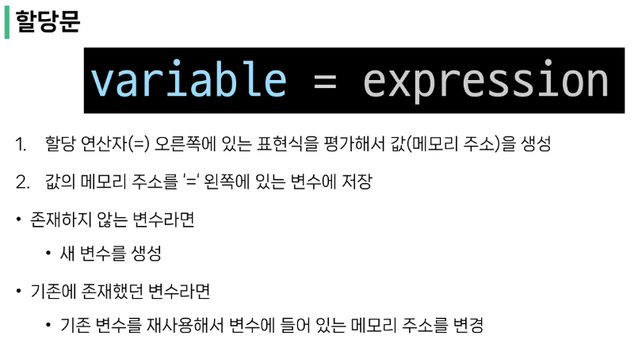
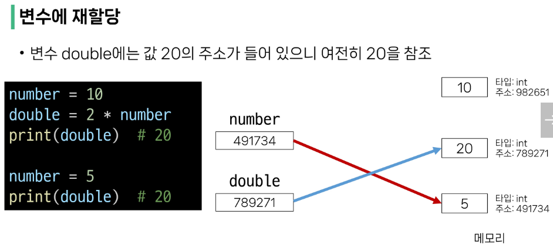

# 0717 TIL

## 잡다한 것

- 이어폰 구비(선 있는 것) - 다시보기를 위해
- 언어가 사라지는 이유: 커뮤니티 부재(사람이 많이 사용해야함)
- 불안감: 지금 Java 해야하나? 다른 언어 뭐해야되나?
  **한가지 메인 언어를 잘해놔야 합니다.** 
- 파이썬을 잘 하는 학생들은 다양한 분야에서 다양한 프로그래밍 언어를 사용하여 사회생활을 하더라, 파이썬-> 파이썬 사용 기업만 간다? (No)
- 내가 원하는 회사에서 사용하는 언어와 툴은 입사 후에 배움-> 파이썬으로 어느정도 수준을 보여주기만 하면 입사하는데 아무런 지장 없음, (다른 프로그래밍 언어도 똑같이 금방 이해하고 다루겠다고 생각함)
- 단, 메인 언어를 어느 정도 수준 이상으로 올라가기까지 많은 노력 필요(파이썬의 정점을 찍어보자~)
- 파이썬으로 알고리즘을 푸는 건 다른 언어로 푸는 것보다 조금이라도 유리한 위치에서 시작하는 것이다.
- 우리는 파이썬을 배우고 있지만, 실제로는 프로그래밍 언어에 대한 전반적인 이해력을 기르고 있는 것
- 1 byte: 영 문자 하나를 나타낼 수 있는 단위

## 파이썬

- 인터프리터의 장점: 운영체제가 바뀌더라도 우리가 쓰는 언어(문법)는 유지됨

- 문장 ⊃ 표현식 , 문장이 표현식보다 큰 범주, 표현식은 값, 변수, 연산자 등을 조합하여 계산되고 결과를 내는 코드 구조, 문장은 **실행 가능한 동작**을 기술하는 코드

- 연산자 우선순위: `**`(지수) >`-`(음수)> `*,/,//,%`(곱셈, 나눗셈)>`+,-`(덧셈, 뺄셈)

- 파이썬은 오른쪽의 값에 따라 타입이 바뀜(좋은 것 같은데 안 좋을 수 있다-> `a=123`밑에 `a=12.3`을 치면 타입이 int였다가 float로 타입이 바뀌어버림)

- 변수 지정할 때 대소문자 구별

- ~~파이썬은 모든 게 다 객체이다~~ 

- 객체(Object): 타입을 갖는 메모리 주소 내 값

- 변수: 그 변수가 참조하는 객제의 메모리 주소를 가짐

- 할당문 

- 실수 주의 
  
    애매하면 추측하지 말고 필요한 부분만 쳐서 확인하기!!(나머진 주석)

- **`sum` 같은 걸로 변수 할당하면 안됨-> 되긴 하는데 `sum()`(함수)가 고장나 버림**  

- 다른 사람을 위한 설계 스타일 준수사항(버릇 들이기)
  
  - 한 줄의 길이는 79자로 제한하며, 길어질 경우 줄 바꿈을 사용
  
  - 문자와 밑줄(`_`)을 사용하여 함수, 변수, 속성의 이름을 작성
    
    - cf) 자바는 대문자로 구분 지음 ex)`sumOfDinner`
  
  - 변수명은 누구나 직관적으로 알아보기 쉽게
    
    - is_로 시작하는 변수(암묵적인 약속): `True`냐 `False`이냐를 암시하는 변수
    
    - 단수, 복수도 구별해주면 좋음:`number`,`numbers` 
    
    - 누구나 당연히 아는 (시간 같은) 것은 대문자로 해주는 것을 권유(상수로 암시): `SECONDS`,`MINUTE`,`HOURS` 
  
  - 공백(spaces) 4칸을 사용하여 코드 블록을 들여쓰기(에디터에 설정되어 있음)
  
  - 연산자도 센스있게
    `result 2 + 3 * (4 - 5) / 2` 이렇게 한칸씩 띄어줘서 가독성 올려주기
  
  - 함수 정의나 클래스 정의 등의 블록 사이에는 빈 줄을 추가
  
  - 파이썬 PEP8 구글에 치면 자세히 나와있습니다.

- Python Tutor 사이트: 직관적으로 볼 수 있어 공부에 도움
   https://pythontutor.com/ 

- 주석처리는 그냥 `Ctrl + /`로 해주면 됨
