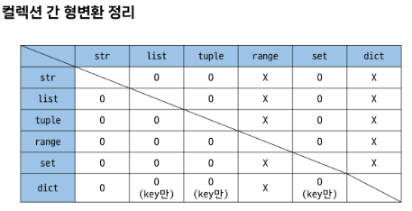

# 0718 TIL

## 잡다한 것

- 자동 저장 설정하기(Visual studio code -> file에 들어가면 Auto save있음)

## Python

- Floating point rounding errer: 예를 들어 0.1의 경우 정확한 0.1의 값이 아닌 0.1에 가까운 수여서 작은 오차 발생하는 것
  (10진수의 0.1은 2진수로 표현하면 무한대로 반복)

- 지수 표현 방식 예
  `314e-2`<= 314*0.01

--- 

### Sequence Types

- Sequence Types 특징
  
  - 순서
    
    - 값들이 순서대로 저장 (**정렬 x**)
  
  - 인덱싱
    
    - 각 값에 고유한 인덱스(번호)를 가지고 있으며, 인덱스를 사용하여 특정 위치의 값을 선택하거나 수정가능
  
  - 슬라이싱
    
    - 인덱스 범위 조절해 부분적인 값 추출 가능
  
  - 길이
    
    - `len()` 함수를 사용하여 저장된 값의 개수(길이)를 구할 수 있음
  
  - 반복
    
    - 반복문을 사용하여 저장된 값들을 반복적으로 처리 가능

- Str
  
  - 문자들의 순서가 있는 **변경 불가능한** 시퀀스 자료형
  
  - 하나를 썻으면 하나를 쭉 써라(큰 따움표 썻다가 작은 따움표 썻다가 왔다갔다 하지마라)
  
  - `\n`: 줄 바꿈
    `\t`: 탭
    `\\`: 백슬래시
    `\'`: 작은 따움표
    `\"`: 큰 따움표
  
  - ```python
    print(f'{3.141592: .4f}') # 소수점 넷째자리까지
    ```
  
  - 슬라이싱 Tip
  
  - `my_str[0,0,-1]`: 문자열 뒤집기

- List
  
  - 여러 개의 값을 순서대로 저장하는 **변경 가능한** 시퀀스 자료형
  
  - `[]`로 표기
  
  - 데이터는 어떤 자료형도 저장 가능
  
  - 문자열 뒤집기와 같이 Str로 가능한 것들 모두 List도 가능
  
  - 중첩된 리스트 접근

- Tuple
  
  - 여러 개의 값을 순서대로 저장하는 **변경 불가능한** 시퀀스 자료형
  
  - `()`로 표기
  
  - 데이터는 어떤 자료형도 저장 가능
  
  - `my_tuple = (1,) `: 원소가 하나일 때  끝에 `,` 필요
    없으면 타입이 int형으로 되어버림
  
  - 튜플은 개발자가 직접 사용하기 보다 **파이썬 내부 동작**에서 주로 사용됨

- Range
  
  - 연속된 정수 시퀀스를 생성하는 **변경 불가능한** 자료형
  
  - `range[n]`: 0부터 n-1까지의 숫자의 시퀀스
  
  - cf) 리스트로 형 변환 시 데이터 확인 가능
    `print(list(range(5)))`
  
  - 주로 반복문에 많이 쓰임

--- 

### Non-sequence Types

- dict(딕셔너리)
  
  - key-value 쌍으로 이루어진 **순서**와 **중복**이 없는 **변경 가능한** 자료형
  
  - key는 변경 불가능한 자료형만 사용 가능
    (str, int, float, tuple, range 등)
  
  - value는 모든 자료형 사용가능
  
  - `{}`로 표기
  
  - 딕셔너리 사용
    
    - key를 통해 value에 접근

- Set
  
  - **순서**와 **중복**이 없는 **변경 가능한** 자료형
  
  - 수학에서의 집합과 동일한 연산 처리 가능
  
  - `{}` 로 표기(dict와 겹치네)
    그래서 변수 설정할때 `{}`로 하면 안되고`set()`로 해야함
    (dict한테 밀림..)
  
  - 세트의 집합 연산
    
    

--- 

### Other Types

- None
  
  - 파이썬에서 '값이 없음'을 표현하는 자료형

- Boolean
  
  - 참과 거짓을 표현하는 자료형

---

### Collection

- 여러 개의 항목 또는 요소를 담는 자료 구조
  (str, list, tuple, set, dict)

- 컬렉션 정리

- 불변과 가변의 차이점
  이렇게 문자열은 통으로 넣고 리스트는 따로 따로 들어가 있는 것을 자료구조를 통해 볼 수 있고 이로 인해 불변과 가변의 차이점을 알 수 있다.

- 가변 데이터의 주의 사항

- 불변 데이터의 주의 사항
  
  

---

### Type Conversion

- 암시적 형변환
  
  - Boolean->정수->실수 순으로 확장
  
  - 파이썬이 자동으로 형변환을 하는 것
  
  - Boolean과 Numeric Type에서만 가능
  
  - 더 큰 쪽으로 감(Boolean이 Numeric보다 작다)
    `True + 3` :  4가 됨
  
  - 0을 제외한 모든 숫자는 True

- 명시적 형변환
  
  - 개발자가 **직접** 형변환을 하는 것
    암시적 형변환이 아닌 경우를 모두 포함
  
  - str-> integer: 형식에 맞는 숫자만 가능(ex. ABC는 안됨)
    integer-> str: 모두 가능
  
  - `int(3.5)`: 3이 됨(절삭)
    `round()`함수: 반올림 해주는 함수(**주의 사항: xx.5일때 올리는 것도 있고 안 올리는 것도 있음**) , 주로 앞의 값이 홀수면 올려주고 앞의 값이 짝수이면 안 올려줌
  
  - 이런 식으로 해주면 됨
    
    
  
  - 컬렉션 간 형변환 정리
    list 만능~

---

### 추가 잡다한 것

- is 비교 연산자
  

- 예시 

- **단축평가**(중요!!!!!!!!!!!!!!!)
  
   
  마지막까지 점검한 것이 답으로 나옴(굳이 점검 할 필요가 없으면..끝내버림) 
  (0은 거짓이다, 기억하기)(위에꺼 두개 설명: 괄호를 먼저 계산하고 생각해보면 됨)(0이 아닌 값은 True이므로 젤 위에것은 `'b' in vowels`가 된다.(`True and 'b'`가 되어))

- 단축평가 동작
  
  

- 우선순위 기억할 것!! cf) and가 or 보다 우선순위 높음 
  
  `-2**2`=`-4`
