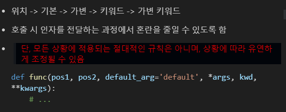
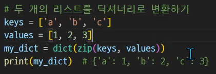

# 0719 TIL

## 잡다한 것

- 주석처리 할 때 `Ctrl+/`을 추천 했는데 `""" """` 는 Docstring으로 함수를 설명할 때 주로 사용되는 주석(주석 처리할 때 `""" """`잘 안 쓰는 이유?)
- 에러 보고 파악하는 연습하기
- `k, n , m = map(int, input().split())`<=369문제
- `Alt + Shift + 화살표 아래키` :  복사할 것 드래그 하고 치면 됨
- 소수점 둘째자리 연산 many하면 100을 곱해서 다 한뒤에 나중에 되돌리면 연산 속도를 좀 더 올릴 수 있다.
- 함수는 stack에 올려야 해서 연산 속도 떨어짐...
- 함수 만들때 최소한으로 호출 되도록 만들 것
- 파이썬에 문자는 없다! 문자열만 존재 할 뿐
- 소수점 표현법
- 튜플 `1,2` 이런식으로 괄호 없어도 됨
- 리스트로 형변환시 데이터 확인 가능
- dict는 없는 것은 추가함
- 원하는 부분 드래그 한 후에 `Alt+ 방향키`하면 올라가거나 내릴 수 있음
- 파이썬 documentation 구글에 치고 아래에서 자습서와 라이브러리 레퍼런스 이 2개를 많이 이용하게 될 것!
  

## Functions(함수)

- 사용하는 이유: 재사용성이 높아지고, 코드의 가독성과 유지보수성 향상

- 내장 함수: 별도의 import 없이 바로 사용가능한 함수

- 함수 정의할 때 input이 필요하면 `def 함수명(매개변수):`에서 매개변수에 넣어줌

- 함수에서 `return`이 종료 역할을 해줌 

- `return`이 없으면 `None`이 나옴

---

## 매개변수와 인자

- 매개변수: 함수를 **정의**할 때, 함수가 받을 값을 나타내는 변수

- 인자: 함수를 **호출**할 때 실제로 전달되는 값

- 예시 
  

- 인자의 종류(만들어 있는 거 가져다 써야 해서 알아야 함(라이브 러리나 다른 사람이 짠 것 파악))
  
  - 위치인자 
    
    
    타입이 없어서 위치 반대로 해도 오류는 안 나지만 결과는 이상하게 될 것이다. 위치 주의바람!
  
  - 기본 인자 값
    
    - 함수 정의에서 매개변수에 기본 값을 할당해줘서, 함수 호출 시 인자를 전달하지 않으면, 기본값이 매개변수에 할당됨
    
    - 기본 값을 할당해준 인자의 위치에 다른 값을 넣어줘도 됨(다른 값을 할당해주면 다른 값이 들어가는 것)
      
      
  
  - 키워드 인자
    
     
    키워드 인자는 위치인자와 달리 이름을 맞춰주는 것이므로 인자의순서가 달라도 상관없다.
    
    주의사항 : 매개변수 1개 남았다고 남은 인자이름 다 안 쳐주면 안됨(위치 인자랑 키워드 인자방식을 2가지 다 이용한다고 오류 뜸)
    
    (위치 인자가 키워드 인자보다 먼저 써지면 되긴 함!!)
  
  - 임의의 인자 목록
    
    - 정해지지 않은 개수의 인자를 처리하는 인자
    
    - 함수 정의 시 매개변수 앞에 `*`를 붙여 사용하며, 여러 개의 인자를 **tuple**로 처리
    
    - 대표적으로 `print()`가 있다
      
      
  
  - 임의의 키워드 인자 목록
    
    - 정해지지 않은 개수의 키워드 인자를 처리하는 인자
    
    - 함수 정의 시 매개변수 앞에 `**`를 붙여 사용하며, 여러 개의 인자를 **dictionary**로 묶어 처리
      
      
  
  - 함수 인자 권장 작성순서 cf) print()함수: ​`print(*objects, sep=' ', end='\n', file=sys.stdout, flush=False)`-> 가변인자 , 기본인자

---

## 함수와 Scope

- Python의 범위(Scope)
  
  - 함수는 코드 내부에 local scope를 생성하며, 그 외의 공간인  global scope로 구분
    (함수가 local을 만든다)

- cf> 변수 수명주기
  
  
  local scope part 기억해두기!

- 이름 검색 규칙
  
   
  없으면 윗 단계로 올라가서 찾습니다. 근데 그 반대는 No!! 
  근데 출력만 잘 되면 상관없다고 함수 밖에다변수를 정의하고 쓰진 말것!(좋은 코딩방식 아님)

- LEGB RULE (TEST 유력)
  변수명이나 함수명 할당 시 내장함수를 의식해야 하는 이유!
  
  호출 시 그 지역 내에 있는 것을 보고 거기에 없으면 위로? 
  
  (줄 간격에 따른 세상으로 생각)(local scope는 함수가 호출될 때 생성되고, 함수가 종료 될 때 까지 유지한다는 것을 기억 바람)

- 'global'키워드
  
  - 재귀는 리턴 값을 받기 어려움 그래서 global()을 써서 값 받는 방식으로 사용하기도 함
  
  - **일반적으로 함수 내에서 전역 변수를 수정하려는 경우에 사용**
  
  - 주의사항: 매개변수에 global 사용 불가
  
  - 별로 추천은 안함(꼬일 수 있으므로)
  
  - 참조형(가변)은 global을 쓰지 않아도 함수 내에서 바꿀 수 있다.(왜냐하면 주소로 가서 값을 바꿔버리기 때문)(그래도 global 써 줘도 됨)
  
  - 값형(불변)은 값 자체를 복사하므로 함수 내에서 수정할려면 global사용 필요
  
  - cf) 함수 내에서 읽기는 가능하다

---

## 재귀함수

- 함수 내부에서 자기 자신을 호출하는 함수

- 특징
  
  - 특정 알고리즘 식을 표현할 때 변수의 사용이 줄어들며, 코드의 가독성이 높아짐
  
  - 1개 이상의 base case(종료되는 상황)가 존재하고, 수렴하도록 작성

- 주의할 점: 무한 호출에 걸릴 수 있다.
  종료 조건을 명확히 반복되는 호출이 종료조건을 향하도록 짜라

- 예시 

---

## 유용한 함수

- map(function, iterable)
  
  - iterable: 반복이 가능한 객체
  - map(함수**명**, 반복이 가능한 객체)

- zip(*iterables) (좀 더 연구 필요!!!)
  
  - 전치 행렬에 GOOD
  
  - 임의의 iterable을 모아 **튜플**을 원소로 하는 zip object를 반환
  
  - ex 
    
    
    

- lambda()
  
  - 이름 없이 정의되고 사용되는 익명 함수
  
  - 함수구조: `lambda 매개변수: 표현식`
  
  - map()함수와 함께 쓰면 좋을 듯
  
  - 일회성 느낌
  
  - ex 
    
  
  - 남용하진 말 것(함수 정의해서 하는 게 좀 더 눈에 잘 들어오긴 하므로)
  
  - 콜백을 바로 정의할 때 씀 

---

## Packing & Unpacking

- Packing : 여러 개의 값을 하나의 변수에 묶어서 담는 것

- 변수에 담긴 값들은 튜플(tuple)형태로 묶임

- `*`을 활용한 패킹 

- Unpacking : 패킹된 변수의 값을 개별적인 변수로 분리하여 할당하는 것 
  
  
  `**`을 활요해서 언패킹을 하면 value값이 나옴

- 패킹/ 언패킹 연산자 정리
  
  

---

## 모듈

- 모듈
  
  - **한** 파일로 묶인 변수와 함수의 모음
  
  - 특정한 기능을 하는 코드가 작성된 파이썬 파일(.py)
  
  - 객체 밑으로 들러가는 함수를 메소드라고 함
    ex) `math.sqrt()`에서 `sqrt()`가 메소드

- 모듈 활용
  
  - import를 사용하여 모듈 내 변수와 함수에 접근 가능
  
  - 내장 함수 help를 사용해 모듈에 무엇이 들어있는지 확인 가능
    ex) `help(math)`
  
  - 모듈을 import하는 다른 방법
    
    

- 패키지 : 관련된 모듈들을 하나의 디렉토리에 모아 놓은 것
  
  - cf) 사용법 (쓸 일 없음)
  
  - 관련내용
    
    
  
  - 패키지 설치 관련
    
    
    
    `==`안 붙이면 최신 버전으로 깔림
    `==`붙여서 자기가 원하는 버전으로 깔 수 있음
