# 0720 TIL

## 잡다한 것

- 프로그래밍은 우리 프로그램이 어떻게 그 목적을 명확하게 전달하는 지에 대한 것

- "작은 효율성에 대해서는, 말하자면 97% 정도에 대해서는, 잊어버려라. 섣부른 최적화는 모든 악의 근원이다." - 도널드 knuth

- ws_2_4.py 다시 공부!

- 집에것도 마크다운 이미지 설정 건드리기

- is 관련
  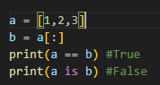

- 복사 관련
  
  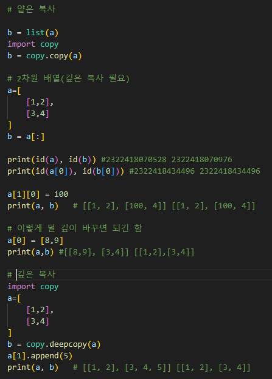

- sum 함수를 사용하여 2차원 배열을 1차원 배열로 바꿀 수 있다(문서 확인하기)

---

## Control of flow

- 제어문: 조건에 따라 코드 블록을 실행하거나 반복적으로 코드를 실행

- 조건문: 조건이 참(True)인 경우에만 코드 블록을 실행하거나 건너뜀
  
  - `if`, `elif`, `else`
  
  - 복수 조건문: 조건식을 동시에 검사하는 것이 아니라 **순차적**으로 비교, 즉 위에것을 걸러내고 밑으로 내려오는 느낌(질문 할 것: 그러면 나올 확률이 높은 것을 위에다가 두면 연산속도가 올라가나요?)
    
    - 다른 언어는 이렇지 않다! and를 써서 조건을 상세화 시켜줘야 함
    
    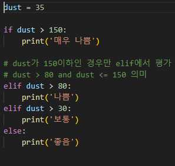

- 반복문: 주어진 코드 블록을 여러 번 반복해서 실행하는 구문
  
  - Style 1: 특정 작업을 반복적으로 수행
  
  - Style 2: 주어진 조건이 참인 동안 반복적으로 수행
  
  - `for` (Style 1에 해당)
      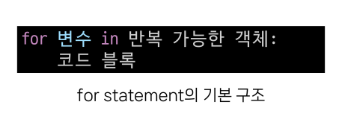
    
    - 반복 가능한 객체(iterable) :시퀀스 객체 뿐만 아니라 set,dict 등도 해당
    
    - 인덱스로 리스트 순회
      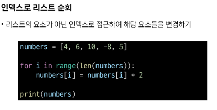
    
    - 중첩된 반복문: 아래 반복문이 다 끝나야 윗 반복문으로 올라간다.(이걸 잘 다룰 줄 알아야 합니다!)
      ex)
      
      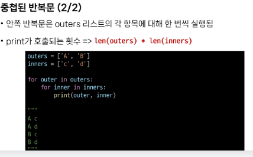
    
    - 중첩 리스트 순회(IM시험에서 요구되는 능력)
      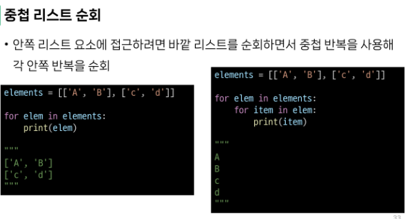
  
  - `while` (Style 2에 해당)
    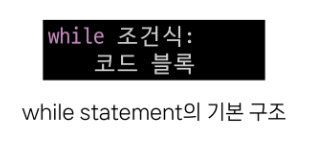
    주어진 조건식이 **거짓(False)** 이 될 때 까지 반복(그래서 반드시 종료조건을 넣어줘야 함)
    
    - (for문이 할 수 없는) 사용자 입력에 따른 반복 가능
      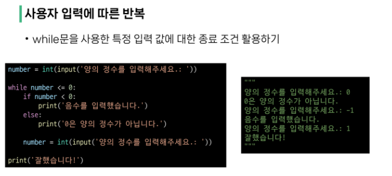
  
  - 적절한 반복문 활용하기
    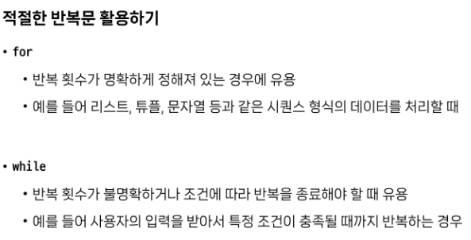

- 반복 제어
  
  - for문과 while은 매 반복마다 본문 내 모든 코드를 실행하지만 때때로 일부만 실행하는 것이 필요할 때가 있음
  
  - `break`(반복을 즉시 중지), `continue`(밑으로 내려가지 않고 다음 반복으로 건너뜀)
  
  - 주의사항
    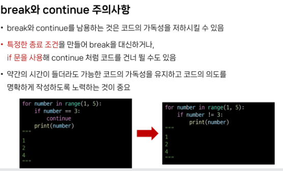

- List Comprehension
  
  - 간결하고 효율적인 리스트 생성 방법(하지만 더 가독성이 좋은 것은 아님.....)(좋은 코드란 내가 만든 것의 의도를 쉽게 파악할 수 있는 것이므로 별로 추천은 안 함(단 알고는 있을 것))
  
  - 구조
    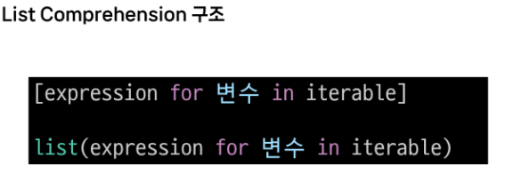
  
  - ex
    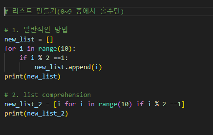
    
    if는 바로 뒤에 붙어주면 됩니다. 
    
    else는 또 다르게 됨(찾아보든지)
    
    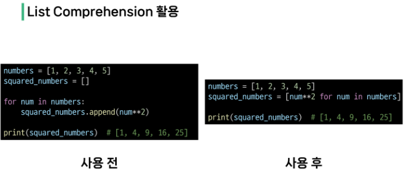
  
  - cf)
    
    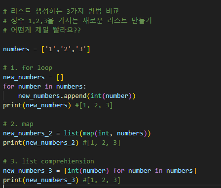

- pass: 아무런 동작도 수행하지 않고 넘어가는 역할
  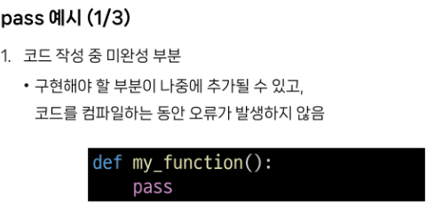
  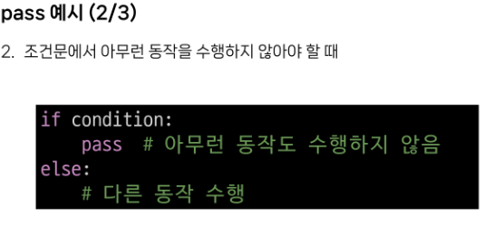
  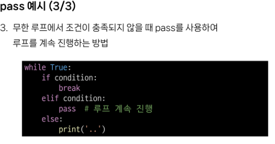

- enumerate : iterable 객체의 각 요소에 대해 인덱스와 함께 반환하는 내장함수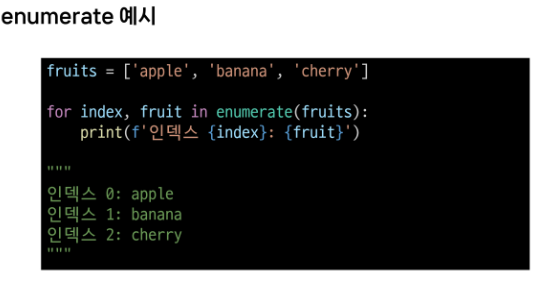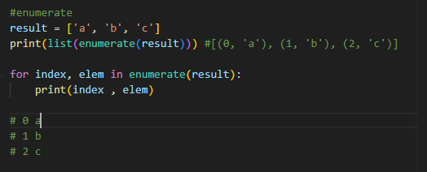
