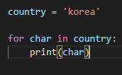
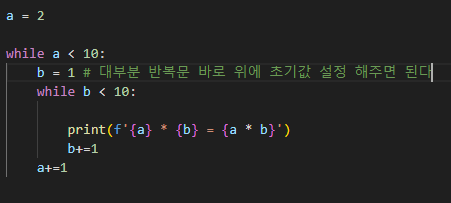
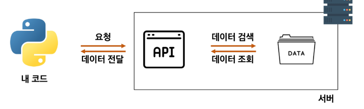
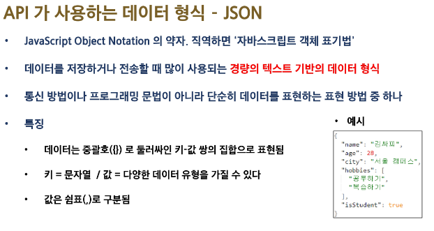
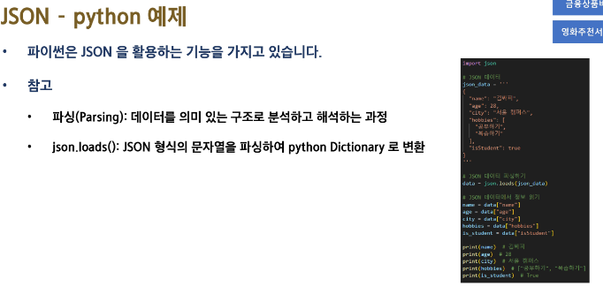

# 0721 TIL

## 잡다한 것

- Json.load()함수로 문자열을 딕셔너리 형태로 바꿀 수있다.

- 오늘 다시보기 다시보기

- 수정 안하고 읽기만 할 것이면 리스트로 변환 안 해도 된다.
  

- while문을 사용한 구구단
  

- 크롬 확장
  

---

## 관통 프로젝트

- 클라이어트가 서버에 요청하는 두 가지 방법
  
  - 웹 브라우저를 켜서 주소창에 주소를 입력
  
  - 서버에 정보를 요청하는 파이썬 코드를 작성(requset**s**)

- **파이썬 코드 파악**
  
  - `url`: 요청을 보내는 서버의 주소
  
  - `requests.get(url)` : 해당 서버(url)에 데이터를 달라고 요청을 보내는 함수
  
  - `.json()` :
    
    - 내부의 데이터를 JSON(파이썬의 딕셔너리와 비슷함) 형태로 변환해주는 함수

- API
  
  - 클라이언트가 서버에게 요청하는 방식이 여러가지가 있는데 그 방식마다 번역기를 만드는 것은 비효율적이라서 API를 만듬
  
  - 클라이언트가 원하는 기능을 수행하기 위해서 서버 측에 만들어 놓은 프로그램
  
  - 서버 측에 특정 주소로 요청이 오면 정해진 기능을 수행하는 API를 미리 만들어 둡니다.
    
    - 클라이언트는 서버가 미리 만들어 놓은 주소로 요청을 보냅니다.
  
  
  
  - 정보를 수집하기 위해서는 2가지를 찾아야 합니다.
    
    - 정보를 가지고 있는 서버 - 유료일지도???
    
    - 해당 서버가 제공하는 API
  
  - 오픈 API
    
    - 외부에서 사용할 수 있도록 무료로 개방된 API
    
    - 사용법은 공식 문서(Docs)에 명시
  
  - 오픈 API 특징 및 주의사항
    
    - 너무 많은 계정에서 동시에 요청을 보내면 서버가 견디지 못함
    
    - 이러한 문제점을 해결하기 위해 오픈 API는 API KEY를 활용하여 사용자를 확인
      
      - 서버에 요청할 때 마다 해당 API KEY를 보내 정상적인 사용자인 것을 확인 받음
    
    - 이번엔 한 개의 API KEY로 한꺼번에 엄청난 요청을 보내도 서버가 견디지 못함
    
    - 일부 오픈 API는 사용량이 제한되어 있습니다.
      
      - 공식 문서의 일일 및 뭘간 사용량(할당량) 제한을 반드시 확인할 것
      
      - 사용량 초과시 요금이 청구 될 수도 있다
  
  - API가 사용하는 데이터 형식 - JSON
    
    
    
    dict와 다른 점: 하나의 데이터가 아닌 여러개의 데이터가 있다면 딕셔너리`{}`를 리스트`[]`로 묶여서 옴
  
  - ex
    
    
    문자열일 때 Json_data에서 age만 가져오고 싶으면 어떻게? (`json_data['age']`로 가져올 수 없다, 문자열이라서, 그나마 한다면 슬라이싱 정도?(너무 힘들 듯))
    
    (`data=json.loads(json_data)`을 해줘서 파싱을 해줌(dict형태로 바꿔줌))
    
    파싱: 원하는 형태(dict)로 변환하는 느낌
