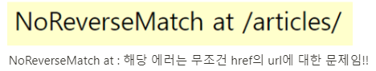
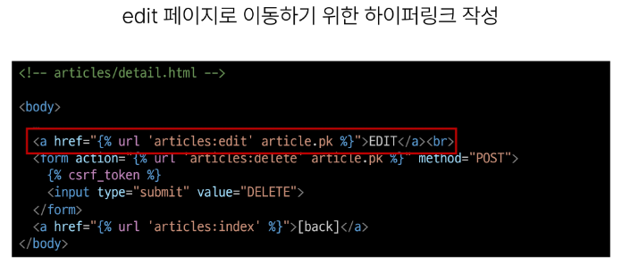

# 0925_TIL

## 잡다한 것

- form 태그의 action: 목적지

- 에러 잡기
  

- 4xx: 클라이언트가 잘못, 5xx: 서버가 잘못, 2xx: 성공적 응답
  

- 흐름
  

---

## Django ORM with view

- Django shell에서 연습했던 QuerySet API를 직접 view 함수에서 사용하기

### Read

- 2가지 조회 진행
  
  1. 전체 게시글 조회
  
  2. 단일 게시글 조회

- 전체 게시글 조회
  
  

- 단일 게시글 조회
  

- 단일 게시글 페이지 링크 작성
  
  
  

### Create

- new 기능 구현
  
  
  

- create 기능 구현
  
  
  

### HTTP request methods

- method: 행동

- HTTP
  
  - 네트워크 상에서 데이터를 주고 받기위한 약속

- HTTP request methods
  
  - 데이터(리소스)에 어떤 요청(행동)을 원하는지를 나타내는 것
    

- 'GET' Method
  

- 'POST' Method
  
  
  - POST method 적용
    
    

- GET -> R, POST -> CUD

- HTTP response status code
  

- 403 Forbidden
  
  
  

- CSRF
  

- CSRF Token 적용
  

- 요청 시 CSRF Token을 함께 보내야 하는 이유
  
  똑같이 생긴 사이트에 속아서 홀라당~,  인증된 사이트에서 요청이 왔는지 확인을 하도록 함 (토큰 심어줌) (토큰이 있으면 내가 만든 사이트에서 잘 보낸거구나를 확정을 지음, 토큰이 없으니 내가 만든 사이트에서 보낸거구나로 판단)
  
  

#### redirect

- redirect()
  
  - 클라이언트가 인자에 작성된 주소로 다시 요청을 보내도록 하는 함수

- redirect() 함수 적용
  

- redirect 특징
  

### Delete

- Delete 기능 구현
  
  

### Update

- C와 U는 유사(단 U는 수정하는 느낌이라 값이 저장?? 되어있는 부분이 좀 다름)

- edit 기능 구현
  
  
  
  

- update 기능 구현
  
  

### 참고

