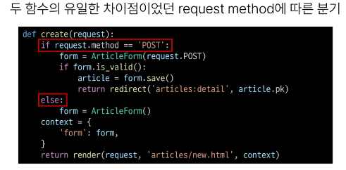

# 0926 TIL

## 잡다한 것

## Django Form

### 개요

- 유효성 검사
  
  - 수집한 데이터가 정확하고 유효한지 확인하는 과정

- 유효성 검사 구현
  

### Django Form

#### Form Class

- Django Form?
  
  - 사용자 입력 데이터를 수집하고, 처리 및 유효성 검사를 수행하기 위한 도구
  
  - 유효성 검사를 단순화 하고 자동화 할 수 있는 기능을 제공
  
  - 즉, 개발자는 자잘한 유효성 검사에 대해 신경 쓸 필요없이 그냥 요청만 잘 받고, 처리만 잘하면 된다.
  
  - Form class에 몇 천줄짜리 기능이 들어가 있다.

- Form class 정의
  
  

- Form class를 적용한 new 로직
  
  
  
  
  왼쪽에 표기된 것들이 name속성에 들어가 있다.
  

- Form rendering options
  
  

#### Widgets

- Widgets란?
  
  - HTML 'input' element의 표현을 담당

### Django ModelForm

- ModelForm이 등장한 이유
  
  - 반복되는 것(중복) 줄일려고
    
    - model과 form 유사한 부분이 많음
  
  - model과 유사한 form -> 반복을 줄일려고 ModelForm이 나옴
  
  - modelform은 form과 기본적인 역할은 똑같다.
  
  - 다만, model 기반으로한 form이기 때문에 어떤 몇개의 필드를 사용자로 부터 입력 받는지를 이미 알고 있어서 재정의를 안해도 되도록 해줌

- 그렇다고 Form을 안 쓰는 것은 아님(아래)(DB 저장 유무에 따라)
  
  

- ModelForm?
  
  - Model과 연결된 Form을 자동으로 생성해주는 기능을 제공
    
    - Form + Model

메타 데이터는 어떠한 데이터에 대한 데이터이다.(여기서는 Article에 대한 데이터인 것)
(~~이거 만든 사람이 그냥 Meta라고 지은 것~~)
등록된 모델 클래스를 알아서 렌더링 해석하고  field 생성해

- Meta class
  
  - ModelForm의 정보를 작성하는 곳

- 빈 값 허용은 기본적으로 하지 않고, Max_length 같은것도 검사함

### 참고

맨 앞에는 키워드 인자를 쓰지 않아도 됨(위치인자 생각하면 됨)

- Widget 응용
  
  

### Handling HTTP requests

#### view 함수 구조 변화

- new&create 함수 결합
  

- 새로운 create view 함수
  
  
  
  
  

- 기존 new 관련 코드 수정
  
  
  

- 기존 edit 관련 코드 수정
  
  
