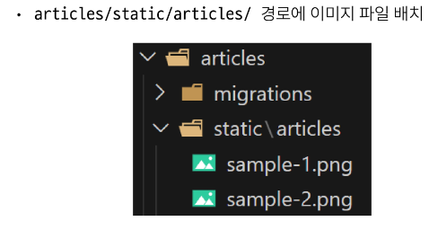

# 0927 TIL

## 잡다한 것

- 참고(공식문서)
  [How to manage static files (e.g. images, JavaScript, CSS) | Django documentation | Django](https://docs.djangoproject.com/en/4.2/howto/static-files/#serving-files-uploaded-by-a-user-during-development)

- 데이터베이스에 왜 이미지 파일 덩어리가 저장되지 않고 경로가 저장되나요???
  
  1. 성능 및 DB 최적화
     
     - 직접 파일을 저장하면 DB 크기가 급격하게 증가
       
       - 성능이 저하
       
       - 파일 자체는 파일 시스템에 별도로 저장
       
       - DB에는 그 파일에 대한 문자열 경로만
  
  2. 유지 보수 관점
     
     - 만약 db에 직접 파일을 저장해버리면 파일을 변경하거나 업데이트 할 때 직접 조작해야 함
       
       - 그런데 db에 경로만 저장되어 있다면 파일시스템에서만 파일을 수정하면 됨
  
  3. 등등등..

- 테이블에 들어가는 것은 텍스트 데이터의 형태만 들어간다.(db가 기하급수적으로 커지는 것을 방지)

## Django Static files

### Static files

- static files(정적 파일)이란?
  
  - 서버 측에서 변경되지 않고 고정적으로 제공되는 파일(이미지, JS, CSS 파일 등)

- 웹 서버와 정적 파일
  
  

#### static files 제공하기

1. 기본 경로에서 제공하기

2. 추가 경로에서 제공하기
- Static files 기본 경로
  app폴더/static/
  
  - 그래서 이후의 static 경로를 가져올 때 template처럼 이 이후의 경로를 작성해주면 된다.

- 기본 경로 static file 제공하기
  
  
  
  - static은 built in이 아니라서 load를 해줘야 된다.
  
  
  
  - 온라인상에 URL 주소(static 파일을 제공하기 위한 URL)가 존재해야 된다.(static이 그 역할을 해줌)

- STATIC_URL
  
  - 기본 경로 및 추가 경로에 위치한 정적 파일을 참조하기 위한 URL 실제 파일이나 디렉토리가 아니며, URL로만 존재
    
    
    

- Static files 추가 경로
  
  - STATICFILES_DIRS에 문자열 값으로 추가 경로 설정

- STATICFILES_DIRS
  
  - 정적 파일의 기본 경로 외에 추가적인 경로 목록을 정의하는 리스트

- 추가경로 static file 제공하기
  
  
  
  
  

### Media files

- Media Files?
  
  - 아까는 같은 이미지 파일인데 static 파일이라고 하고 이번에는 왜 media 파일??
    
    - Media 파일은 큰 범주 내에서는 정적 파일이라는 범주 내에 포함되지만, 거기에 특정한 조건이 붙는다.(조건: 서버가 미리 준비한 파일이 아니라 사용자가 업로드하는 정적 파일이다.)
  
  - 사용자가 웹에서 업로드하는 정적 파일
    (user-uploaded)
  
  - Static 파일이 Media 파일보다 큰 범주이다.

#### 이미지 업로드

- 기존 필드에는 이미지 업로드를 할 수 있는 필드가 없다.(model field)

- 필드 하나가 더 필요하다!!

- 미디어 파일을 제공하기 전 준비
  

- MEDIA_ROOT
  
  - 미디어 파일들이 위치하는 디렉토리의 절대 경로
    

- MEDIA_URL
  
  - MEDIA_ROOT에서 제공되는 미디어 파일에 대한 주소를 생성
    (STATIC_URL과 동일한 역할)
    

- 이미지 업로드
  
  
  
  

#### 업로드 이미지 제공

- 업로드 이미지 제공하기
  
  
  

- 업로드 이미지 수정
  

### 참고

