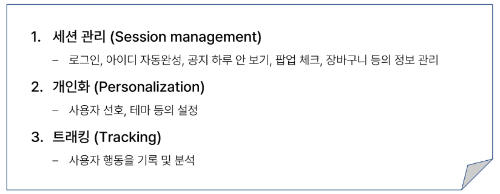
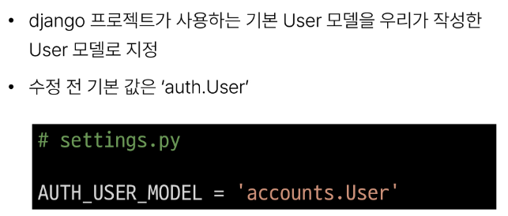

# 1004_TIL

## 잡다한 것

---

## Django Authentication System 1

### Cookie & Session

#### 개요

- 우리가 서버로부터 받는 페이지를 둘러볼 때 **우리는 서버와 서로 연결되어 있는 상태가 아니다.**

- HTTP?
  
  - HTML 문서와 같은 리소스들을 가져올 수 있도록 해주는 규약
  
  - 웹(WWW)에서 이루어지는 모든 데이터 교환의 기초

- HTTP 특징
  

- 상태가 없다는 것은..
  

- 쿠키
  
  - **서버**가 사용자의 웹 브라우저에 전송하는 작은 데이터 조각
    
    - 클라이언트 측에서 저장되는 작은 데이터 파일이며, 사용자 인증, 추적, 상태 유지 등에 사용되는 데이터 저장 방식

- 쿠키 사용 예
  

- 쿠키 사용 원리
  

- 쿠키를 이용한 장바구니 예시
  
  
  
  
  
  만약에 호박고구마를 담았다면, 쿠팡서버로 부터 쿠키를 받는다. (쿠키에는 장바구니에 호박고구마가 담겨있다라는 정보가 담겨있다.)
  그리고 그 쿠키를 매 요청마다 계속 보낸다.

- 쿠키 사용 목적
  

- 세션(Session)
  
  - 쿠키 중에서도 상태를 유지하기 위한 목적을 가진 쿠키를 세션이라고 한다.
  
  - 상태 관리를 서버가 하는 것임
  
  - 서버 측에서 생성되어 클라이언트와 서버 간의 **상태를 유지**
  
  - 상태 정보를 저장하는 데이터 저장 방식
    
    - 쿠키에 세션 데이터를 저장하여 매 요청시마다 세션 데이터를 함께 보냄

- 세션 작동 원리
  

- 서버 측에서는 세션 데이터를 생성 후 DB에 저장하고 세션 ID를 생성
  이 ID를 클라이언트 측으로 전달하여, 클라이언트는 쿠키에 이 ID를 저장

- 서버로부터 쿠키를 받아 브라우저에 저장하고, 클라이언트가 같은 서버에 재요청 시마다 저장해 두었던 쿠키도 요청과 함께 전송
  
  - 예를 들어 로그인 상태 유지를 위해 로그인 되어있다는 사실을 입증하는 데이터를 매 요청마다 계속해서 보내는 것

- 쿠키와 세션의 목적
  
  - 서버와 클라이언트 간의 **상태를 유지**

#### 참고

### Authentication System

- Django Authentication System(인증 시스템)
  
  - 사용자 인증과 관련된 기능을 모아 놓은 시스템

- Authentication(인증)
  
  - 사용자가 자신이 누구인지 확인하는 것(신원 확인)

- 사전 준비
  
  현재까진 articles라는 앱이용(목적: 게시판에 대한 기능), 이제부턴 회원에 대한 기능이 필요, 물론 articles에서 해도 되지만 app을 나누는 기준이 기능단위이므로..., 지금 만들 것은 게시판과는 거리가 있으므로 두번째 앱인 accounts 생성할 것임.

### Custom User model

- 기본적으로 제공하는 User model을 Custom User model로 대체하기

- 내장된 auth 앱
  

- User 클래스를 대체하는 이유
  

- 대체하기
  
  
  
  
  
  
  
  공식문서(위)
  
  

- 사용자 User 테이블의 변화
  

- 프로젝트를 시작하며 **반드시** User 모델을 대체해야 한다.
  

### Login

- Login?
  
  - Session을 Create하는 과정

이전에는 form를 직접 만들었는데 이번 인증 시스템에서 사용하는 form들은 built-in form들을 가져다가 쓸 것이다.

로그인에 사용되는 데이터는 인증만 있으면 되므로 DB 저장이 필요없으므로 ModelForm이 아닌 Form이다.(단, 회원가입은 ModelForm임)

- 로그인 페이지 작성
  
  

- 로그인 로직 작성
  

- 세션 데이터 확인하기
  
  

- 로그인 링크 작성
  

### Logout

- Logout?
  
  - Session을 Delete하는 과정

- 로그아웃 로직 작성
  
  

### Template with Authentication data

- Template with Authentication data?
  
  - 템플릿에서 인증 관련 데이터를 출력하는 방법

- 현재 로그인 되어있는 유저 정보 출력하기
  

- context processors
  

#### 참고

