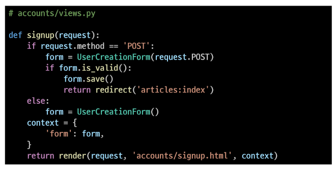
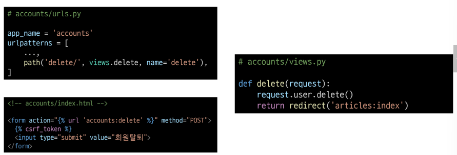
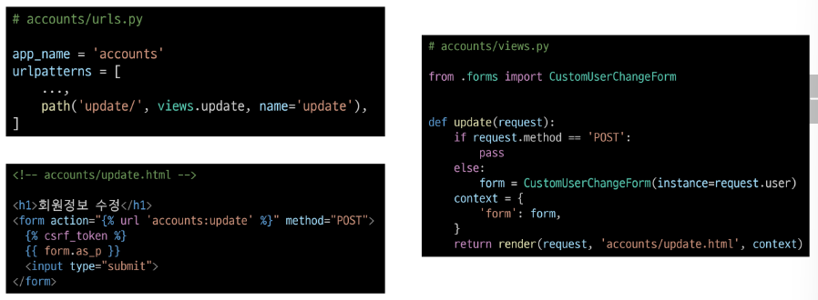
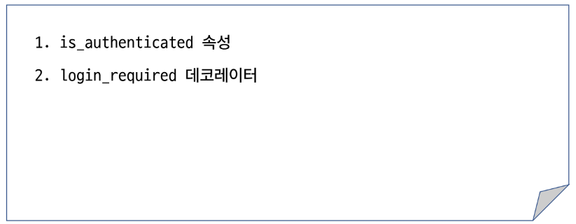
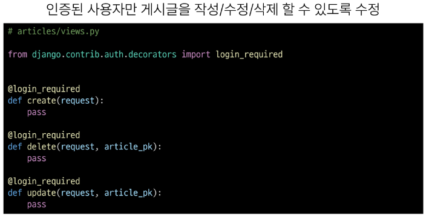

# 1005 TIL

## 잡다한 것

## Django Authentication System 2

### 회원 가입

- 회원가입
  
  - User 객체를 Create하는 과정

- 회원 가입 페이지 작성
  
  

- 회원 가입 로직 작성
  

- 회원 가입 로직 에러
  
  - modelform이다 보니깐 어떠한 모델에 연결이 되어있다는 것을 의미하고, 클래스 meta쪽에 과거에 썻던 과거의 유저클래스가 등록이 되어있어서 오류 발생
  
  - 해결법: 기존의 상속 받던 부분에서 meta속의 model등록 된것만 바꾸면 되므로
    기존의 폼을 다시 상속 받고 해당하는 부분만 바꾸면 된다.
    
    
    
    
    - 해진
      

- 회원 가입 로직 작성
  
  
  
  

- User 모델을 직접 참조하지 않는 이유
  
  
  - 자동으로 반환해줘서 유지보수에도 GOOD
    - 이렇게 안하면 중간에 클래스 이름 등 변경사항 발생 시 관련된 모든 코드에 찾아가 일일히 수정필요.

- 회원 가입 로직 작성
  

### 회원 탈퇴

- 회원 탈퇴
  
  - User 객체를 Delete 하는 과정

- 회원 탈퇴 로직 작성
  
  
  

### 회원정보 수정

- 회원정보 수정
  
  - User 객체를 Update 하는 과정

- 회원정보 수정 페이지 작성
  
  
  

- UserChangeForm 사용 시 문제점
  
  

- CustomUserChangeForm 출력 필드 재정의
  
  

- 회원정보 수정 로직 작성
  

### 비밀번호 변경

- 비밀번호 변경
  
  - 인증된 사용자의 Session 데이터를 Update 하는 과정

왜 ModelForm이 아니고 Form이지?? 사용자의 기존의 Session 데이터를 갱신
즉, 사용자가 입력한 데이터를 그대로 저장하는 과정이 아닌 사용자가 입력한 데이터를 암호화를 거쳐서 그 결과물 하나만 db에 들어가 인증수단으로 함으로써 사용자의 입력 데이터가 직접적으로 db에 들어가지 않으므로

- 비밀번호 변경 페이지 작성
  
  
  

- 비밀번호 변경 로직 작성
  
  

#### 세션 무효화 방지하기

- 암호 변경 시 세션 무효화
  - 비밀번호 변경은 Session 데이터가 갱신되는 과정이라서 session 데이터는 장고의 db에 있고 이 세션 데이터를 활용하는 키는 브라우저가 쿠키로 가지고 있어서 이 키와 기존에 있던 session 데이터가 일치해야 되는데 비밀번호가 변경됨으로써 사용자의 인증정보가 다 변경이 되어 session 데이터도 새로 만들게 됨, 그럼 브라우저 입장에서 기존에 가지고 있던 session 키가 안 먹히게 되어서 로그아웃 됨

- update_session_auth_hash 적용
  

### 인증된 사용자에 대한 접근 제한

- 로그인 사용자에 대해 접근을 제한하는 2가지 방법
  

- is_authenticated  적용하기
  

- login_required 적용하기
  
  

### 참고

