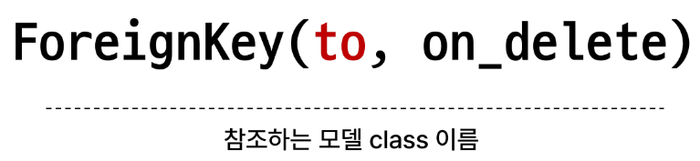
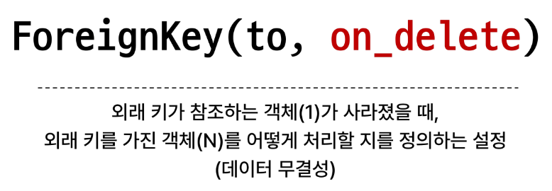

# 1011 TIL

## 잡다한 것

ForeignKey 값이 지워지면 Null로 바뀌는 속성도 있다.

- 참고
  

## Many to one relationships 1

### 개요

- Many to one relationships(N:1 or 1:N)
  
  - 한 테이블의 0개 이상의 레코드가 다른 테이블의 레코드 한 개와 관련된 관계

- Comment(N) - Article(1)
  
  - 0개 이상의 댓글은 1개의 게시글에 작성될 수 있다.

- 테이블 관계
  
  
  Comment(댓글)은 몇 번 게시글에 달린 댓글인지가 반드시 데이터로 존재해야 된다.
  N:1 관계에서의 외래키는 N쪽이 들고있다.

### 댓글 모델 구현

- 댓글 모델 정의
  

- on_delete의 'CASCADE'
  
  게시글에 댓글이 작성되어있는데 게시글 작성자가 게시글을 지운다면??
  게시글은 상관이 없지만, 댓글은 문제가 발생
  댓글은 본인이 가지고 있는 외래키 필드에 참조하고 있는 article.pk 정보를 가지고 있는데 그것들이 필요 x해짐 -> 이게 DB에서는 무결성 원칙을 위반하게 되는 것이 된다.(정확한 데이터 참조 불가...)

- Migration
  
  외래키에 대한 클래스 변수명을 소문자 단수형으로 권장한 이유: **저절로 뒤에 _id가 붙어져서 나옴을 알 수 있다.** 그리고 참조하고 있는 모델은 Article인데 만약 ssafy라고 외래키 이름을 정한다?? (그러면 명시적이지 않다...)

#### 댓글 생성 연습

### 관계 모델 참조

- 역참조
  
  - N:1 관계에서 1에서 N을 참조하거나 조회하는 것
    
    - 1-> N
  
  
  
  역참조 어려운 이유: 게시글에는 댓글에 대한 정보가 없다.

- 역참조 사용 예시
  
  

- related manager 이름 규칙
  
  

- Related manager 연습
  
  

### 댓글 구현

#### 댓글 CREATE

- 댓글 CREATE 구현
  
  
  
  
  
  
  
  
  
  
  
  
  
  

#### 댓글 READ

- 댓글 READ 구현
  
  

#### 댓글 DELETE

- 댓글 DELETE 구현
  
  
  
  

#### 참고

