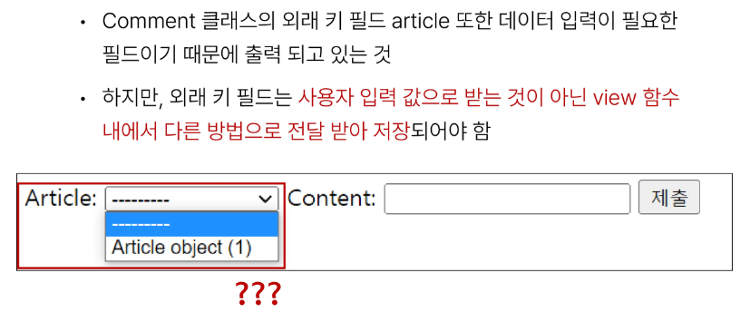

# 1011 TIL

## 잡다한 것

## Many to one relationships 1

### 개요

- Many to one relationships(N:1 or 1:N)
  
  - 한 테이블의 0개 이상의 레코드가 다른 테이블의 레코드 한 개와 관련된 관계

- Comment(N) - Article(1)
  
  - 0개 이상의 댓글은 1개의 게시글에 작성될 수 있다.

- 테이블 관계
  

### 댓글 모델 구현

- 댓글 모델 정의
  

- on_delete의 'CASCADE'
  

- Migration
  

#### 댓글 생성 연습

### 관계 모델 참조

- 역참조
  
  - N:1 관계에서 1에서 N을 참조하거나 조회하는 것
    
    - 1-> N
  
  

- 역참조 사용 예시
  

- related manager 이름 규칙
  

- Related manager 연습
  
  

### 댓글 구현

#### 댓글 CREATE

- 댓글 CREATE 구현
  
  
  
  
  
  
  
  
  
  

#### 댓글 READ

- 댓글 READ 구현
  
  

#### 댓글 DELETE

- 댓글 DELETE 구현
  
  
  
  

#### 참고

