# 1012 TIL

## 잡다한 것

- 장고는 User모델에 대한 직접 참조를 싫어한다.
  
  - User 모델은 대체된 상태이고 현재 활성화 된 모델이 하나라서 문제는 없지만 이후에, 이 User모델이 커스텀 모델로 이름이 변경되거나 잠시 비활성화 되고 활성화 된다거나, 즉! User 모델에 대해서 변경사항이 생겼을 때 우리가 User를 직접 참조한 코드들을 다 찾아가서 변경해줘야 되는 문제가 생김
  
  - 그래서 User에 대한 변경사항이 생겨도 활성화된 User 모델을 자동으로 추적해서 리턴해주는 함수를 이용(get_user_model())

- 장고 코딩 스타일
  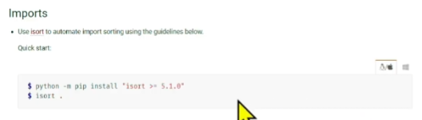
  알아서 import 순서 정렬해줌

- ERD (개체-관계 모델)

---

## Many to one relationships 2

### 개요

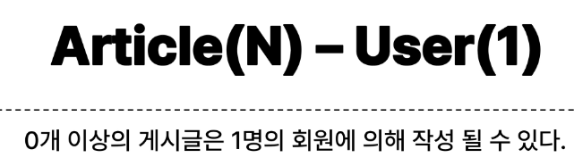

### Article & User

#### 모델 관계 설정

- Article-User 모델 관계 설정
  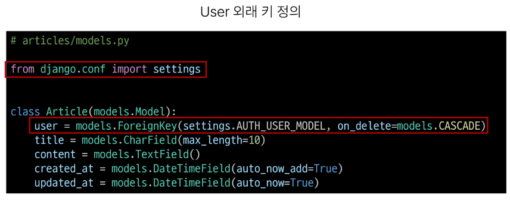

- User 모델을 참조하는 2가지 방법
  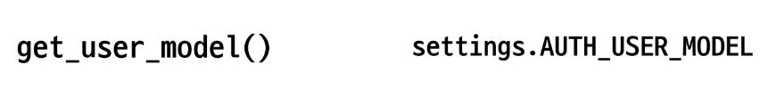
  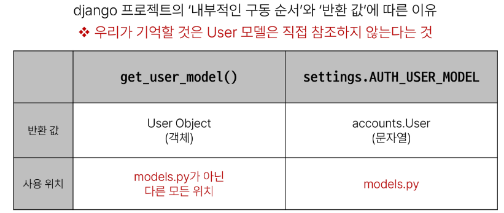
  왜 이렇게 나뉠까??
  runserver을 할 때 많은 과정들이 있는데(점차적), models.py가 구동이 될 때 User 객체가 아직 장고에 존재하지 않을 수 있다. 
  즉, models.py 구동 속도가 꽤 빨라서 임의로 문자열로 참조하는 것이 필요

- Migration
  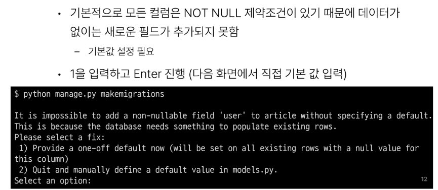
  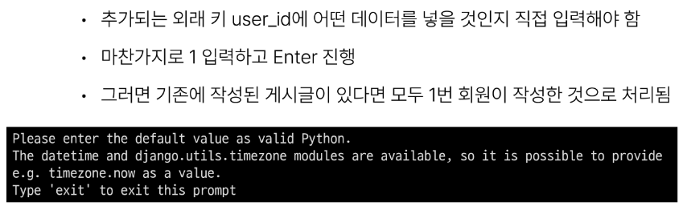
  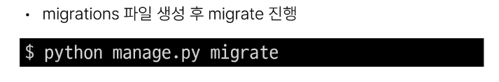
  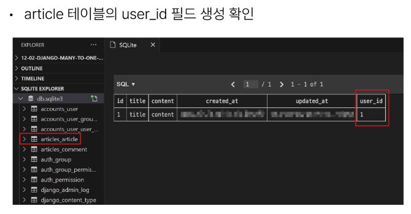

#### 게시글 CREATE

- 게시글 CREATE
  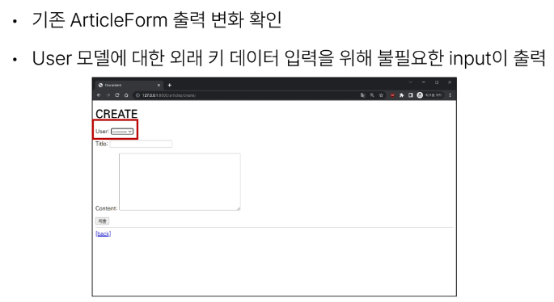
  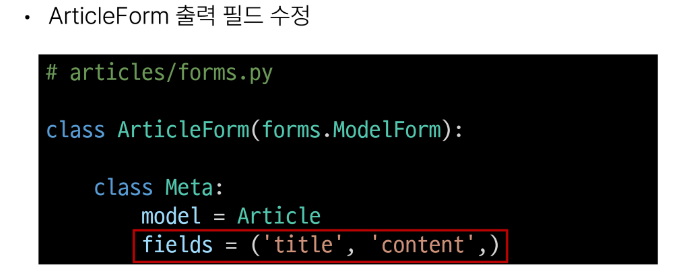
  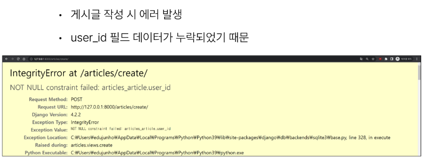
  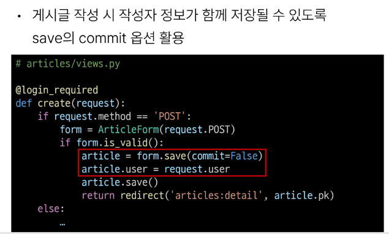
  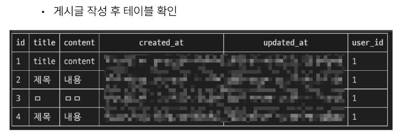

#### 게시글 READ

- 게시글 READ
  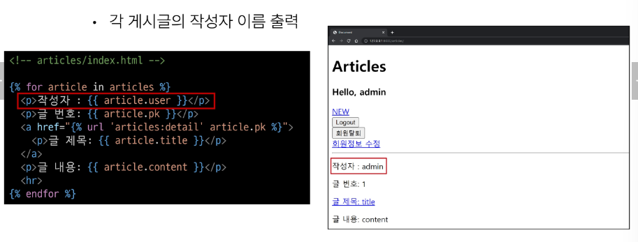
  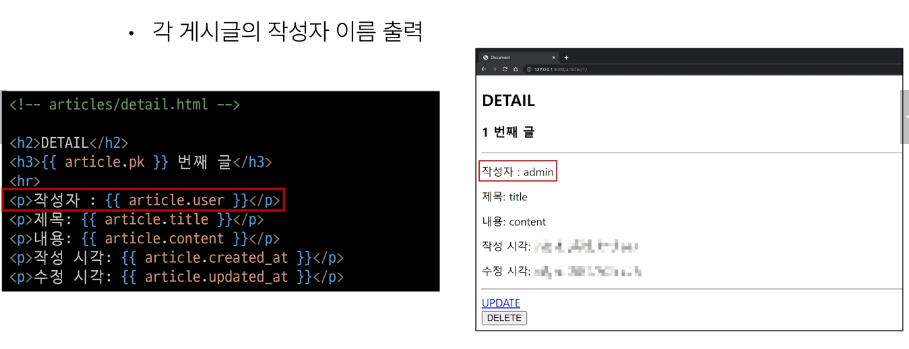

#### 게시글 UPDATE

- 게시글 UPDATE
  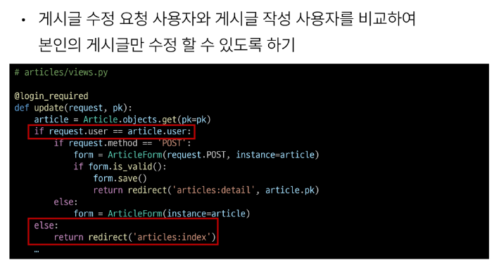
  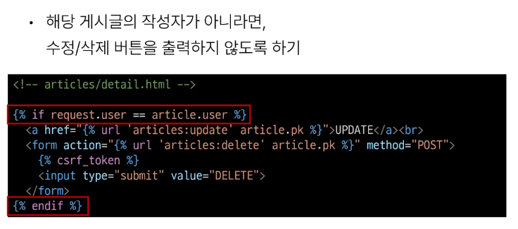

#### 게시글 DELETE

- 게시글 DELETE
  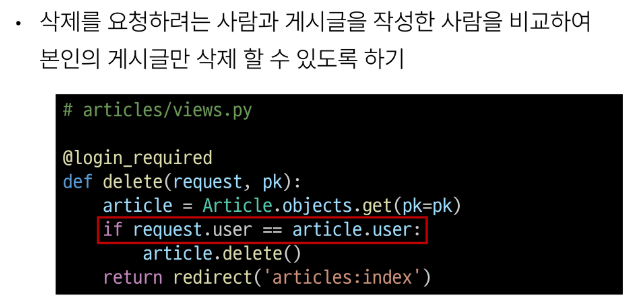

### Comment & User

#### 모델 관계 설정

- Comment-User 모델 관계 설정
  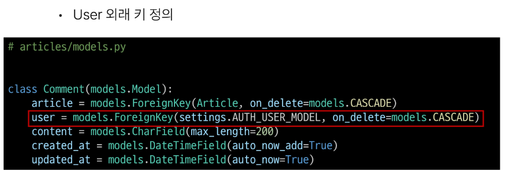

- Migration
  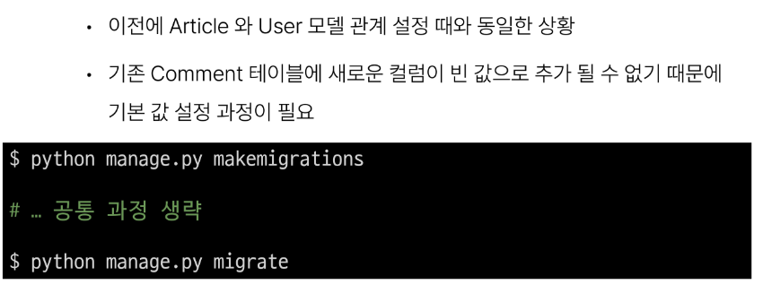
  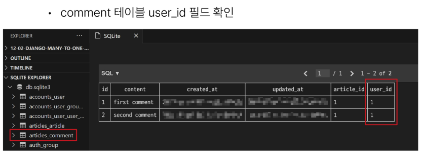

#### 댓글 CREATE

- 댓글 CREATE
  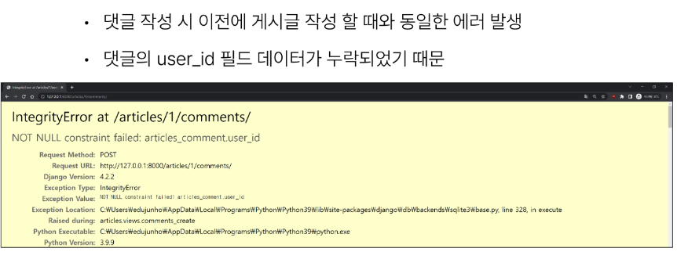
  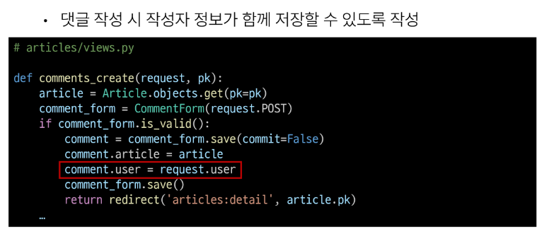
  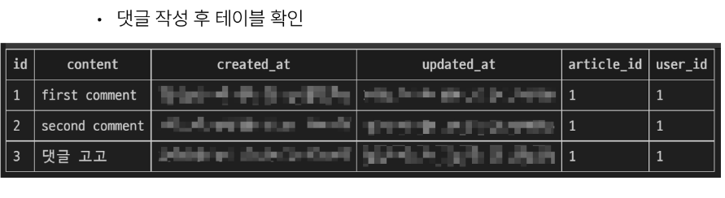

#### 댓글 READ

- 댓글 READ
  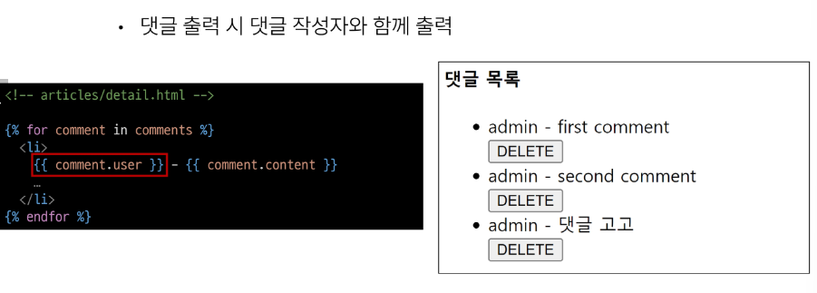

#### 댓글 DELETE

- 댓글 DELETE
  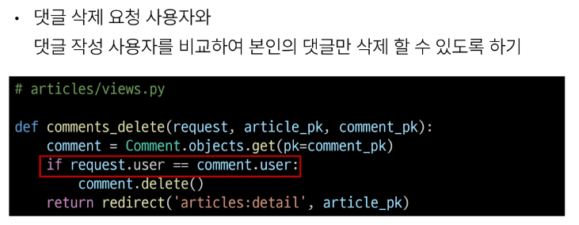
  

#### 참고

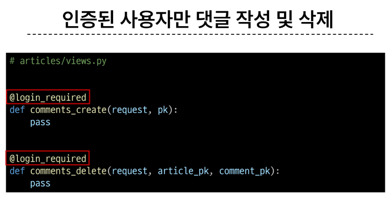
