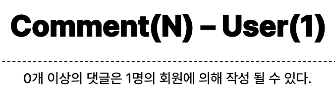

# 1012 TIL

## 잡다한 것

## Many to one relationships 2

### 개요

### Article & User

#### 모델 관계 설정

- Article-User 모델 관계 설정
  

- User 모델을 참조하는 2가지 방법
  
  

- Migration
  
  
  
  

#### 게시글 CREATE

- 게시글 CREATE
  
  
  
  
  

#### 게시글 READ

- 게시글 READ
  
  

#### 게시글 UPDATE

- 게시글 UPDATE
  
  

#### 게시글 DELETE

- 게시글 DELETE
  

### Comment & User

#### 모델 관계 설정

- Comment-User 모델 관계 설정
  

- Migration
  
  

#### 댓글 CREATE

- 댓글 CREATE
  
  
  

#### 댓글 READ

- 댓글 READ
  

#### 댓글 DELETE

- 댓글 DELETE
  
  

#### 참고

