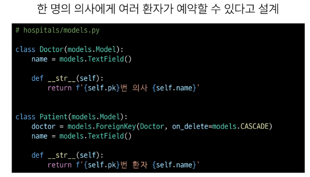
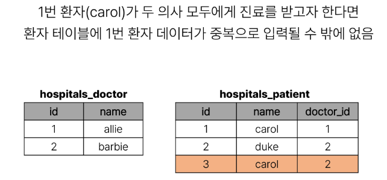
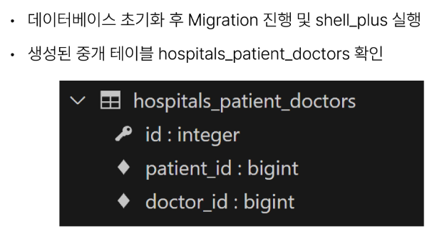

# 1016 TIL

## 잡다한 것

- 역 참조의 정의: 1에서 N을 참조하는 것이 역참조가 아니라, 본인을 참조하고 있는 외래키를 가진 애를 참조하는 것이다!!

- ERD를 보면
  

## Many to many relationships 1

### Many to many relationships

- Many to many relationships(N:M or M:N)
  
  - 한 테이블의 0개 이상의 레코드가 다른 테이블의 0개 이상의 레코드와 관련된 경우
    
    - **양쪽 모두에서 N:1 관계를 가짐**

- M:N 관계의 역할과 필요성 이해하기
  

#### N:1의 한계

- 의사와 환자 간 모델 관계 설정
  
- 의사와 환자 데이터 생성
  
- N:1의 한계 상황
  
  
  
  - 지금은 예약이라는 내용을 환자 쪽의 외래키로 설정하고자 했는데, 문제가 발생하므로 그냥 환자쪽에는 환자만 넣고, 의사쪽에는 의사만 넣은 뒤 예약에 대한 정보는 3번째 테이블에 넣자!

#### 중개 모델

- 예약 모델 생성
  

- 예약 데이터 생성
  

- 예약 정보 조회
  

- 추가 예약 생성
  

- 예약 정보 조회
  
  
  - 예약을 만들어내는 주체가 의사도 환자도 아닌 예약이라는 클래스...(코드 구성상)
    
    - 우리는 객체 지향적인 코드를 작성 중이다. 의사 인스턴스와 환자 인스턴스가 조금 더 주도적으로 예약을 형성하도록 했으면 좋겠다.
    
    - 그래서 아래를 이용

- **Django에서는 'ManyToManyField'로 중개모델을 자동으로 생성**

#### ManyToManyField

- Django ManyToManyField
  
  
  - 보면 N:1 관계에서는 참조대상의 소문자 단수형을 썻는데 이번엔 참조대상의 소문자 복수형을 쓰고있음을 알 수 있다.(다른 외래키와 구분하기 위해)
    
    
    
    
    
    

- **만약 예약 정보에 증상, 예약일 등 추가 정보가 포함되어야 한다면?**

#### 'through' argument

- 'through' argument
  
  
  
  
  
  

- M:N 관계 주요 사항
  
  
  - 물리적인 변화가 없음=> ManyToManyField를 어디에 생성을 하든 각각의 두 테이블에는  필드가 새로 생성 x

### Django ManyToManyField

- ManyToManyField's Arguments
  

- 'related_name' arguments
  
  
  - 다만, related_name을 설정하면 이전의 명령어는 더 이상 사용 불가

- 'symmetrical' arguments (대칭)
  
  
  
  - 자기 스스로를 다 대 다 관계로 참조할 때 사용
  
  - 팔로우 기능에 이용됨
  
  - 유저모델은 하나이므로 유저와 유저 간의 다 대 다 관계를 만드는 것은 스스로 다 대 다 관계를 형성하는 수 밖에 없다.

- M:N에서의 methods
  

### 좋아요

#### 모델 관계 설정

- Many to many relationships(N:M or M:N)
  
  - 한 테이블의 0개 이상의 레코드가 다른 테이블의 0개 이상의 레코드와 관련된 경우
    
    - **양쪽 모두에서 N : 1관계를 가짐** 

- Article(M) - User(N)
  
  - 0개 이상의 게시글은 0명 이상의 회원과 관련
    
    - 게시글은 회원으로부터 0개 이상의 좋아요를 받을 수 있고, 회원은 0개 이상의 게시글에 좋아요를 누를 수 있음

- 모델 관계 설정(1~2)
  
  

- user.article_set 역참조 매니저 충돌
  
  
  
  - _set이면 주로 N:1에서의 역참조이구나로 판단함, 그래서 N:M에서의 역참조의 이름을 바꿔주는 것을 권장

- 모델 관계 설정(3~4)
  

- User-Article간 사용 가능한 전체 related manager
  
  

#### 좋아요 기능 구현

- 누가(user) / 어디에(article)가 필요할 텐데, 잘 생각해보면 variable routing에는 article만 있으면 된다.
  - 우리는 유저를 별도로 검색한 적이 없다. 좋아요를 누른다는 것은 누군가가 로그인이 되어있다는 것이고 request(요청)객체에 이미 들어가 있다.

