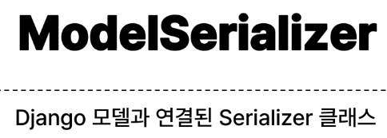

# 1018 TIL

## 잡다한 것

## Django REST framework1

### REST API

- API
  
  - 애플리케이션과 프로그래밍으로 소통하는 방법
    
    - 클라이언트-서버처럼 서로 다른 프로그램에서 요청과 응답을 받을 수 있도록 만든 체계

- API란
  

- Web API
  

- REST(Representational State Transfer)
  
  - API Server를 개발하기 위한 일종의 소프트웨어 설계 방법론
    
    - "약속(규칙X)"

- RESTful API
  

- REST API
  
  - REST라는 설계 디자인 약속을 지켜 구현한 API

- REST API 실제 예시
  

- REST에서 자원을 정의하고 주소를 지정하는 방법
  

#### 자원의 식별

- URI(Uniform Resource Identifier) (통합 자원 식별자)
  
  - 인터넷에서 리소스(자원)를 식별하는 문자열
    
    - 가장 일반적인 URI는 웹 주소로 알려진 URL

- URL(Uniform Resource Locator) (통합 자원 위치)
  
  - 웹에서 주어진 리소스의 주소
    
    - 네트워크 상에 리소스가 어디 있는지를 알려주기 위한 약속
  
  

- Schema(or Protocol)
  

- Domain Name
  

- Port
  

- Path
  

- Parameters
  

- Anchor
  

#### 자원의 행위

- HTTP Request Methods
  
  - 리소스에 대한 행위(수행하고자 하는 동작)를 정의
    
    - HTTP verbs 라고도 함

- 대표 HTTP Request Methods
  

- HTTP response status codes
  
  - 특정 HTTP 요청이 성공적으로 완료되었는지 여부를 나타냄

- HTTP response status codes
  

#### 자원의 표현

- 그동안 서버가 응답(자원을 표현)했던 것
  

- 응답 데이터 타입의 변화
  
  
  
  

#### 사전준비

- 사전준비
  
  

- python으로 json 응답 받기
  

### DRF

- Django REST framwork(DRF)
  
  - Django에서 Restful API 서버를 쉽게 구축할 수 있도록 도와주는 오픈소스 라이브러리

#### Serialization

- Serialization("직렬화")
  
  - 여러 시스템에서 활용하기 위해 데이터 구조나 객체 상태를 나중에 재구성할 수 있는 포맷으로 변환하는 과정
    
    - 어떠한 언어나 환경에서도 나중에 다시 쉽게 사용할 수 있는 포맥으로 변환하는 과정

- Serialization 예시
  

### DRF with Single Model

#### DRF with Single Model

- 프로젝트 준비
  

- Postman 설치 및 안내
  
  

- Postman 화면 구성
  

- URL과 HTTP requests methods 설계
  

#### GET

- GET-List(1)
  

- GET-List(2~3)
  
  

- 이전 view 함수와의 비교
  

- 'api_view' decorator
  

- GET - Detail
  
  
  

#### POST

- POST
  
  
  
  

#### DELETE

- DELETE
  
  

#### PUT

- PUT
  
  
  

#### 참고

