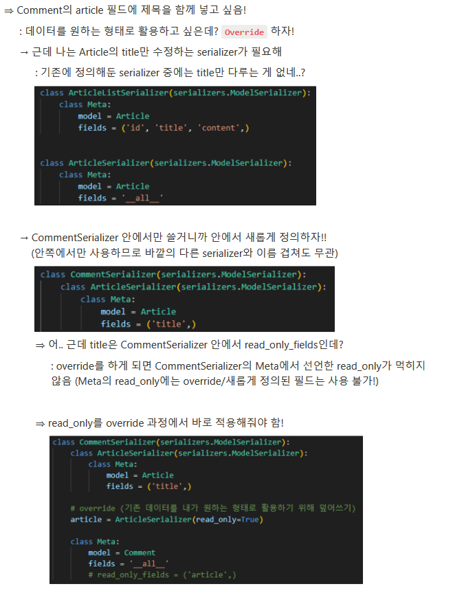

# 1019 TIL

## 잡다한 것

- 참고
  

- 브라우저로 하면 작은 따옴표로 하면 안되고 마지막 것도 `,` 찍으면 안됨

- 일부 데이터 수정 원할 때 필요한 옵션
  
  

- 전체 목록을 조회하기 위해서 Comment(댓글)라고 하는 데이터를 json 데이터로 보내줘야 되는데, 우리가 이  Comment를 조회했을 때 쿼리셋으로 데이터가 올 것이다. 그런데, 이 쿼리셋을 그래로 json으로 변경 불가. 그렇게 때문에 이것을 json이건 다른 데이터 타입이건 유연하게 다른 데이터 타입으로, 혹은 서로 다른 운영체제 간에 문제 없이 잘 활용하기 위해서 serializer를 이용

## Django REST framework 2

### DRF with N:1 Relation

#### 사전준비

- Comment 모델 정의
  

- URL 및 HTTP request method 구성
  

#### GET

- GET-List
  
  
  
  Response에서 .data를 붙여줘야 json 형태의 데이터를 넘겨 줄 수 있다. (안 달면 그냥 객체임..) 
  

- GET-Detail
  
  

#### POST

- POST(1~4)

- 읽기 전용 필드
  

- POST(5)
  

#### DELETE & PUT

- DELETE & PUT

#### 응답 데이터 재구성

- 댓글을 조회하면 게시글에 대한 정보가 있기는 한데 외래키의 실제 pk값만 있다.
  만약에 클라이언트가 이 데이터를 받았을 때 이 pk값을 활용하기 살짝 어려움
  (20번째의 제목을 알고 싶다면, 20를 먼저 추출해서 변수에 저장, 이걸로 다시 게시글 조회해야 됨....) (큰 문제는 없긴 한데,, 복잡..) => 이를 해결하기 위해 단일 댓글을 조회 할 때 pk값이 아닌 이 게시글의 title값으로 한 방에 처리하고 싶다.
  
  

- 댓글 조회 시 게시글 출력 내역 변경
  
  
  
  

### 역참조 데이터 구성

- 역참조 데이터는 기본적으로 제공해주지 않아서 우리가 직접 생성해 줘야한다.

- Article -> Comment 간 역참조 관계를 활용한 JSON 데이터 재구성
  

- 단일 게시글 + 댓글 목록
  
  
  
  

- 단일 게시글 + 댓글 개수
  
  
  
  
  

- [주의] 읽기 전용 필드 지정 이슈
  

### API 문서화

- OpenAPI Specification(OAS)
  
  - RESTful API를 설명하고 시각화하는 표준화된 방법
    
    - API에 대한 세부사항을 기술할 수 있는 공식 표준

- drf - spectacular 라이브러리
  
  
  
  
  

- OAS의 핵심 이점 - "설계 우선"접근법
  

#### 참고

- API를 만들 때 필요한 기능(전에 하던 templates에선 그닥..왜냐, 게시글이 없을 때 메인 페이지를 볼 수 x)(적합한 사용처가 있으니 막 도입 x)

- 실제 서비스에서 사용자가 없는 것을 조회할 수 있다.
  
  - 근데 사용자가 없는 것을 조회를 했는데 서버가 다운이 된다??
  
  - 그럼 다른 사용자는 어뜩함?
  
  - 찾고자 하는 것이 없을 때는 서버를 끄지 않고 올바른 응답 상태 코드를 줘야 된다.(404)

- DoesNotExist 예외 : 서버가 끝남..

