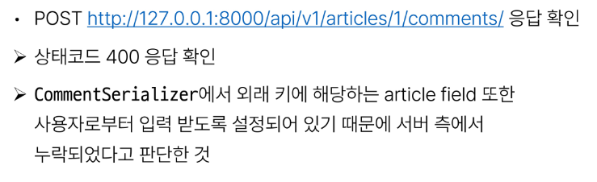

# 1019 TIL

## 잡다한 것

## Django REST framework 2

### DRF with N:1 Relation

#### 사전준비

- Comment 모델 정의
  

- URL 및 HTTP request method 구성
  

#### GET

- GET-List
  
  
  
  

- GET-Detail
  
  

#### POST

- POST(1~4)

- 읽기 전용 필드
  

- POST(5)
  

#### DELETE & PUT

- DELETE & PUT

#### 응답 데이터 재구성

- 댓글 조회 시 게시글 출력 내역 변경
  
  
  

### 역참조 데이터 구성

- Article -> Comment 간 역참조 관계를 활용한 JSON 데이터 재구성
  

- 단일 게시글 + 댓글 목록
  
  

- 단일 게시글 + 댓글 개수
  
  
  

- [주의] 읽기 전용 필드 지정 이슈
  

### API 문서화

- OpenAPI Specification(OAS)
  
  - RESTful API를 설명하고 시각화하는 표준화된 방법
    
    - API에 대한 세부사항을 기술할 수 있는 공식 표준

- drf - spectacular 라이브러리
  
  
  
  
  

- OAS의 핵심 이점 - "설계 우선"접근법
  

#### 참고

