# 1023 TIL

## 잡다한 것

## Introduction of JavaScript

### History of JavaScript

#### 웹 브라우저와 JavaScript

- 웹의 탄생(1990)
  

- 웹 브라우저의 대중화(1993)
  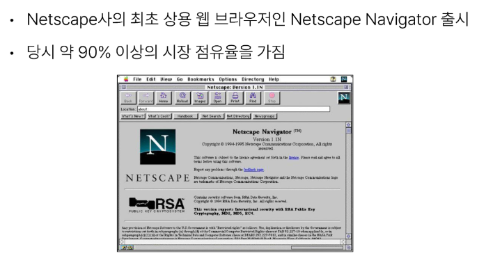

- JavaScript의 탄생(1995)
  

- JavaScript 파편화(1996)
  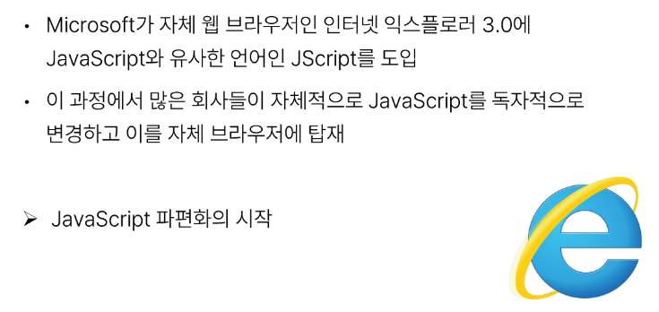

- 1차 브라우저 전쟁(1995-2001)
  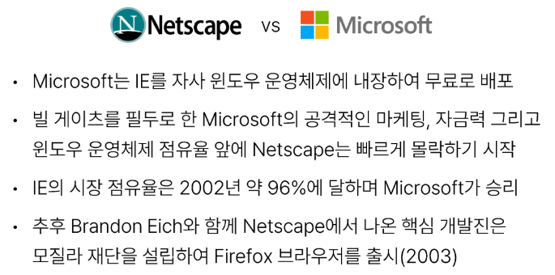

- 1차 브라우저 전쟁의 영향
  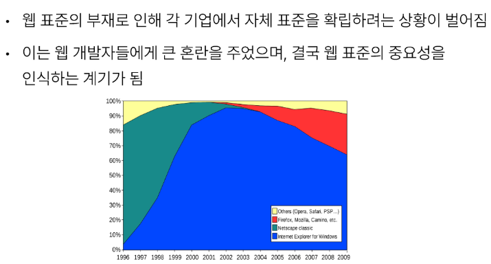

- ECMAScript 출시(1997)
  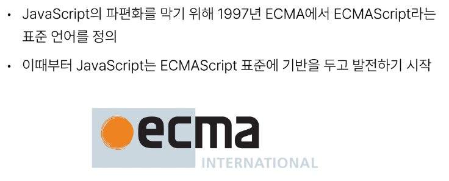

- 2차 브라우저 전쟁(2004-2017)
  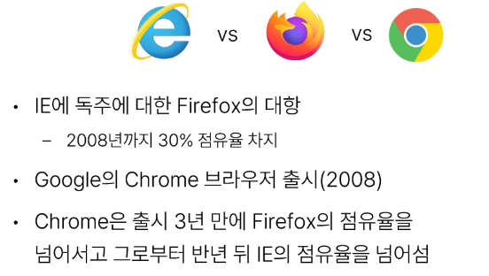

- 2차 브라우저 전재의 영향
  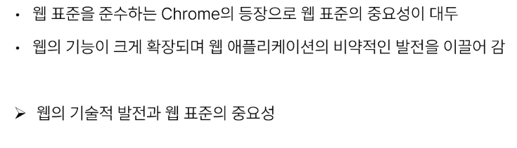

#### ECMAScript

- ECMAScript
  
  - Ecma International(정보와 통신 시스템을 위한 국제적 표준화 기구)이 정의하고 있는 표준화된 스크립트 프로그래밍 언어 명세
    
    - 스크립트 언어가 준수해야 하는 규칙, 세부사항 등을 제공

- ECMAScript와 JavaScript
  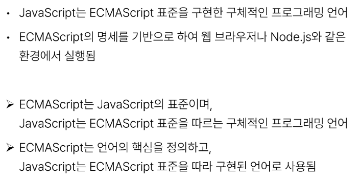

- ECMAScript의 역사
  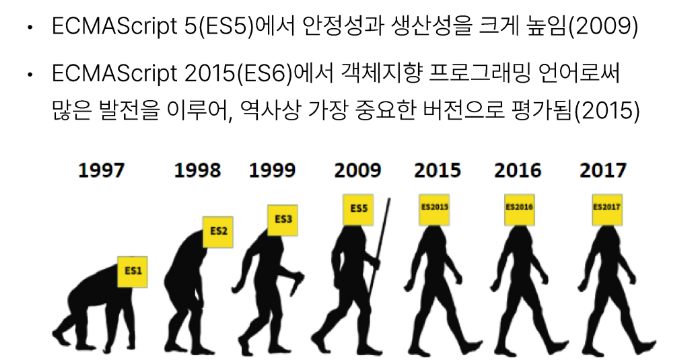

- JavaScript의 현재
  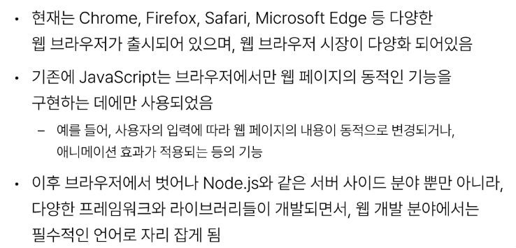

### JavaScript and DOM

#### DOM

##### DOM 개요

- 웹 브라우저에서의 JavaScript
  
  - 웹 페이지의 동적인 기능을 구현

- JavaScript 실행 환경 종류
  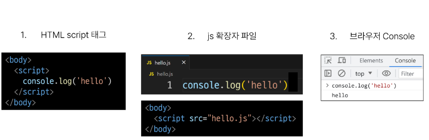

- DOM(The Document Object Model)
  
  - 웹 페이지(Document)를 구조화된 객체로 제공하여 프로그래밍 언어가 페이지 구조에 접근할 수 있는 방법을 제공
    
    - 문서 구조, 스타일, 내용 등을 변경할 수 있도록 함

- DOM 특징
  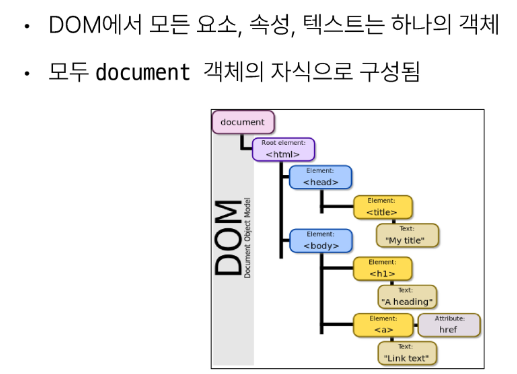

- DOM tree
  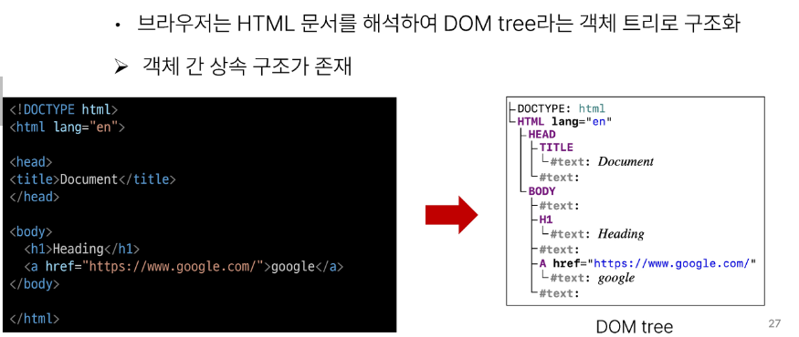

- 브라우저가 웹 페이지를 불러오는 과정
  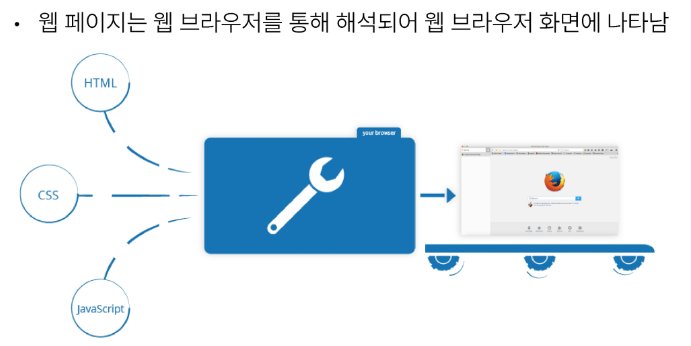

- DOM 핵심
  
  - 문서의 요소들을 객체로 제공하여 다른 프로그래밍 언어에서 접근하고 조작할 수 있는 방법을 제공하는 API

##### document 객체

- 'document '객체
  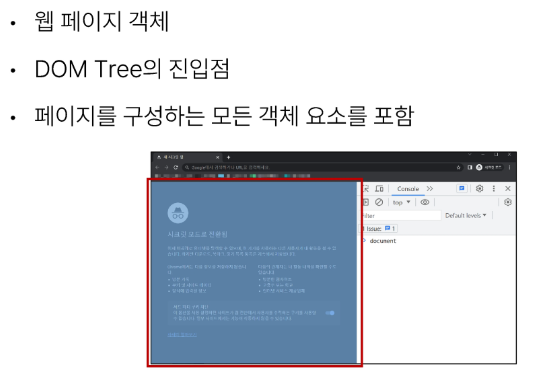

- 'document '객체 예시
  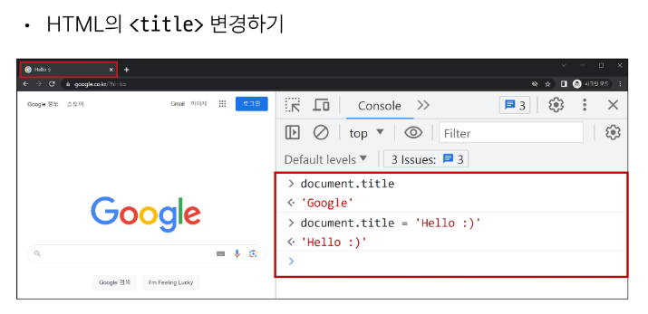

#### DOM 선택

- DOM 조작 시 기억해야 할 것
  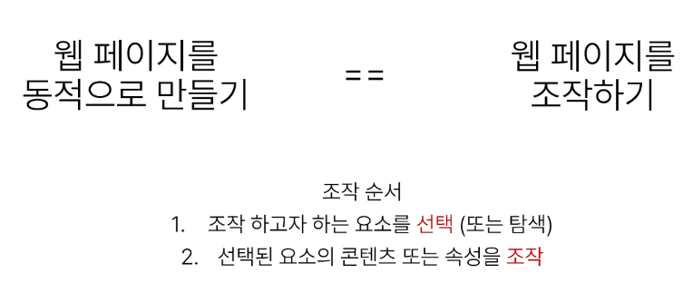

##### 선택 메서드

- 선택 메서드
  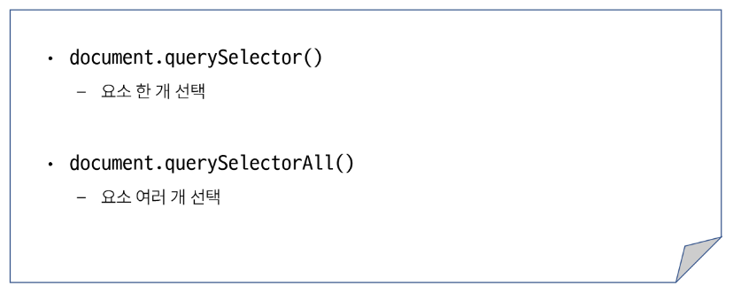

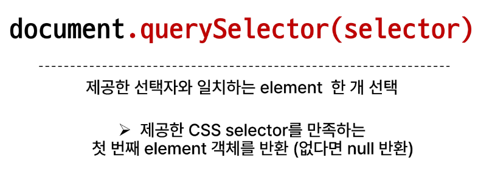
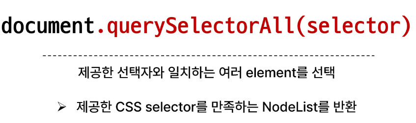

- DOM 선택 실습
  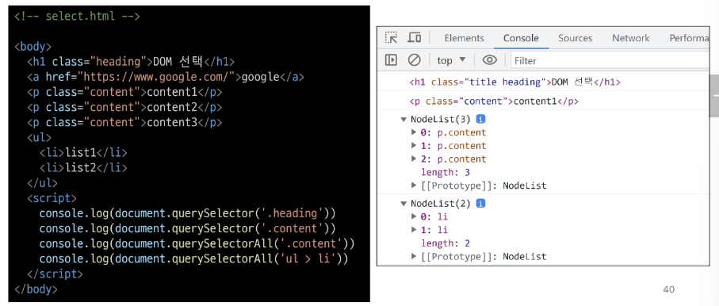

#### DOM 조작

##### 속성 조작

- 속성(attribute)조작
  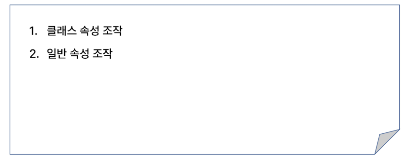

- 클래스 속성 조작
  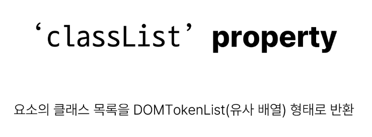

- classList 메서드
  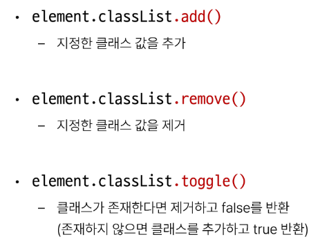

- 클래스 속성 조작 실습
  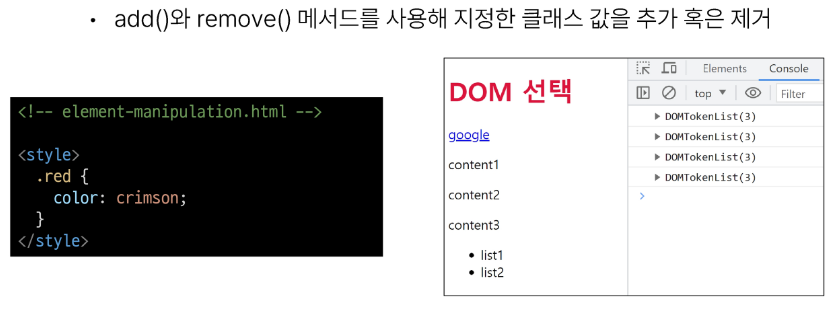
  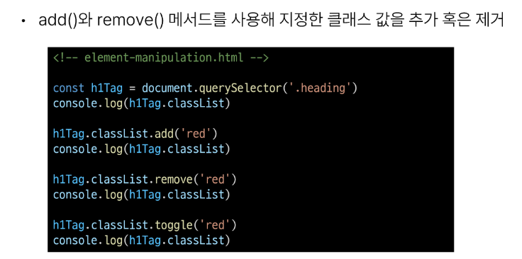

- 속성 조작 메서드
  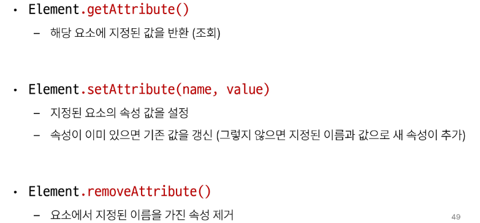

- 속성 조작 실습
  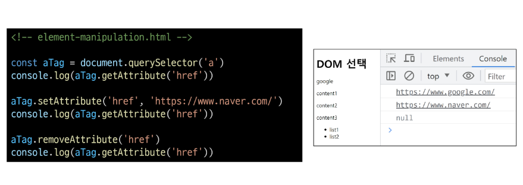

##### HTML 콘텐츠 조작

- HTML 콘텐츠 조작
  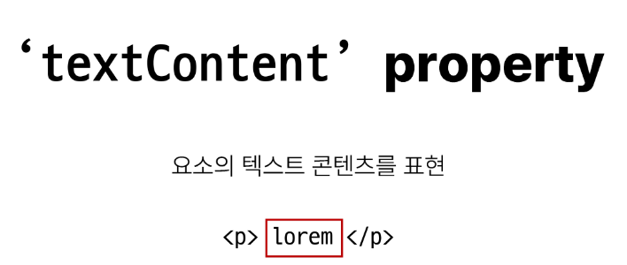

- HTML 콘텐츠 조작 실습
  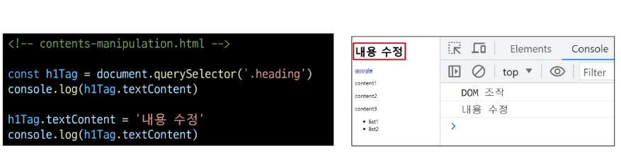

##### DOM 요소 조작

- DOM 요소 조작 메서드
  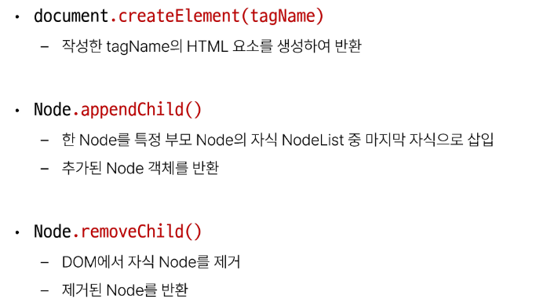

- DOM 요소 조작 실습
  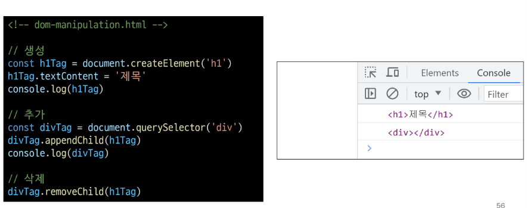

##### style 조작

- style 조작
  

- style 조작 실습
  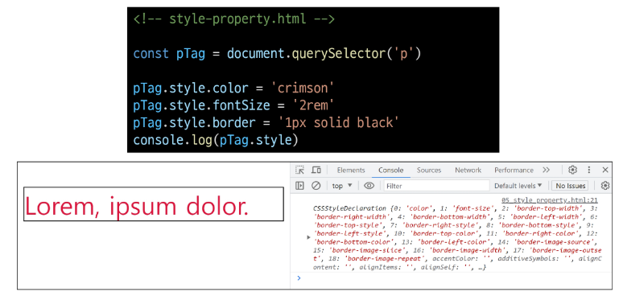

##### 참고

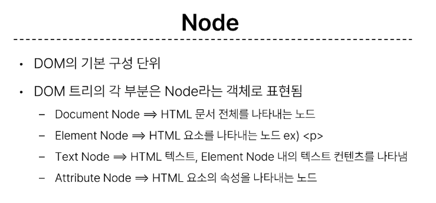
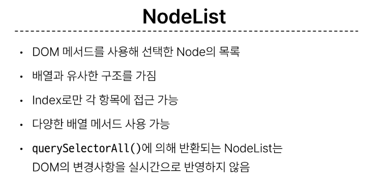
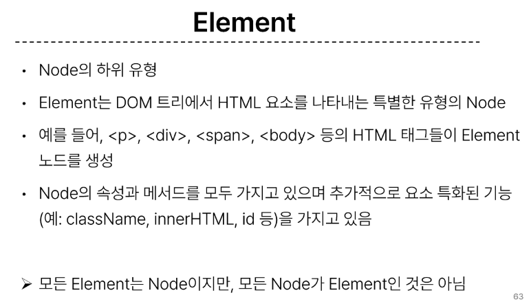
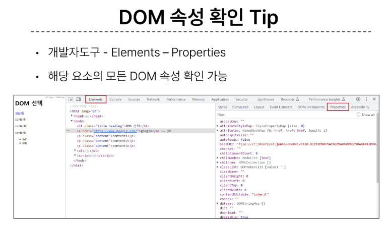
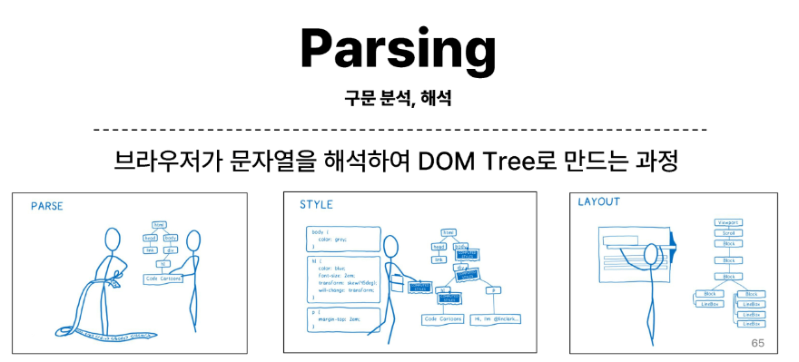

