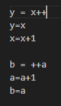
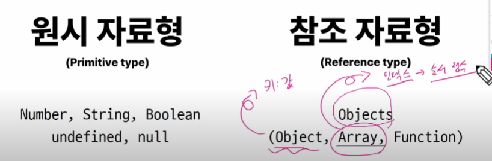
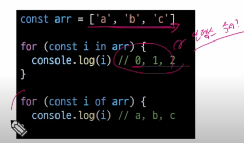

# 1024 TIL

## 잡다한 것

- 권장 스타일 가이드
  [JavaScript Standard Style](https://standardjs.com/rules-kokr.html)

- 게임 
  
  https://jsisweird.com/

- 불변.메소드 : 비파괴적 메소드
  가변.메소드: 파괴적 메소드

- 처음에 일단 const를 쓰고 오류나면 let을 써도 됨

## Basic syntax of JavaScript

### 변수

- JaveScript 문법 학습
  

- 식별자(변수명) 작성 규칙
  
  
  
  - 파스칼: 첫글자 대문자

- 변수 선언 키워드
  
  

- let
  

- const
  
  
  - const는 초기값 선언도 필수임

- 블록 스코프(block scope)
  
  
  - 파이썬과 자바스크립트의 차이점:
    
    - 파이썬에서는 영역의 차이를 들여쓰기로 판단
    
    - 자바스크립트에서는 중괄호로 영역을 분류
  
  - 같은 점:
    
    - 블록 스코프를 가지는 변수는 블록 바깥에서는 접근 불가능
    
    - 하지만 만약에 안에서 찾았는데 변수가 없다?? - 그러면 전역변수로 역으로 찾아 올라가긴 함(단, 비추..) (반대는 No)

- 변수 선언 키워드 정리
  

### 데이터 타입

- 데이터 타입
  
  
  
  - 여기에서의 Object는 타입의 이름이다.(파이썬의 딕셔너리와 비슷하게 생김)

- 원시 자료형 예시
  
  
  - 주소가 복사된 것이 아닌 값만 복사

- 참고 자료형 예시
  
  
  - 주소 자체가 복사 됨

#### 원시 자료형

- Number 예시
  

- 문자열은 작은 따옴표를 쓰는 것을 권장(스타일 가이드)

- String 예시
  
  
  - 연결 연산자라고 함

- Template literals(템플릿 리터럴)
  

- null 과 undefined
  
  
  
  - const는 애초에 초기값 필수라 undefined인 경우가 나오지 x

- '값이 없음'에 대한 표현이 null과 undefined 2가지인 이유
  

- 소문자로 되어있네???(기억!)

- 자동 형변환
  

### 연산자

- 할당 연산자
  

- 증가 & 감소 연산자
  
  
  
  - ~~할당문이라는 것은 값이 바뀜을 의미~~
  
  - ++, --의 위치가 뒤냐 앞이냐에 따라 할당되는 결과가 전이냐 후냐로 나뉨
  
  - 할당하고 커지냐 커지고 할당하냐의 차이
  
  - '단독'은 ++이 앞에 오나 뒤에 오나 똑같음

- 비교 연산자
  

- 동등 연산자(==)
  
  
  - 암묵적 타입 변환 때문에 코딩 시 골치 아파 질 수 있다.

- 일치 연산자(===) (이걸 기본으로 사용하는 것을 권장)
  
  
  - null 과 undefined를 서로 비교할 때 일치 연산자는 false 반환하고, 동등 연산자에서는 true 반환 -> 그래서 값이 없음을 비교하는 특수한 경우를 제외하고는 일치 연산자를 이용

- 논리 연산자
  
  
  - 하나만 쓰면 비트 연산..

### 조건문

- if 예시
  

- 조건(삼항) 연산자
  

### 반복문

- 반복문 종류
  

- while 예시
  

- while과 똑같이 조건이 거짓으로 판별될 때까지 반복

- for 예시
  

- for 동작 원리
  

- for ...in 예시
  
  - 보면 기존에 알고 있던 key 값이 나온 것을 알 수 있다.
    
    - 다만, 자바스크립트에선 key를 **속성**이라고 부름!!

- 반복 가능한 객체 -> 순서 -> 인덱스

- 딕셔너리는 순서 x 하지만 파이썬에서는 반복 가능한 객체로 분류됨
  
  - 자바스크립트에서는 딕셔너리(여기선 object)를 반복 가능한 객체에 포함 시키지 x

- for ...of 예시
  

- 배열 반복과 for ...in
  
  
  - for...in은 키 값(속성)을 반환한다.
  
  - 배열의 키 값은 인덱스!!
  
  - **for...in은 object에서만 쓰인다.**(**특정 순서에 따라 인덱스를 반환하는 것을 보장 x하므로**), 순서가 중요한 애들한테는 for...in 사용 x
    
    
  
  - 배열의 키 값은 인덱스!!(Array도 근본은 객체다?)
    
    
    - for ... in :인덱스 순서대로 나온건가? No.. 그냥 열거된 속성값을 출력했을 뿐.
    
    - for ... in은 객체의 속성값을 반환하잖아, 그래서 배열의 속성값인 인덱스 0, 1, 2가 반환된 거임
    
    - 순서를 보장하는 것은 for...of이다

- for ...in 과 for...of
  
  
  - for ... of는 object는 아예 실행조차 불가
  
  - for ...of는 순서를 보장하면서 출력하는 것인데, object는 애초에 순서가 x(타입에러 발생)
  
  - 즉, **for... in : object, for...of : object를 제외한 나머지**

- **반복문 사용 시 const 사용 여부**
  

- 반복문 종합
  
  
  - for...in과 for...of도 break와 continue를 사용가능
  - 참고
    - 스코프는 중괄호만 찾으면 된다.
    
    - let과 const를 썻다면 무조건 중괄호 영역 기준으로만 스코프를 만들기 때문에

### 참고

- 중괄호로 결정나는 블록 스코프와 달리 반복문의 중괄호, 조건문의 중괄호 이런 것들도 줄괄호의 영역으로 취급 안하고 모두가 같은 영역으로 취급, 단 , **함수**만 빼고

- 호이스팅 TEST. (면접에도 한 번씩 물어봄)
  
  
  - 자바스크립트가 실행이 되면서 어? 변수의 name이 있네 선언만 끌어올림..(값은 끌어올리지 않고.)
    
    
