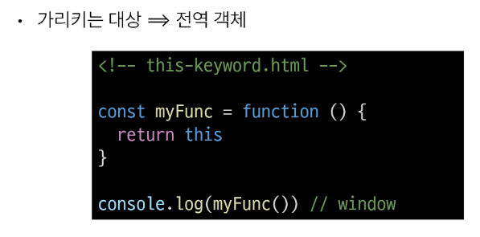
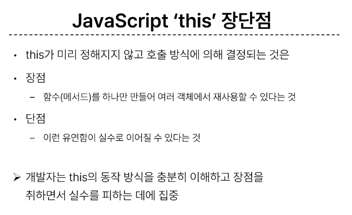
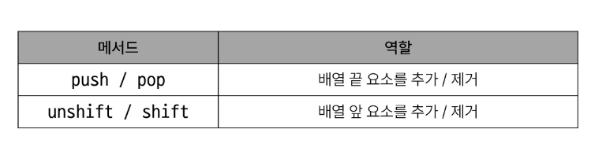

# 1025 TIL

## 잡다한 것

## JavaScript Reference data types

### 함수

#### 개요

- 데이터 타입
  
  

#### 함수 정의

- 함수 구조
  

- 함수 정의 2가지 방법
  
  
  

- 함수 표현식 특징
  
  

- 함수 선언식과 표현식 종합
  

#### 매개변수

- 매개변수 정의 방법
  
1. 기본 합수 매개변수(Default function parameter)
   

2. 나머지 매개변수(Rest parameters)
   
- 매개변수와 인자의 개수 불일치
  
  

#### Spread syntax

- 전개 구문
  

- 전개 구문 활용
  
  

#### 화살표 함수

- 화살표 함수 작성 결과
  

- 화살표 함수 작성 과정
  
  
  

#### 참고

### 객체

#### 개요

#### 구조 및 속성

- 객체 구조
  

- 속성 참조
  
  

- 'in' 연산자
  

#### 객체와 함수

- Method 사용 예시
  

#### this

- Method & this 사용 예시
  

1. 단순 호출 시 this
   

2. 메서드 호출 시 this
   

3. 중첩된 함수에서의 this 문제점과 해결책
   
- JavaScript 'this' 정리
  

#### 추가 객체 문법

1. 단축 속성
   

2. 단축 메서드
   

3. 계산된 속성(computed property name)
   

4. 구조 분해 할당(destructing assignment) 
   
   
   - 구조 분해 할당 활용
     

5. Object with '전개 구문'
   

6. 유용한 객체 메서드
   

7. Optional chanining ('**?.**')
   
   
   
   
   - Optional chanining 장점
     
   
   - Optional chanining 주의사항
     
   
   - Optional chanining 요약
     

#### JSON

- JSON

- Object < - > JSON 변환하기
  

#### 참고

### 배열

#### 개요

- 배열 구조
  

#### 배열과 메서드

- 주요 메서드
  

#### Array helper method

- 주요 Array Helper Methods
  

- forEach 구조
  
  

- forEach 활용
  
  

- 콜백 함수 예시
  

- map 구조
  
  

- map 활용
  
  

- python에서의 map 함수와 비교
  

- 배열 순회 종합
  

#### 추가 배열 문법

1. Array with '전개 구문'
   

2. 기타 Array Helper Methods
   

#### 참고

