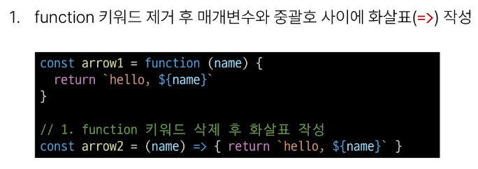
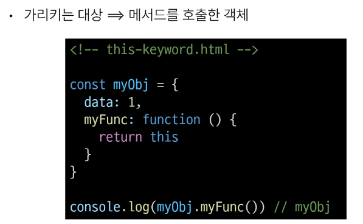
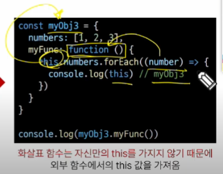
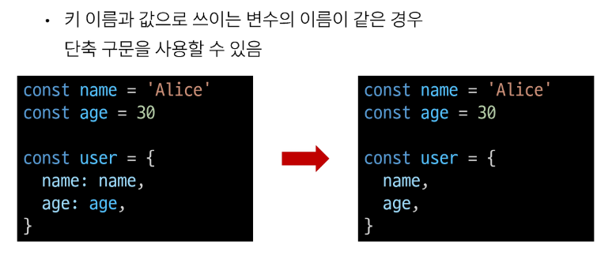
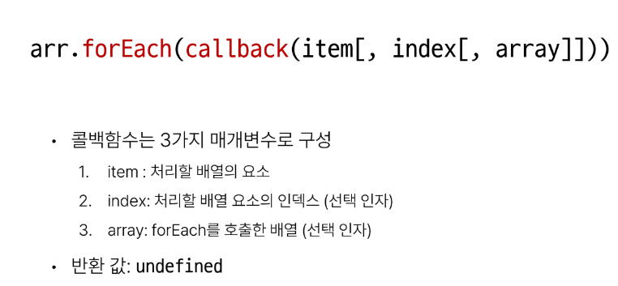
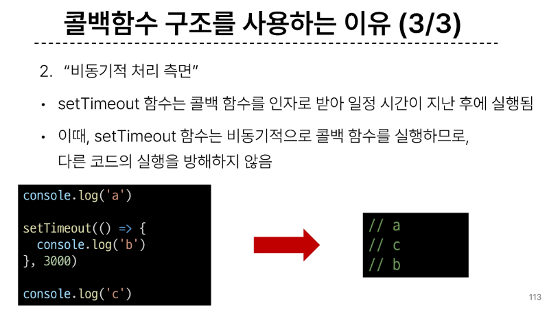

# 1025 TIL

## 잡다한 것

- 호이스팅 - 선언만 꼭대기로 끌어올려지는 것
- 콜백 함수 : 함수의 매개변수에 함수가 들어가는 것??, 콜백함수는 괄호 x

## JavaScript Reference data types

### 함수

#### 개요

- 데이터 타입
  
  

#### 함수 정의

- 함수 구조
  

- 함수 정의 2가지 방법
  
  
  

- 함수 표현식 특징
  
  

- 함수 선언식과 표현식 종합
  

#### 매개변수

- 매개변수 정의 방법
  
1. 기본 함수 매개변수(Default function parameter)
   

2. 나머지 매개변수(Rest parameters)
   
   
   - 참고: 파이썬에서는 배열이 아닌 튜플로 허용했음
- 매개변수와 인자의 개수 불일치
  
  
  - 에러가 뜨지않고 누락된 인자는 undefined로 할당 됨
    
    
    - 이것도 에러가 안 나고 초과 입력한 인자는 사용 x

#### Spread syntax

- 전개 구문
  

- 전개 구문 활용
  
  
  - 만약 확장하는 인자의 수가 더 많다면??
    
    - ex: numbers= [1, 2, 3, 4] 라면?? 기존과 동일하게 6이 나온다.
  
  - 만약 확장하는 인자의 수가 더 적다면??
    
    - ex: numbers= [1, 2]라면?? 이번에는 NaN이 나옴(연산이 안되네??)
    
    

#### 화살표 함수(많이 쓰임)

- 화살표 함수 작성 결과
  

- 화살표 함수 작성 과정
  
  
  
  보통 1단계까지 처리함, 2~3단계는 함수라는 느낌이 덜하므로(그래도 알긴 해야 됨)

#### 참고

- object에는 중괄호가 필요로 하는데 중괄호를 없앤다구?? 못 없애지(그러면 return도 안돼!) (그래도 없애고 싶다고?? 그럼 소괄호로 감싸기라도 해라)

### 객체

#### 개요

#### 구조 및 속성

- 객체 구조
  
  
  - ~~보면 파이썬에서의 (oop) 속성과 메소드 느낌 있네.~~
  
  - name처럼 하나의 단어일 때는 `''` 생략 가능(알아서 문자형으로 판단 함)

- 속성 참조
  
  
  
  - 생각해보면 key 이름에 띄어쓰기 같은 구분자가 있으면 대괄호 접근만 가능한 것이 당연
    
    - `user. key with space`(이게 되겠냐??)
  
  - 인화: 속성값이 없을 때는 `.`은 불가능 하고 `[]`접근만 된다구요!

- 'in' 연산자
  
  
  - boolean 값으로 나온다.

#### 객체와 함수

- Method 사용 예시
  

#### this

- Method & this 사용 예시
  
  
  - 함수(greeting)가 포함된 객체는 person이니깐 this는 person을 가리킴
  
  - 함수(greeting)가 객체 person에 속해있으므로 this는 person을 가리킴

1. 단순 호출 시 this
   
   
   - 여기서 window는 브라우저의 최상위 객체이다.
     
     - 어? document아니었나?, 사실 그 위에 window가 있었다.
     
     - 다만, window는 생략가능 했어서 ~~window.~~document. ... 이렇게 된 것

2. 메서드 호출 시 this
   
   
   - myFunc(메서드)를 호출한 myObj(객체)
   
   - 너 누가 불렀니? 너 부른 애 데리고 와!

3. 중첩된 함수에서의 this 문제점과 해결책
   
   
   - ~~왼쪽은 속해있는 거 없지?? 그래서 일반, 오른쪽은 속해있는 것이 없었지만, 외부 함수에서 this를 가져오므로 myObj3에 속하게 됨~~
     
     
     - 화살표 함수는 자신만의 this가 없어서 자기상위 함수의 this를 찾아간다. 
- JavaScript 'this' 정리
  

#### 추가 객체 문법

1. 단축 속성
   

2. 단축 메서드
   

3. 계산된 속성(computed property name)
   

4. 구조 분해 할당(destructing assignment) (많이 중요)
   
   
   - 한방에 쫙 할당하는 방법이 없을까 해서 나옴
   
   - 변수를 할당하는 데 특이하게 중괄호를 쓰고 있네?
   
   - 속성과 이름이 같아야지만 알아서 받아줌
   
   - 구조 분해 할당 활용

5. Object with '전개 구문'
   

6. 유용한 객체 메서드
   
   
   - 보면, 결과가 배열로 나온다.

7. Optional chanining ('**?.**')
   
   
   
   
   - Optional chanining 장점
     
   
   - Optional chanining 주의사항
     
   
   - Optional chanining 요약
     

#### JSON

- JSON

- 파이썬에서 JSON은 문자열 형태이기 때문에 바로 활용 불가 -> 타입 변경해서 씀(리스트or 딕셔너리)
  
  - 자바스크립트에서도 JSON은 문자열 형태이기 때문에 바로 활용 불가 -> 타입 변경해서 씀(배열 or 객체)

- Object < - > JSON 변환하기
  

#### 참고

- 프레임, 도장 같은 것을 만드는 것이 어떨까??
  

### 배열(앞의 함수와 객체도 중요했지만 배열이 젤 중요)

#### 개요

- 배열 구조
  
  
  - 자바스크립트에서는 음수 인덱스 지원 x
    
    - 마지막 요소는 (length -1) 로 접근 할 것

#### 배열과 메서드

- 주요 메서드
  

#### Array helper method(오늘 배운 것 중에서 젤 중요한 part)

- 주요 Array Helper Methods
  
  
  - forEach 와 map은 근본적으로 동작하는 원리는 동일,
  
  - 차이점: forEach는 리턴 x, map은 리턴 o

- for : index, for ...of : item을 받을 수 있는데 forEach는 둘 다 받을 수 있다.

- forEach 구조
  
  

- forEach 활용
  
  
  - 여기서 화살표 함수가 정말 많이 활용 된다.
    
    - this를 안 쓰면 위나 아래나 동작이 동일하지만, 보통 콜백 함수를 쓸 때는 화살표를 많이 씀
      

- 콜백 함수 예시
  

- map 구조
  
  

- map 활용
  
  
  
  - 반환이 있기 때문에 return이 들어감, 그리고 어디엔가에 결과물을 할당함(변수 필요)( ex. const result1)

- python에서의 map 함수와 비교
  

- 배열 순회 종합
  
  
  - 대신에 return 쓰지 뭐.

#### 추가 배열 문법

1. Array with '전개 구문'
   

2. 기타 Array Helper Methods
   

#### 참고

- 비동기적 처리 -> 병렬 처리를 의미
  
  
  
