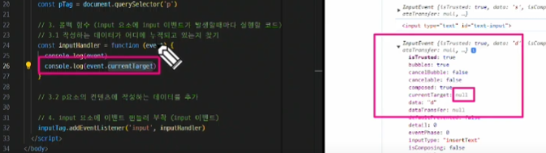
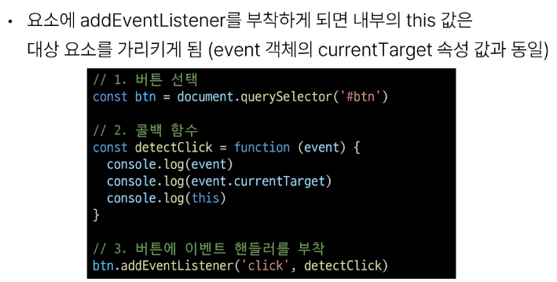
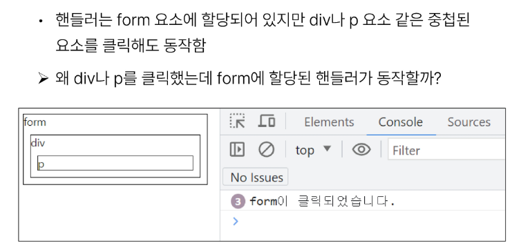
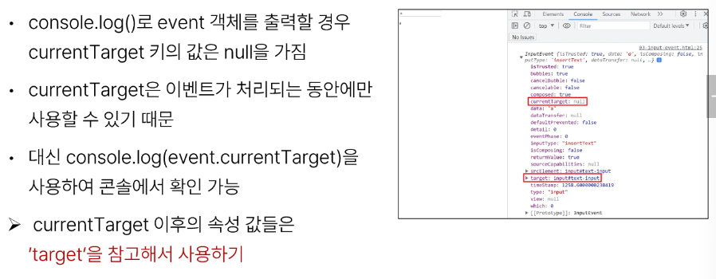

# 1026 TIL

## 잡다한 것

- 버블링 관련
  [Event bubbling, 이벤트 버블링이란? :: 박상준의 기술블로그](https://sangjuntech.tistory.com/22)

- 참고
  
  
  - 왜 왼쪽에선 똑바로 값이 나오는데 오른쪽에선 null로 나오지??
    
    - 버블링 되어 올라가는 속도 보다 출력되는 속도가 더 빨라서 그럼
    
    - 그래서 개발자 도구 타고 들어가서 속성값 찾아낼 때 참고할 것!
      
      - asd 쳤을 때 asd가 어디에 들어가 있지??

- Lodash
  [Lodash Documentation](https://lodash.com/docs/4.17.15)

## Controlling event

### 이벤트

#### 개요

- 일상속의 이벤트
  

- 웹에서의 이벤트
  

#### event

- event object
  

#### event handler

- DOM에서 어떤 이벤트(type)가 발생했을 때 콜백함수(handler)를 실행할 것인가??

- 이벤트 객체가 콜백 함수의 첫번째 인자로 전달 됨

- addEventListener 써보라고 Test 나옴

- .addEventListener(type, handler)
  

- addEventListener 활용
  
  
  
  - addEventLister라는 event handler는 독특하게 This를 강제로 본인이 부착된 Dom 대상을 가리키도록 되어있다.
  
  - 주의사항, addEventLister의 함수를 화살표 함수로 쓰면 안됨(왜냐? 화살표 함수는 자신만의 this를 가지지 못해서 addEventLister가 강제 시키지 못해여기선 window가 나와버림), event.target으로 접근하든가~
  
  - 콜백함수가 길어지는 것 같으면 별도로 따로 작성해도 됨(가독성 up)

- addEventListener의 콜백 함수 특징
  

#### 버블링

- 버블링 개요
  
  

- 버블링(Bubbling)
  

- 버블링 예시
  
  

- 'target' & 'currentTarget' 속성
  
  
  - 'this' 로 쓰든 'currentTarget'으로 쓰든 똑같음
  
  - target은 진또배기(실제 이벤트가 발생한 위치)

- 'target' & 'currentTarget' 예시
  
  
  
  
  - 버블링 덕분에 하위 요소 전부에다가 event handler를 달아주지 않아도 된다.
    

### event handler 활용

- event handler 활용 실습
  
  
  

- input 이벤트 실습
  
  

- currentTarget 주의사항
  

- click & input 이벤트 실습
  
  

- todo 실습
  
  
  

- 로또 번호 생성기 실습
  
  

- lodash
  

#### 이벤트 기본 동작 취소(중요)

- 이거도 써보라고 테스트 많이 나옴

- 다만, 주의사항: 버블링, 즉 전파를 취소시키는 것은 아님!!

- 이벤트 동작 취소 실습
  
  
  

#### 참고

- 이벤트 처리할 때의 THIS는 다르다!!
