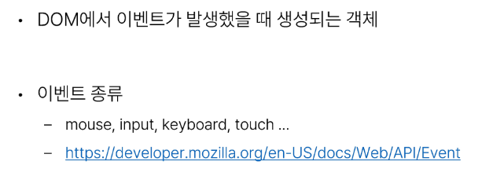
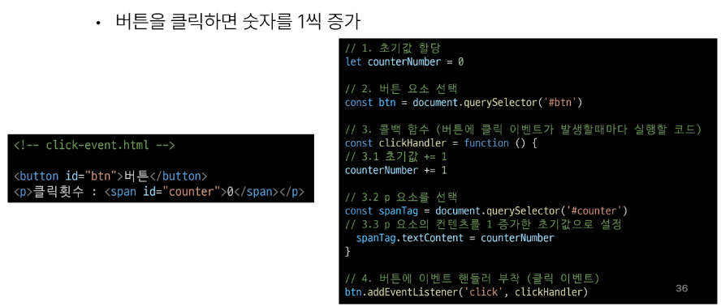

# 1026 TIL

## 잡다한 것

## Controlling event

### 이벤트

#### 개요

- 일상속의 이벤트
  

- 웹에서의 이벤트
  

#### event

- event object
  

#### event handler

- .addEventListener(type, handler)
  

- addEventListener 활용
  
  

- addEventListener의 콜백 함수 특징
  

#### 버블링

- 버블링 개요
  
  

- 버블링(Bubbling)
  
  

- 버블링 예시
  
  

- 'target' & 'currentTarget' 속성
  

- 'target' & 'currentTarget' 예시
  
  
  
  

### event handler 활용

- event handler 활용 실습
  
  
  

- input 이벤트 실습
  
  

- currentTarget 주의사항
  

- click & input 이벤트 실습
  
  

- todo 실습
  
  
  

- 로또 번호 생성기 실습
  
  

- lodash
  

#### 이벤트 기본 동작 취소

- 이벤트 동작 취소 실습
  
  
  

#### 참고

