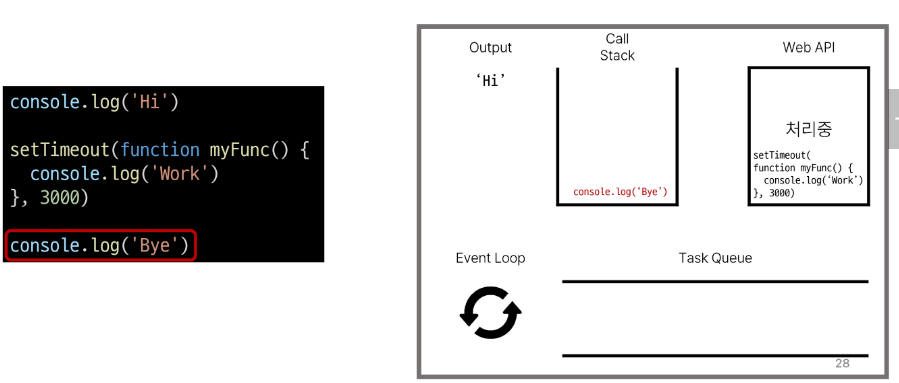
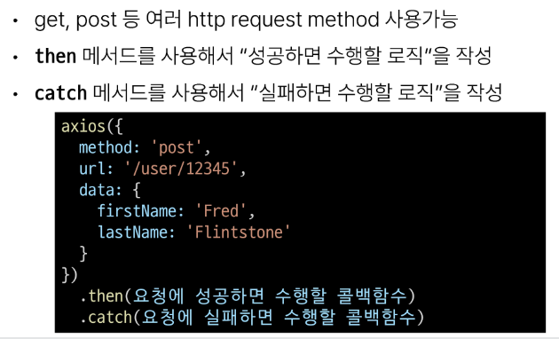

# 1030 TIL

## 잡다한 것

## Asynchronous JavaScript

### 비동기

#### 개요

- Synchronous(동기)
  
  - 프로그램의 실행 흐름이 순차적으로 진행
    
    - 하나의 작업이 완료된 후에 다음 작업이 실행되는 방식

- Synchronous 예시
  

- Asynchronous(비동기)
  
  - 프로그램의 실행 흐름이 순차적이지 않으며, 작업이 완료되기를 기다리지 않고 다음 작업이 실행되는 방식
    
    - 작업의 완료 여부를 신경 쓰지 않고 **동시에 다른 작업들을 수행할 수 있음**

- Asynchronous 특징
  

- Asynchronous 예시
  
  
  
  
  - 이렇게 자바스크립트가 콜백함수를 사용하는 이유: 비동기적(병렬) 처리를 해서 동시에 많은 작업을 하기 위함. 

### JavaScript와 비동기

- Single Thread 언어, JavaScript
  
  - Thread란?
    
    - 작업을 처리할 때 실제로 작업을 수행하는 주체로, multi-thread라면 업무를 수행할 수 있는 주체가 여러 개라는 의미

- JavaScript는 한번에 여러 일을 수행할 수 없다
  

- JavaScript Runtime
  

- 브라우저 환경에서의 JavaScript 비동기 처리 관련 요소
  

- 브라우저 환경에서의 JavaScript 비동기 처리 동작 방식
  

- 런타임(JS가 동작할 수 있는 환경)의 시각적 표현
  
  - 기존에 알고 있는 스택, 큐와 같음 
  
  - 자바스크립의 영역은 Call Stack 하나 뿐이다.
  
  - 나머지는 런타임의 영역(브라우저가 도와주는 영역)
  
  - 왜 콜백함수라고 할까?? (참고)
    
    - Call Stack으로 돌아오므로
    
    
    
    
    
  
  - 스택에서 언제 빠지냐?? 호출이 되면서, (즉 빠지면서 호출됨)
    
  
  
  
  - (바로 처리 못하는 것은) 시간 많이 걸리는 거야 하면서, Web API로 보내버림 
  
  - 0초라고 해도 일단 보내고 봄.
  
  - 비동기로 처리되는 함수들이 따로 분류되어 있음
    
    
    
  
  - ~~스택이 비었고 3초도 지났으므로 나옴.~~
  
  - ~~3초가 지났지만 스택이 차있다면 나오지 못함~~
  
  - 3초 뒤 출력 보장 못 받음, 3초 뒤에 Task Queue에 들어가기만 함
  
  - 3초가 지나고 Call Stack으로 들어가는 것이 아닌 대기실이라 불리는 Task Queue로 감
  
  - 여기서 Event Loop는 Call Stack과 Task Queue를 감시하는 역할, 대기실에 뭐가 찼네? 언제 Call Stack으로 넣을 수 있을까?? 파악
  
  - 언제 넣을 수 있느냐? - Call Stack이 비었을 때 들어감
    
    
    

- stack이 비어있으면 call Stack으로 Task Queue에 있었던 놈이 차례차례 들어간다.
  
  
  
  
  

- 비동기 처리 동작 요소
  
  
  - 이벤트 리스너도 콜백 함수를 인자로 받으므로 바로 처리 안 되겠지? (비동기 처리)
  
  

- 정리
  

### AJAX(오늘의 메인)

#### 개요

- AJAX(Asynchronous JavaScript + XML)
  
  - JavaScript의 비동기 구조와 XML 객체를 활용해 비동기적으로 서버와 통신하여 **웹 페이지의 일부분만을 업데이트**하는 웹 개발 기술
    

- XMLHttpRequest 객체(XHR 이라고도 함)
  
  - 서버와 상호작용할 때 사용하며 페이지의 새로고침 없어도 URL에서 데이터를 가져올 수 있음
    
    - 페이지를 가져오는 것이 아닌 데이터만 가져올 수 있다.
    
    - 사용자의 작업을 방해하지 않고 페이지의 일부를 업데이트
      
      - 주고 AJAX 프로그래밍에 많이 사용됨

- 이벤트 핸들러는 비동기 프로그래밍의 한 형태
  
  
  - JS는 이렇게 요청이 시간이 오래 걸릴 수 있으므로 요청을 보내놓고 기다려주지 않는 다.
  
  - XHR이라는 객체를 서버로 보낼 것인데 요청을 쉽게 도와주는 라이브러리가 있다.
    (바로 아래의 Axios)

#### Axios(외부 라이브러리임에도 불구하고 (비동기)요청을 보낼 때 반드시 사용되는 라이브러리), (Vue에서도 이용 Many)

- Axios
  
  - JavaScript에서 사용되는 HTTP 클라이언트 라이브러리
    
    - 서버와의 HTTP 요청과 응답을 간편하게 처리할 수 있도록 도와주는 도구
    - ~~파이썬에서의 requests와 같은 역할~~

- Axios 설치
  

- Axios 구조
  
  
  - axios <- 객체

- 고양이 사진 가져오기 실습
  
  
  
  
  
  
  - 파이썬에서 아래와 같이 쓰잖아요, 이 부분이 위와 같은 거다. 구조와 다를 뿐.
  
  
  
  - 여기서의 응답 객체는 then 콜백 함수의 인자로 들어가게 된다.
  
  

- 고양이 사진 가져오기 실습 심화
  
  
  
  
  

- 정리
  

### Callback과 Promise

- Promise : axios를 통해 받은 결과의 객체 이름

- callback과 promise의 목적: 비동기 처리

- 다만 이 둘은 같은 목적은 가지고 있지만 다른 장담점을 가지고 있다.

#### 비동기 콜백

- 비동기 처리의 단점
  

- 비동기 콜백
  
  
  - 비동기 작업에 순서를 집어넣어서 순차적으로 동작하도록 함 
    
    - 콜백이 콜백을 호출하고 콜백이 콜백을 호출하고....

- 비동기 콜백의 한계
  

- 콜백 지옥(Callback Hell)
  

- 콜백 함수 정리
  

#### 프로미스

- Promise
  
  - JavaScript에서 비동기 작업의 결과를 나타내는 객체
    
    - 비동기 작업이 완료되었을 때 결과 값을 반환하거나, 실패 시 에러를 처리할 수 있는 기능을 제공

- Promise
  
  
  - 같은 레벨의 아래로 내려가면서 콜백 함수의 순서는 지켜짐.

- 비동기 콜백 vs Promise
  
  
  - promise(chaining이 핵심)
    
    - 첫번째 일이 끝난 결과가 then의 콜백함수 인자로 들어오고 이게 끝나고 리턴을 하면 그 리턴 값이 다음 then의 콜백함수 인자로 들어감
    
    - 즉 then은 앞의 then이 실행이 끝났을 때 실행이 된다. (chaning)
    
    - 비동기에 순서가 생깄네?
    
    - 주의사항: 이어서 가려면은 앞쪽에 리턴 값이 필요.
      
      - 왜냐하면, 다음 이어지는 then이 그 앞 쪽의 리턴을 받으므로
      
      - ~~맨 앞은 일이 끝난 결과가 then의 콜백함수 인자로...~~
    
    - 결국 then을 enter을 쳐서 떨구면서 작성을 했을 뿐이지 그렇지 않다면??
      
    
    - 위의 것을 떨구면서 작성하면?
      
      
      
      - 결국 이어지고 있는 코드이다.

- Axios
  
  - JavaScript에서 사용되는 **Promise 기반** HTTP 클라이언트 라이브러리

- then & catch
  
  

- then 메서드 chaining의 목적
  

- then 메서드 chaining의 장점
  
  
  - 유연성 추가내:
    
    - then을 이어갈 수 있다는 것은 잘게 쪼갤 수도 있다는 것을 의미.
    
    - 더 세부적으로 쪼개고 그 then이 하는 역할을 하나로 제한을 두면, .catch가 에러를 잡아냈을 때 더 정확한 에러를 잡아낼 수 있다.

- then 메서드 chaining 예시
  
  

- Promise가 보장하는 것(vs 비동기 콜백)
  
  

#### 참고

