# 1031 TIL

## 잡다한 것

## Ajax with Django

### Ajax와 서버

#### 개요

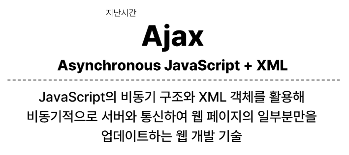

- Ajax를 활용한 클라이언트 서버 간 동작
  
  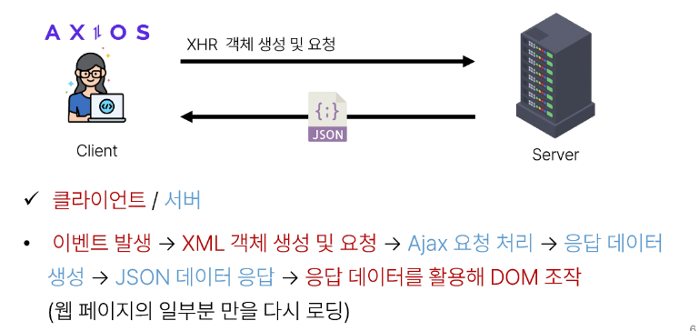

### Ajax with follow

- 사전 준비
  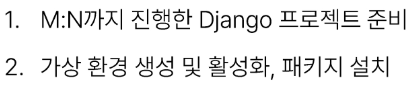

- Ajax 적용
  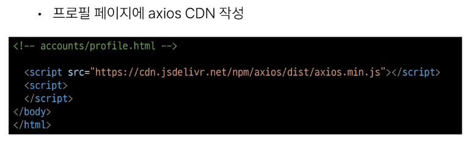
  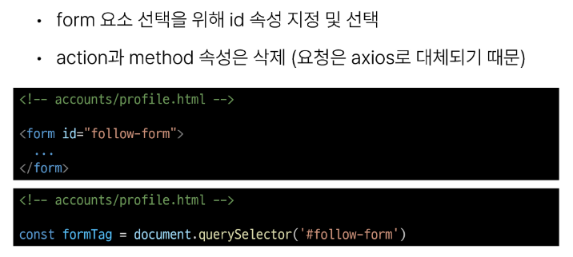
  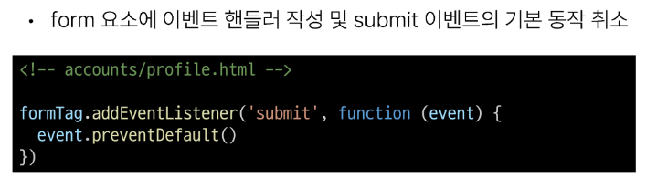
  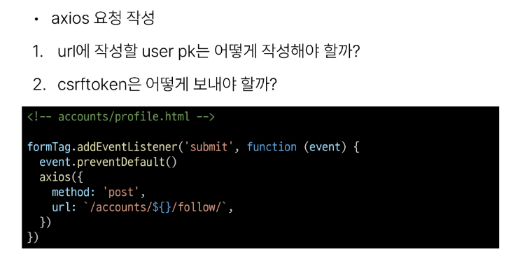
  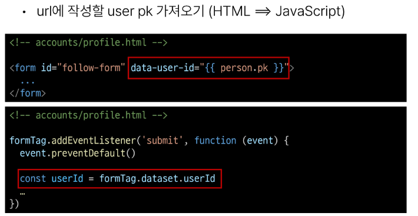
  
  
  
  - data-* 사용 예시
    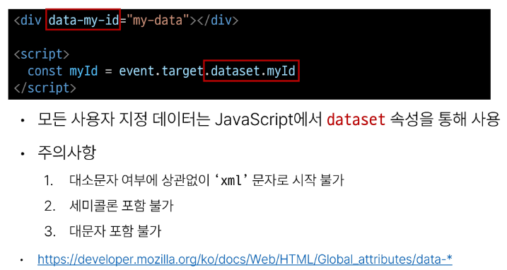
  
  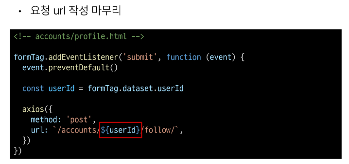
  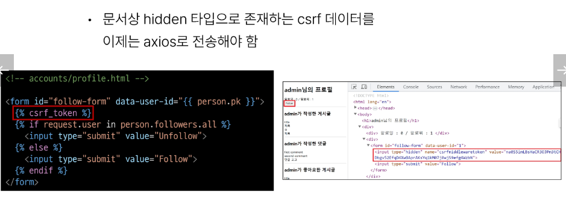
  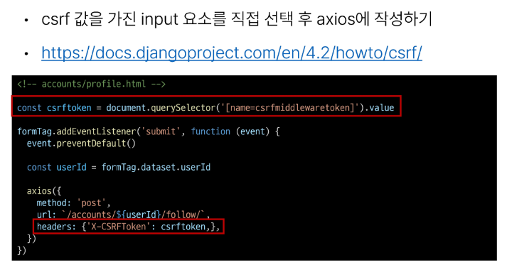
  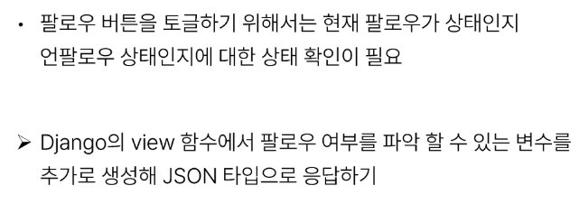
  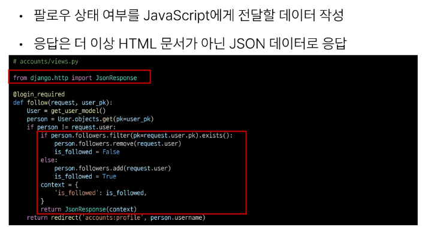
  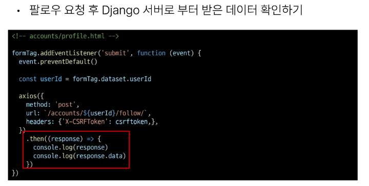
  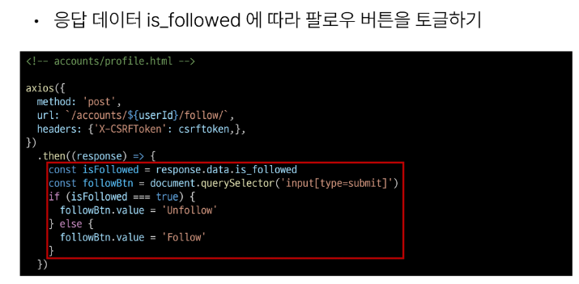
  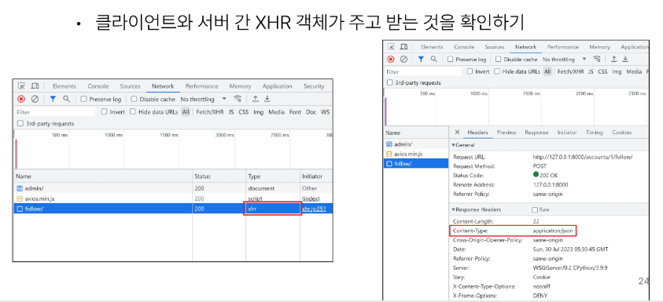
  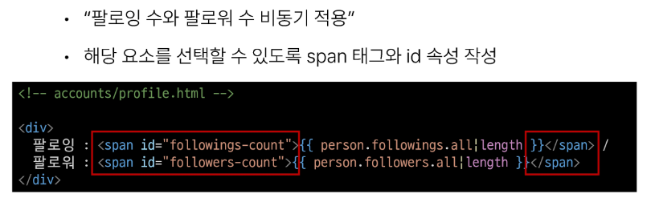
  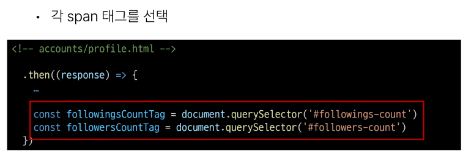
  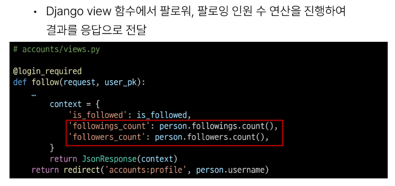
  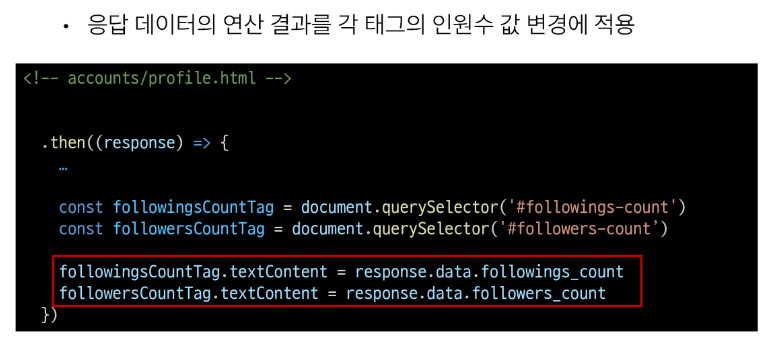

### Ajax with likes

- Ajax 좋아요 적용 시 유의사항
  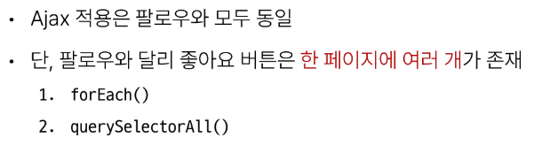

- Ajax 적용
  
  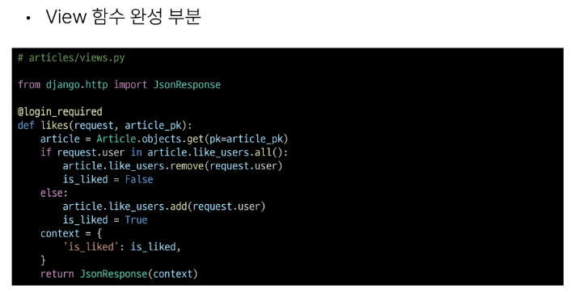
  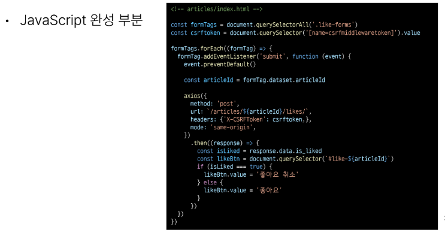

### 참고

