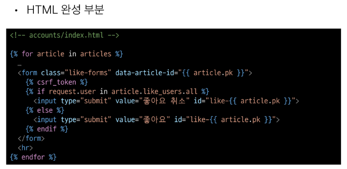

# 1031 TIL

## 잡다한 것

- 자동완성 편하게 하려면 HTML로 변환하고 하기.

- HTML의 데이터를 JS로 보내고 싶다!! (data-*)
  
  - mdn html data attribute 검색하기
    [데이터 속성 사용하기 - Web 개발 학습하기 | MDN](https://developer.mozilla.org/ko/docs/Learn/HTML/Howto/Use_data_attributes)

- django ajax csrf
  
  - [How to use Django’s CSRF protection | Django documentation | Django](https://docs.djangoproject.com/en/4.2/howto/csrf/)
  
  
  

- innerHTML
  [Element: innerHTML property - Web APIs | MDN](https://developer.mozilla.org/en-US/docs/Web/API/Element/innerHTML)

## Ajax with Django

### Ajax와 서버

#### 개요

- Ajax를 활용한 클라이언트 서버 간 동작
  
  
  
  - 여기서 XML이 아닌 XHR임(오타.)

### Ajax with follow

- 사전 준비
  

- Ajax 적용
  
  
  
  
  
  
  
  
  - data-* 사용 예시
    
    
    - 주의사항 (추가)
      
      
      - HTML에서 이렇게 소문자로 작성을 해줬는데 
      
      
      
      - 실제로 자바스크립트가 선택한 결과의 키 이름을 보면 다름을 알 수 있다.
  
  
  
  
  
  
  
  
  
  
  
  
  

### Ajax with likes

- Ajax 좋아요 적용 시 유의사항
  

- Ajax 적용
  
  
  

### 참고

