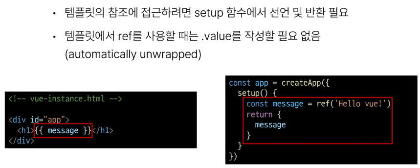

# 1101 TIL

## 잡다한 것

## Introduction of Vue

### Front-end Development

#### Client-side frameworks

- Client-side frameworks가 필요한 이유 - 1
  
  - "웹에서 하는 일이 많아졌다."
    
    - 단순히 무언가를 읽는 곳 -> 무언가를 하는 곳
  
  

- Client-side frameworks가 필요한 이유 - 2
  
  - "웹에서 하는 일이 많아졌다."
    
    - "다루는 데이터가 많아졌다."
  
  

- Vanilla JS만으로 모든 데이터를 조작한다면..
  

#### SPA

- Single Page Application
  

- Client-side Rendering 방식
  

- Client-side Rendering 장점
  

- Client-side Rendering 단점
  

### Vue

#### What is Vue

- What is Vue?
  

- Vue를 학습하는 이유
  

- SSAFY에서의 Vue
  

- Vue의 2가지 핵심 기능
  
  
  

#### Vue Tutorial

- Vue를 사용하는 방법
  

- 첫번째 Vue 작성하기
  
  
  

- ref 함수
  
  

- Vue 기본 구조
  

- 템플릿 렌더링
  
  

- Event Listeners in Vue
  

### 참고

#### Ref Unwrap 주의사항

