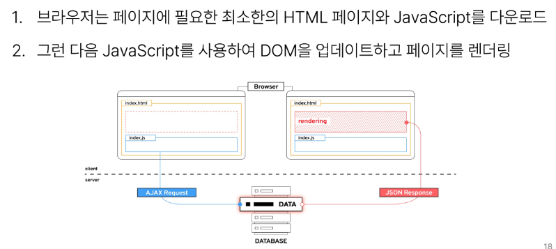

# 1101 TIL

## 잡다한 것

- 래퍼 클래스란?
  [[Java] 래퍼 클래스(Wrapper Class)란 무엇인가? (박싱, 언박싱)](https://coding-factory.tistory.com/547)
- 객체: 참조형이다!

## Introduction of Vue

### Front-end Development

#### Client-side frameworks

- Client-side frameworks가 필요한 이유 - 1
  
  - "웹에서 하는 일이 많아졌다."
    
    - 단순히 무언가를 읽는 곳 -> 무언가를 하는 곳
  
  

- Client-side frameworks가 필요한 이유 - 2
  
  - "웹에서 하는 일이 많아졌다."
    
    - "다루는 데이터가 많아졌다."
  
  

- Vanilla JS만으로 모든 데이터를 조작한다면..
  

#### SPA

- Single Page Application
  
  

- CSR을 간단히 이야기 하면, 화면을 클라이언트가 그리는 것.

- CSR : 이제부터 장고는 더 이상 페이지를 주지 않고 처음에만 하나를 줄 것, 그 이후부터는 클라이언트가 그릴 것이다.

- 반대되는 개념으로 SSR이 있다. 여기서 S는 서버를 의미.

- SSR:서버가 페이지를 그리고, 서버로부터 완성된 페이지를 받아오는 것

- CSR과 SSR의 차이는 결론적으로 페이지를 누가 그리게 되느냐가 가장 큰 차이점

- Client-side Rendering 방식
  
  
  
  - 이벤트 발생 → HTML이 아닌 Axios를 통해 비동기 요청 받기 → JSON 형태로 응답 받기 → 해당 부분만 업데이트

- Client-side Rendering 장점
  
  
  - SSR의 방식은 백엔드가 화면까지 최종적으로 그리고 하기 때문에 사실 프론트 엔드와의 영역이 교집합 many

- Client-side Rendering 단점
  
  
  - SSR은 처음에 받을 때 이미 완성한 페이지를 줌
  
  - 검색엔진 관련-> 검색 엔진이 웹 페이지를 조사하려고 봤더니 덜 그려져 있거나 안 그려져 있거나 할 수 있다. (ㅜ)

### Vue

#### What is Vue

- What is Vue?
  

- Vue를 학습하는 이유
  

- SSAFY에서의 Vue
  

- Vue의 2가지 핵심 기능
  
  
  - CDN을 통해 Vue라는 객체를 바로 사용 가능
  - `const { createApp } = Vue` : JS 객체에 대한 구조 분해 할당
  - Vue라는 객체에서 creatApp이라는 속성 값을 createApp이라는 변수에 할당한 것
  - import 느낌(Vue 객체 내에 있는 것)
  
  
  

#### Vue Tutorial

- Vue를 사용하는 방법
  

- 첫번째 Vue 작성하기
  
  
  
  - 규칙
    
    - app 생성시 사용하는 함수는 createApp이다.
      
      - createApp의 인자로는 객체가 들어간다.
      
      - createApp에는 setup 메서드를 작성해야 한다.
        
        - setup 메서드는 “객체”를 return한다.
  
  
  
  - 어플리케이션(=app)을 특정 DOM에 탑재(연결)

- 일반 데이터가 아닌 반응형 데이터가 되도록 만들어주는 함수이다.

- ref 함수
  
  
  - 객체로 변환한다는 것은 참조형으로 바뀜을 의미
  
  - 뒤에 .value를 하는 것은 언래핑하는 것과 비슷한 느낌
  
  
  
  - 오히려 .value를 달면 안 나오더라.

- 재할당 관련..
  

- Vue 기본 구조
  

- 템플릿 렌더링
  
  

- Event Listeners in Vue
  
  
  - v-on:발생하는이벤트=”할 일”
    
    - @click은 v-on:click의 축약형

- 참고(반응형 변수 vs 일반 변수)
  
  - 일반 변수는 동기화 적용 X
    
    - 그럼 실제로 변수 값에도 변화 없는가?
    
    - No!!! `console.log` 찍어보면 실제 값은 변화중 (동기화만 X)

### 참고

#### Ref Unwrap 주의사항

- CSR의 단점 : 화면에 나중에 그려서  검색 엔진에 노출이 잘 안됨..
  - 이걸 해결하기 위해 추가적인 프레임워크 기술들이 존재.

