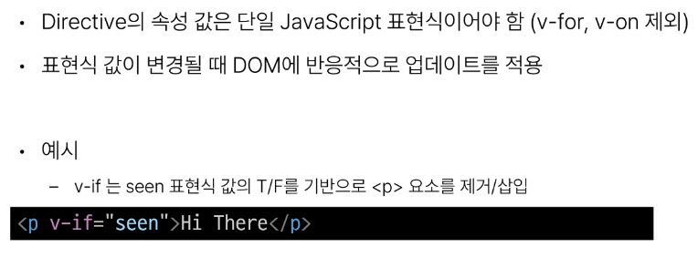
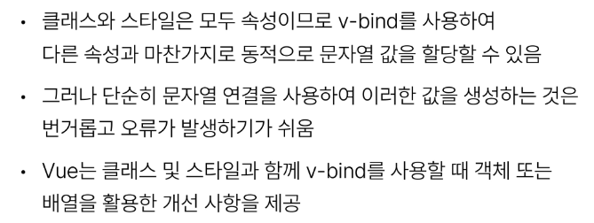
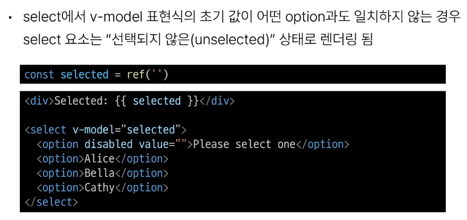

# 1101 TIL

## 잡다한 것

- Binding : 결합하다, **연결하다** 의 의미

- 공식문서
  

## Basic Syntax - 01

### Template Syntax

#### 개요

- Template Syntax 종류
  
1. Text Interpolation
   

2. Raw HTML
   

3. Attribute Bindings(속성에 대한 동적 바인딩.)
   

4. JavaScript Expressions
   
   
   - 다만, 조금 더 코드를 명확하게 하려면, 처리는 되도록이면 Vue 인스턴스에서 할 것
- Expressions 주의사항
  

#### Directive

- Directive 특징
  

- Directive 전체 구문
  
  
  - ~~Value 자리에 콜백함수??(Case by Case긴 하지만..)~~

- Directive - Arguments
  

- Directive - Modifiers
  

- Built - in Directives
  

### Dynamically data binding

- v-vind 사용처
  
  - 속성은 주로 하나인데 Class랑 Style은 주로 여러개 사용되어서 이렇게 떨어트려놓음.

#### Attribute Bindings

- HTML의 속성은 전부 소문자로 되어있으므로....

- Attribute Bindings 예시
  
  

#### Class and Style Bindings

- Class and Style Bindings
  
  
  - 보통 Class와 Style은 한개뿐이 아니라 여러개지?? -> 객체나 배열을 이용.

- Class and Style Bindings가 가능한 경우
  

- 1.1 Binding HTML Classes - Binding to Objects
  
  
  

- 1.2 Binding HTML Classes - Binding to Arrays
  
  

- 2.1 Binding Inline Styles - Binding to Objects
  
  
  

- 2.2 Binding Inline Styles - Binding to Arrays
  

- v-bind 종합
  

### Event Handling

- v-on 구성
  
1. Inline handlers
   

2. Method Handlers
   
   
- Inline Handlers에서의 메서드 호출
  

- Inline Handlers에서의 event 인자에 접근하기
  

- Event Modifiers
  

- Key Modifiers
  
  
  - keyboard 이벤트에 대한 수식어를 Vue 공식문서에서 보여주지 않아서 Mdn에서 keyboardEvent 문서를 봐야됨

- v-on 종합
  

### Form Input Bindings

- Form Input Bindings
  
1. v-bind와 v-on을 함께 사용
   
   

2. v-model 사용
   
   

#### v-model 활용

- v-modle과 다양한 입력(input) 양식
  

- Checkbox 활용
  
  
  

- Select 활용
  
  

- v-model 종합
  

### 참고

