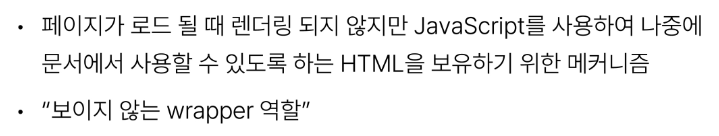
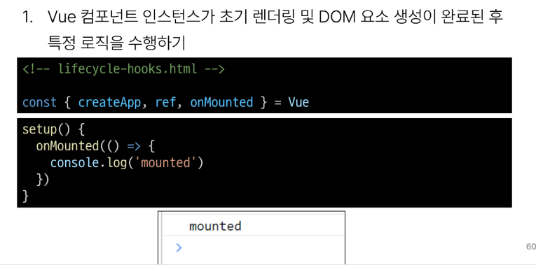
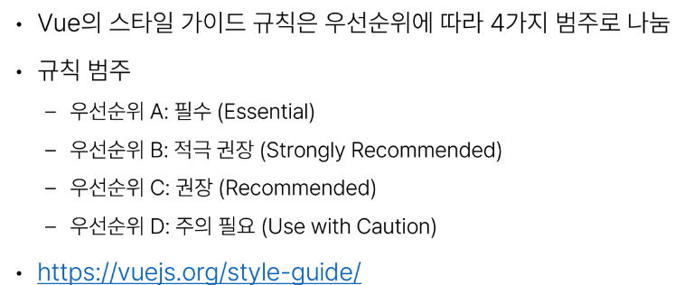
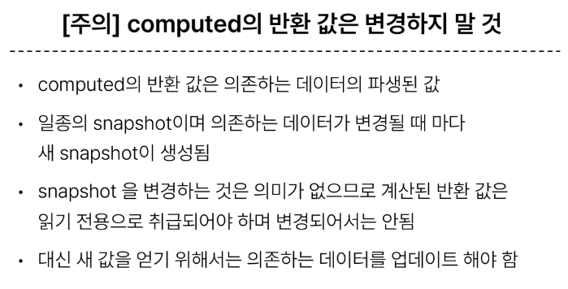

# 1106 TIL

## 잡다한 것

## Basic Syntax - 02

### Computed Property

#### Computed

- Computed 기본 예시
  
  
  

- computed 특징
  

#### Computed vs. Methods

- computed와 동일한 로직을 처리할 수 있는 method
  

- computed 와 method 차이
  

- Cache (캐시)
  

- Cache 예시
  

- computed 와 method의 적절한 사용처
  

- method와 computed 정리
  

### Conditional Rendering

#### v - if

- v - if 예시
  
  
  

- 여러 요소에 대한 v-if 적용
  

- HTML {template} element
  

#### v - if vs. v-show

- v - show 예시
  

- v - if vs. v - show
  

### List Rendering

#### v - for

- v - for 구조
  

- v - for 예시
  
  

- 여러 요소에 대한 v - for 적용
  

- 중첩된 v - for
  

#### v - for with key

- v - for 와 key
  
  

#### v - for with v - if

- v - for 와 v - if 문제 상황 - 1
  

- v - for와 v - if 해결법 - 1
  

- v - for 와 v - if 문제 상황 - 2
  

- v - for와 v - if 해결법 - 2
  

### Watchers

- watch 구조
  

- watch 예시
  
  
  
  

- Computed 와 Watchers
  

### Lifecycle Hooks

- Lifecycle Hooks 예시
  
  
  

- Lifecycle Hooks 특징
  

- Lifecycle Hooks Diagram
  

### Vue Style Guide

- Vue Style Guide
  

- 우선 순위 별 특징
  

- 우선순위 A였던 금일 학습 내용
  

### 참고

