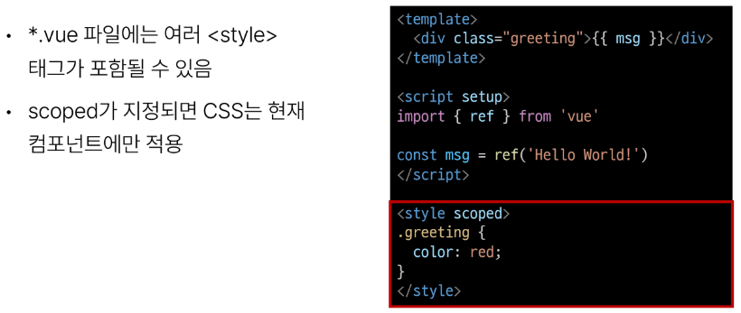

# 1107 TIL

## 잡다한 것

## Single - File Components

### Single - File Components

#### Component

- Component 특징
  

- Component 예시
  

#### SFC

- SFC 파일 예시
  

#### SFC 문법

- SFC 문법 개요
  

- 언어 블록 - `<template>`
  
  

- 언어 블록 - `<script setup>`
  
  

- 언어블록 - `<style scope>`
  

- 컴포넌트 사용하기
  

### SFC build tool (Vite)

#### Vite

- Vite 튜토리얼
  
  
  
  
  

#### NPM

- Node.js의 영향
  

#### Vite 프로젝트 구조

- node_modules
  

- package - lock.json
  

- package.json
  

- public 디렉토리
  

- src 디렉토리
  

- src / assets
  

- src/components
  

- src/App.vue
  

- src/main.js
  

- index.html
  

#### 모듈과 번들러

- Module
  
  

- node_modules의 의존성 깊이
  

- Bundler의 역할
  

### Vue Component

#### Component 활용

- 컴포넌트 사용 2단계
  

- 사전 준비
  
1. 컴포넌트 파일 생성
   

2. 컴포넌트 등록
   
   
- 결과 확인
  

- MyComponentItem 컴포넌트 등록 후 활용
  
  

- Component 이름 관련 스타일 가이드
  

### 추가 주제

#### Virtual DOM

- Virtual DOM
  

- 내부 렌더링 과정
  
  

- Virtual DOM 패턴의 장점
  

- Virtual DOM 주의사항
  

- 직접 DOM 엘리먼트에 접근해야 하는 경우
  

#### Composition API & Option API

- 2가지 API 스타일
  

- Composition API
  

- Option API
  

- API 별 권장 사항
  

### 참고

