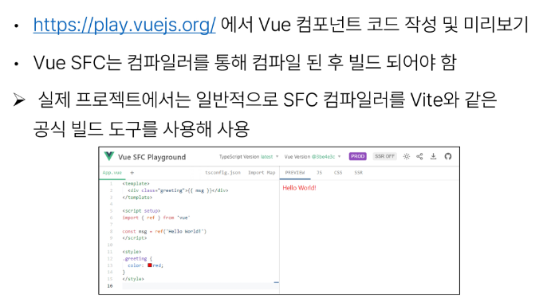
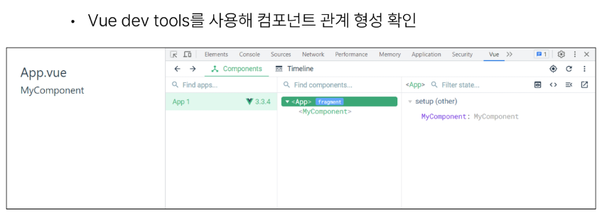

# 1107 TIL

## 잡다한 것

- 파일 하나가 component 하나다!

- 실행하기
  

- Vue3 스타일 가이드
  [우선순위 B 규칙: 강력히 권장 | Vue.js](https://ko.vuejs.org/style-guide/rules-strongly-recommended.html)

- inline -block에 관하여
  
  

## Single - File Components

### Single - File Components

#### Component

- Component 특징
  

- Component 예시
  

#### SFC

- 템플릿 : HTML, 로직 : JS, 스타일 : CSS

- SFC 파일 예시
  

#### SFC 문법

- SFC 문법 개요
  
  
  - 간혹 Vue의 공식문서에는 script - > template -> style로 되어있는 경우가 있다.
    
    - 왜냐하면, Vue 문서를 보는 이유는 template 보단 script 때문이므로.

- 언어 블록 - `<template>`
  
  

- 언어 블록 - `<script setup>`
  
  
  
  - setup 함수가 한번 벗겨진 느낌.
    
    - 이제 setup 함수를 기입하지 않고 setup 함수의 몸통에 있는 내용을 바로 작성 가능.
    
    - return도 사라짐.

- 언어블록 - `<style scope>`
  
  
  - 빼면 모든 컴포넌트에 다 적용 됨...

- 컴포넌트 사용하기
  

### SFC build tool (Vite)

#### Vite

- 주의사항 : git bash에서 하지 말고, vs터미널에서 할 것.

- Vite 튜토리얼
  
  
  
  
  

#### NPM

- JS는 기본적으로 브라우저에서만 실행이 가능했었는데, 이 엔진을 기반으로 브라우저 밖으로도 실행가능하도록 함. (server-side)

- Node.js의 영향
  

#### Vite 프로젝트 구조

- node_modules
  
  
  - 공유를 하지 않겠구나(gitignore, 파일이 너무 커!). 그러면 requirements.txt 같은 것이 있겠네?
    
    - 아래의 package - lock.json, package.json 가 해당 역할을 해줌.

- package - lock.json
  

- package.json
  
  
  - 전반적으로 큰 요약본 정도.

- public 디렉토리
  

- src 디렉토리
  
  
  - 여기서 크게 4가지로 나누어짐

- src / assets
  

- src/components
  

- src/App.vue
  
  
  - 자세히 보면 얘는 컴포넌트 안에 있지 x

- src/main.js
  

- index.html
  
  
  - 이게 바로 최종적으로 우리가 만드는 페이지 하나.

#### 모듈과 번들러

- Module
  
  

- node_modules의 의존성 깊이
  

- Bundler의 역할
  

### Vue Component

#### Component 활용

- 컴포넌트 사용 2단계
  

- 사전 준비
  
1. 컴포넌트 파일 생성
   

2. 컴포넌트 등록
   
   
- 결과 확인
  

- MyComponentItem 컴포넌트 등록 후 활용
  
  

- Component 이름 관련 스타일 가이드
  

### 추가 주제

#### Virtual DOM

- Virtual DOM
  

- 내부 렌더링 과정
  

- Virtual DOM 패턴의 장점
  

- Virtual DOM 주의사항
  

- 직접 DOM 엘리먼트에 접근해야 하는 경우
  

#### Composition API & Option API

- 2가지 API 스타일
  

- Composition API
  

- Option API
  

- API 별 권장 사항
  

### 참고

