# 1108 TIL

## 잡다한 것

## Component State Flow

### Passing Props

#### 개요

- 같은 데이터 하지만 다른 컴포넌트
  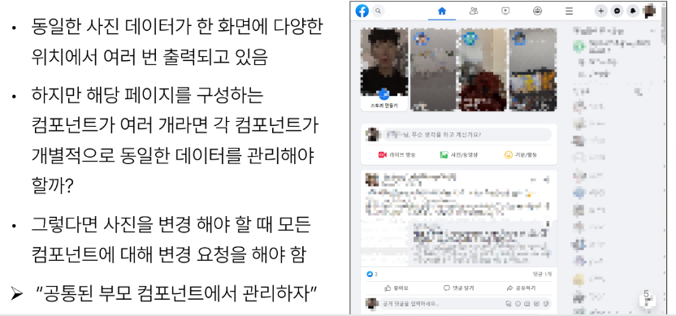

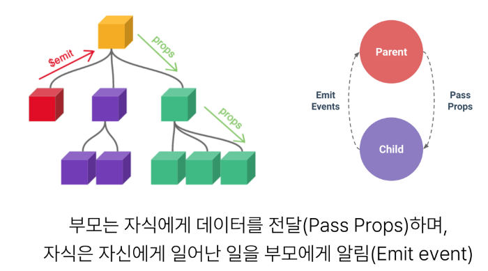

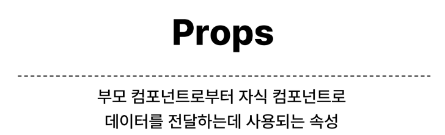
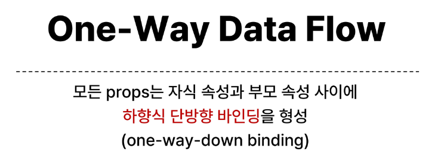

- Props 특징
  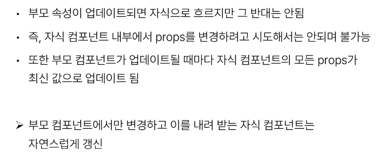

- 단방향인 이유
  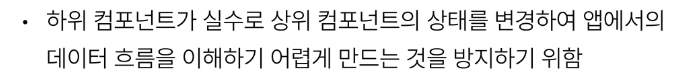

#### 사전 준비

- 사전 준비
  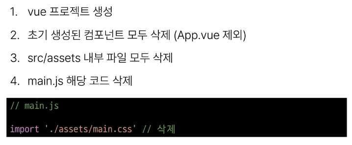

- APP > Parent > ParentChild 컴포넌트 관계 작성
  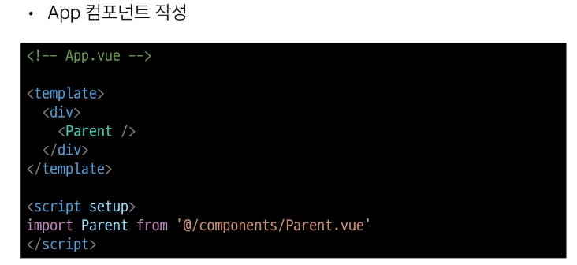
  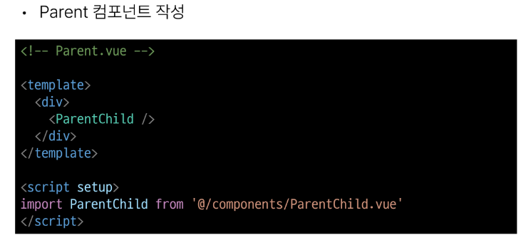
  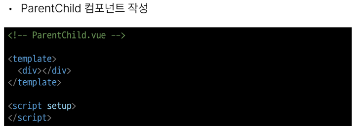

#### Props 선언

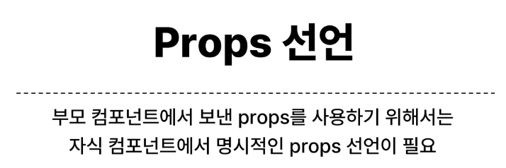

- Props 작성
  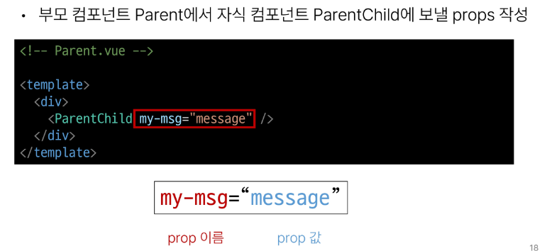

- Props 선언 2가지 방식
  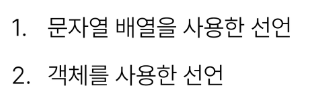
1. 문자열 배열을 사용한 선언
   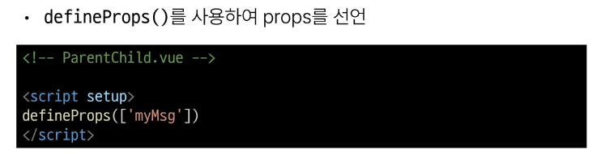

2. 객체를 사용한 선언
   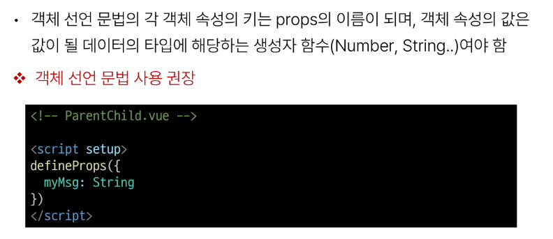
- prop 데이터 사용
  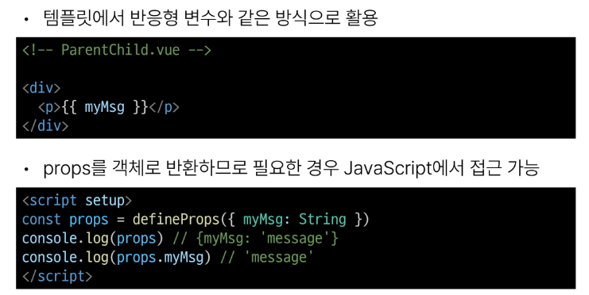
  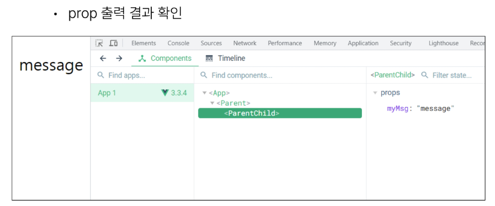

- 한 단계 더 prop 내려 보내기
  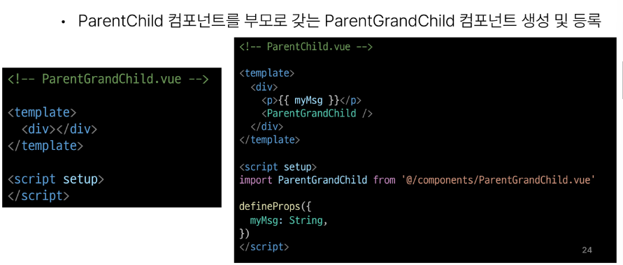
  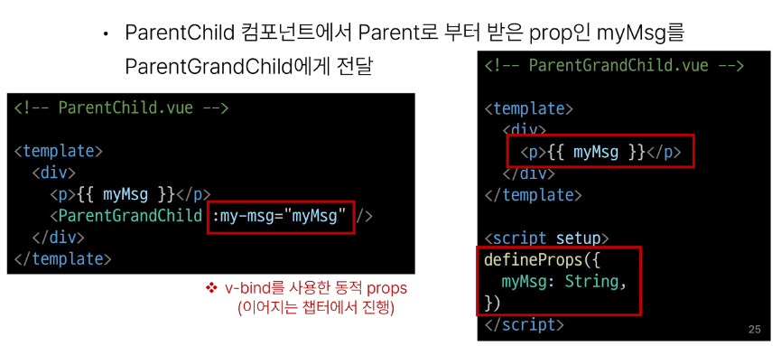
  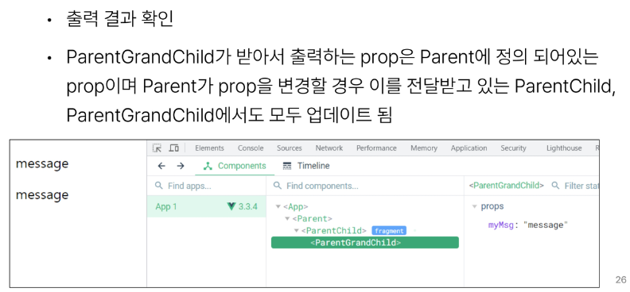

#### Props 세부사항

- Props 세부사항
  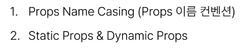
1. Props Name Casing
   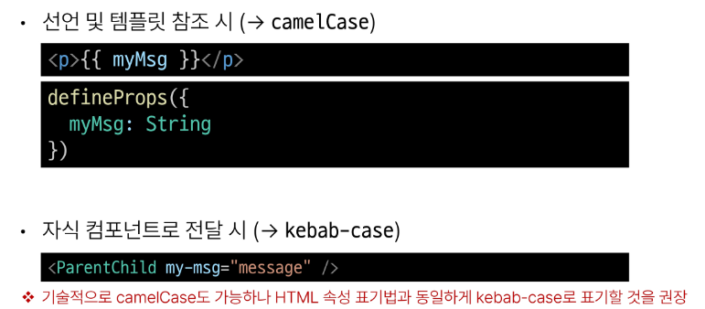

2. Static props & Dynamic props
   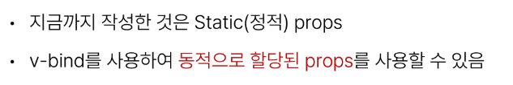
   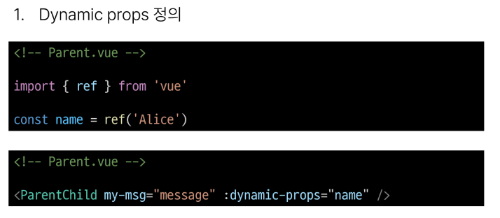
   
   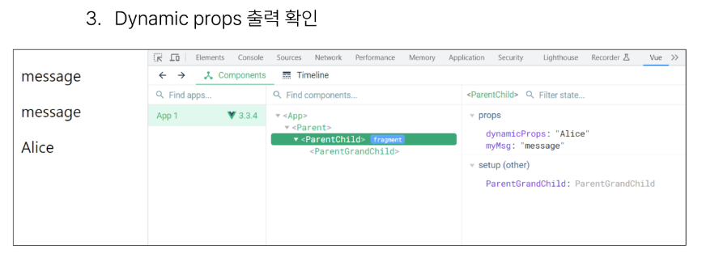

### Component Events

#### 개요

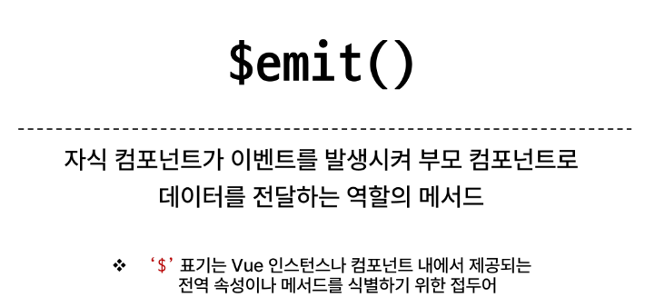

- emit 메서드 구조
  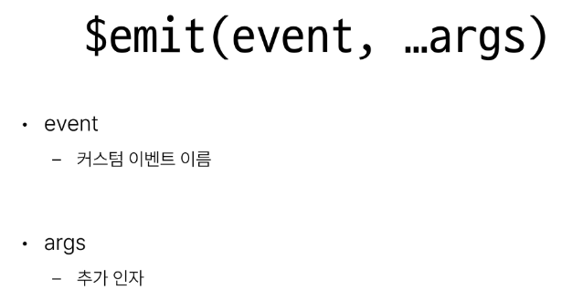

#### Event 발신 및 수신

- Event 발신 및 수신(Emitting and Listening to Events)
  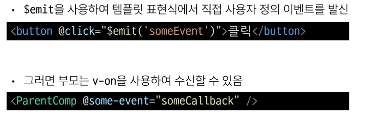

- 이벤트 발신 및 수신하기
  
  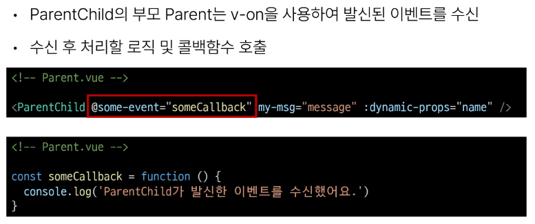
  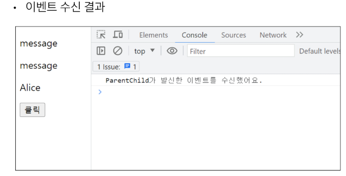

#### 'emit'Event 선언

- emit 이벤트 선언
  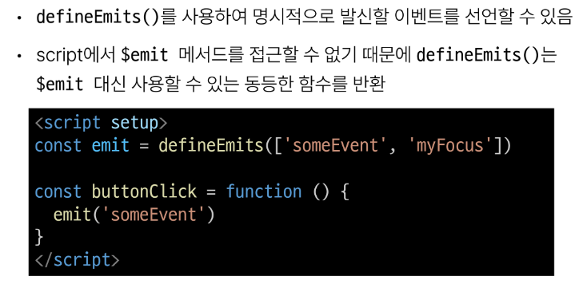

- 이벤트 선언하기
  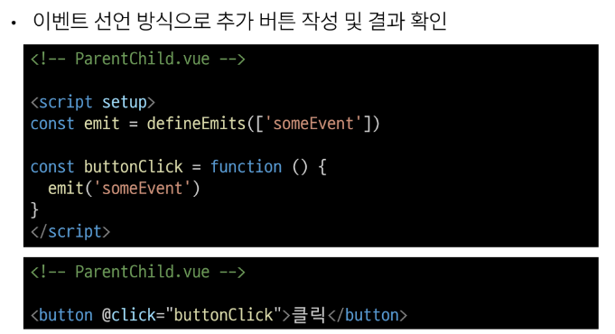

#### Event 인자

- 이벤트 인자(Event Arguments)
  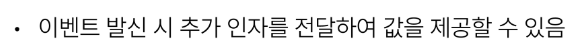

- 이벤트 인자 전달하기
  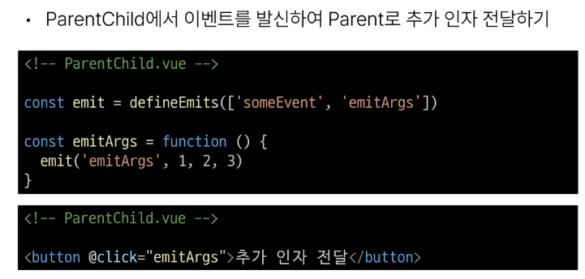
  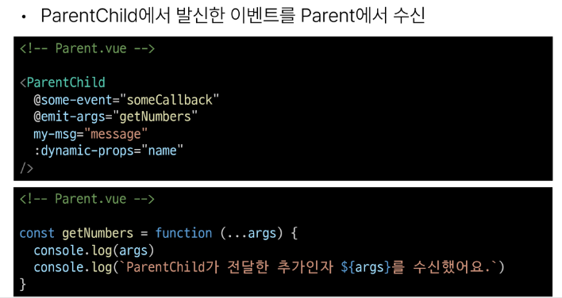
  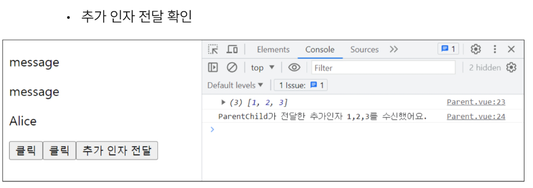

#### Event 세부사항

- Event Name Casing
  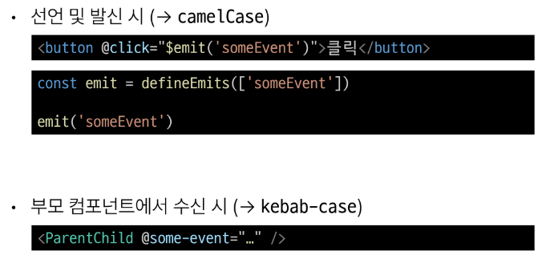

#### emit Event 실습

- emit 이벤트 실습
  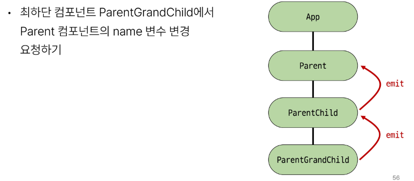

- emit 이벤트 실습 구현
  
  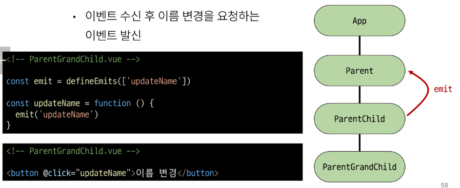
  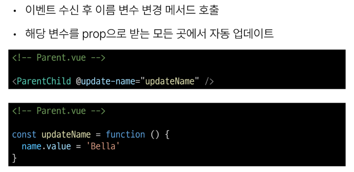
  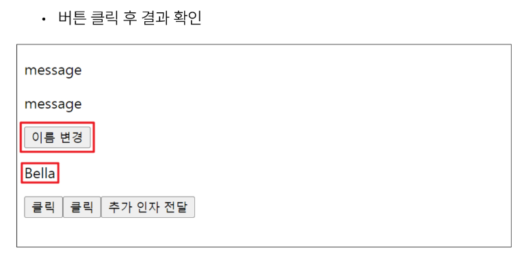

#### 참고

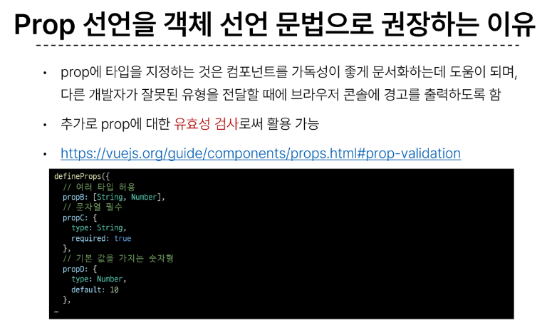
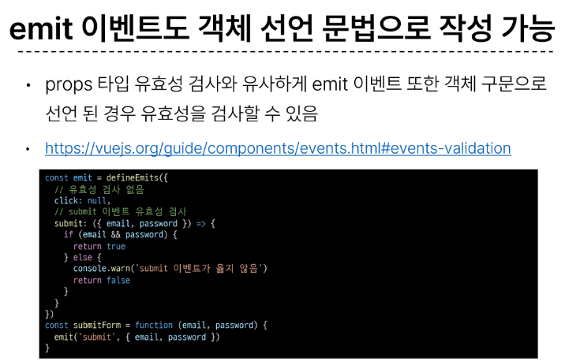
