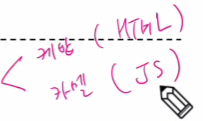
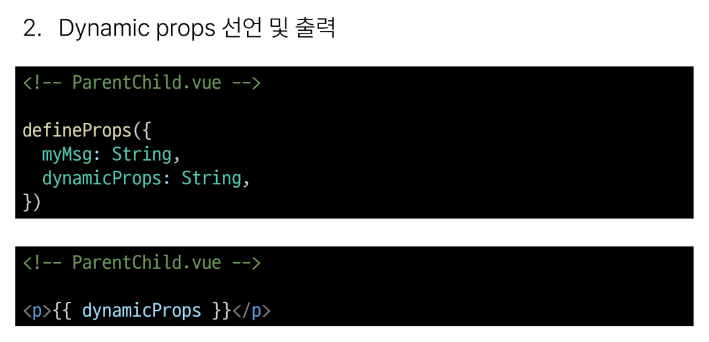
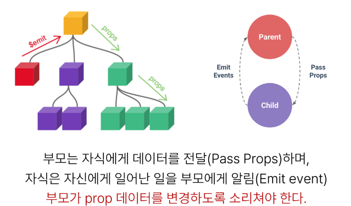
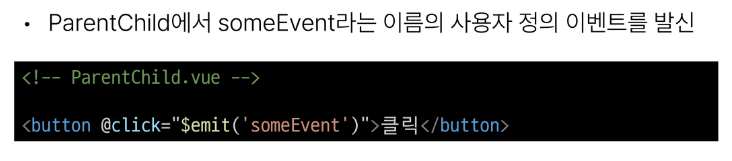
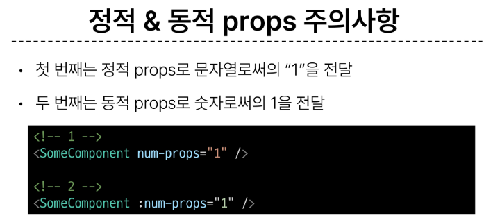

# 1108 TIL

## 잡다한 것

## Component State Flow

- 여기서의 State는 Vue에서 데이터를 의미.

- 주의사항: 버블링 같은 것이 없어서 2칸 이상 건너서 전달하는 것 부모에서 자식이나 자식에서 부모나 둘 다 불가

- 공식 문서
  
  [Props | Vue.js](https://vuejs.org/guide/components/props.html)
  [Component Events | Vue.js](https://vuejs.org/guide/components/events.html)

### Passing Props

#### 개요

- 같은 데이터 하지만 다른 컴포넌트
  
  
  - 이러면(개별 관리..) Vue에서 반응형 데이터를 사용하는 이유가 없어짐...
    
    - 공통된 부모 컴포넌트에서 관리하자!

- 자식은 데이터를 전달하지 않고 이벤트를 알리기만.

- Props 특징
  

- 단방향인 이유
  
  
  - 양방향이라면, 해당 데이터에 접근 가능한 모든 컴포넌트를 다 뒤져봐야 됨
    
    - 하지만 단방향이라면? 해당 데이터를 관리하고 있는 컴포넌트 하나만 찾으면 됨

#### 사전 준비

- 사전 준비
  

- APP > Parent > ParentChild 컴포넌트 관계 작성
  
  
  

#### Props 선언

- Props는 읽기 전용 속성으로 읽기만 함.

- Props 선언을 하지 않으면 이용 불가!!!(까먹지 말자!!)

- 메세지에 대한 갱신/수정 권한은 부모에게 있다.
  
  - 자식은 그냥 읽기 전용으로 받아서 사용만 가능

- Props 작성
  

- Props 선언 2가지 방식
  
1. 문자열 배열을 사용한 선언
   

2. 객체를 사용한 선언
   
- prop 데이터 사용
  
  
  
  - 내려준다고 바로 사용 불가, defineProps를 사용하여서 선언을 한 뒤부터 사용가능.

- 한 단계 더 prop 내려 보내기
  
  
  
  - 받는 것을 보낼때는 문자열이 아닌 변수값을 보내는 이유:
    
    - Parent(부모, 보내주는 대상)의 값이 바뀌었을 때 이것을 받는 친구들을 전부 갱신 시켜줘야 되므로.
  
  - 이렇게 바인딩을 해야 문자열이 아닌 변수값을 보냄
    

#### Props 세부사항

- Props 세부사항
  
  
  
  - Static Props는 값 변동 x(값 자체를 보냄), Dynamic Props는 값 변동 o(반응형 변수 값을 내려보냄.)
1. Props Name Casing
   

2. Static props & Dynamic props
   
   
   
   

### Component Events

#### 개요

- 예시
  
  - cnt = 0이 있다고 가정(부모가 주인)
  
  - 자식 컴포넌트에게 버튼을 누르면 cnt가 1씩 증가하도록 하는 버튼이 있다고 하자
  
  - 하지만 , 이 버튼을 눌러서 직접 cnt 수정 불가
    
    - 왜냐하면 cnt의 주인은 부모이므로. 직접 접근 불가
    
    - 그래서, 내가 cnt를 1 올릴거야라는, 즉 이 버튼을 눌렀어라는 것(이벤트 발생)을 부모에게 알려줘야 함.
  
  - 부모가 계속 대기를 하다가 어떠한 이벤트가 발생했는 것을 듣고 처리.

- 함수이기 때문에 인자를 넣을 수 있다.
  
  - 만약에 부모에게 필요한 데이터가 있다면 자식 컴포넌트가 인자로 데이터를 전달 가능.

- $를 붙인 이유 : 우리가 쓰는 다른 메서드랑 이름이 겹치는 것을 방지.

- emit 메서드 구조
  
  
  - 그냥 소리만 치면 안된다. 어떤 이벤트가 발생했는지 알려줘야 됨, 그래야 부모가 캐치함
  - 아무 이벤트나 들을 수 없잖아, 정확한 이벤트가 뭔지를 알고 들어줘야 겠지.

#### Event 발신 및 수신

- Event 발신 및 수신(Emitting and Listening to Events)
  

- 이벤트 발신 및 수신하기
  
  
  

#### 'emit'Event 선언

- emit 이벤트 선언
  

- 이벤트 선언하기
  

#### Event 인자

- 이벤트 인자(Event Arguments)
  

- 이벤트 인자 전달하기
  
  
  

#### Event 세부사항

- Event Name Casing
  

#### emit Event 실습

- emit 이벤트 실습
  

- emit 이벤트 실습 구현
  
  
  
  

#### 참고

