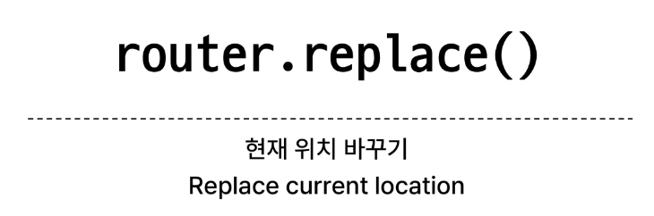

# 1109 TIL

## 잡다한 것

## Router

### Routing

#### 개요

- SSR에서의 Routing
  

- CSR/SPA에서의 Routing
  

- 만약 routing이 없다면
  

### Vue Router

#### 개요

- Vue Router 추가
  
  

- Vue 프로젝트 구조 변화
  

- RouterLink
  

- RouterView
  

- router/index.js
  

- views
  

#### Basic Routing

- 라우팅 기본
  
  

#### Named Routes

- Named Routed 예시
  

- Named Routes 장점
  

#### Dynamic Route Matching with Params

- 매개 변수를 사용한 동적 경로 매칭
  

- 매개 변수를 사용한 동적 경로 매칭 활용
  
  
  
  

#### Programmatic Navigation

- 프로그래밍 방식 네비게이션
  
  

- router.push()
  

- router.push 활용
  
  

- router.push 인자 활용 참고
  

- router.replace()
  

### Navigation Guard

#### 개요

- Navigation Guard 종류
  

#### Globally Guard

- router.beforeEach 구조
  
  
  

- router.beforeEach 예시
  
  

- router.beforeEach 활용
  
  
  

#### Per-route Guard

- router.beforeEnter 구조
  

- router.beforeEnter 예시
  
  

- router.beforEnter 활용
  
  
  

#### In-component Guard

- 컴포넌트 가드 종류
  

- onBeforeRouteLeave 활용
  
  

- onBeforeRouteUpdate  활용
  
  

- 만약 onBeforeRouteUpdate를 사용하지 않았다면
  

### 참고

