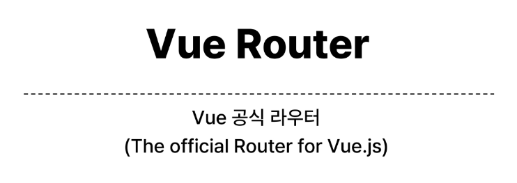

# 1109 TIL

## 잡다한 것

- Vue Composition API 에서 props를 watch하기 (블로그참조) ,실습 5-5
  
  - [Vue Composition API 에서 props를 watch하기](https://heewon26.tistory.com/322)

- 매개변수 보내기(내 정리)
  
  
  
  
  - 다만 2번 방식을 받을 때는 내 생각으론 route.params.username으로만 받아주면 똑같이 잘 받아질 듯!

- 내 생각:
  
  - route는 객체고 router는 전달하는 네비게이션 느낌.

## Router

### Routing

#### 개요

- 페이지가 한 개이기 때문에 사용자에게 페이지가 이동하는 것과 같은 사용자 경험을 제공하기 위해 위의 기술이 필요!!

- SSR에서의 Routing
  

- CSR/SPA에서의 Routing
  

- 만약 routing이 없다면
  
  
  - 뒤로가기 기능은 변경된 URL이 브라우저의 히스토리에 남게 되는 것인데, URL에 변화가 없기 때문에 당연히 히스토리에도 남지 않으므로 뒤로 가기 기능 사용 불가.

### Vue Router

#### 개요

- 페이지 이동(새로고침 발생 x)없이 url만 변동이 생김.
  
  - 하지만 사용자는 페이지 이동이 된 것처럼 느낌.

- Vue Router 추가
  
  

- Vue 프로젝트 구조 변화
  

- RouterLink
  

- a태그랑 유사한데 기본 동작은 막은 것 같은 느낌.
  
  - a태그 특징: 서버로 요청해서 새로운 페이지 받기. (이게 막힌 느낌.)

- RouterView
  
  
  - ~~views에 있는 component가 왔다리 갔다리 보이는 느낌?~~

- router/index.js
  
  
  - urls.py와 비슷

- views
  
  

#### Basic Routing

- 라우팅 기본
  

#### Named Routes

- Named Routed 예시
  

- Named Routes 장점
  
  
  - 나중에 url을 변경하더라도 영향을 받지 x

#### Dynamic Route Matching with Params

- Variable Routing 같은 것임.

- 매개 변수를 사용한 동적 경로 매칭
  

- 매개 변수를 사용한 동적 경로 매칭 활용
  
  
  여기 사이에 빠진 페이지 있음(이게 개 중요한 거였네.. ㅅ)
  
  체크 표시된 id와 위의 :id가 서로 같아야 함!!
  
  

#### Programmatic Navigation

- 프로그래밍 방식 네비게이션
  

- router.push()
  

- router.push 활용
  
  

- router.push 인자 활용 참고
  

- router.replace()
  
  
  - 이걸 어따 써??
    
    - 만약에 로그인이 성공을 하고 메인페이지로 이동하는 로직이 있다면
    
    - 이미 로그인이 성공을 했는데 이전 페이지로 갈 필요가 없잖아.(회원가입 과정이라든지.)

### Navigation Guard

#### 개요

- Navigation Guard 종류
  

#### Globally Guard

- router.beforeEach 구조
  
  
  
  
  - 반드시 to로 보낼 필요 x 한 경우 (return을 써서 우회 가능)

- router.beforeEach 예시
  여기도 빠진 페이지 있음.
  
  

- router.beforeEach 활용
  
  
  

#### Per-route Guard

- ex) (user/1 에서 user/2로 이동하는 경우) user router가 유지되고 있기 때문에 이때는 실행 x

- router.beforeEnter 구조
  

- router.beforeEnter 예시
  
  

- router.beforEnter 활용
  
  
  

#### In-component Guard

- 컴포넌트 가드 종류
  

- onBeforeRouteLeave 활용
  
  

- onBeforeRouteUpdate  활용
  
  

- 만약 onBeforeRouteUpdate를 사용하지 않았다면
  
  
  
  - 1번은 정상적으로 알아서 수정되고(얘는 라우트 객체를 직접 참조해서 갱신이 된 것임!!)
  
  - 2번은 되지 않음. (컴포넌트를 갈아끼우지 않았어서, 안에서 사용하는 변수들도 그대로 가져감...)
  
  - 많이 쓰이겠는데??

### 참고

- 초기 로딩에 해당 컴포넌트가 포함이 된다면, 로딩 속도에 영향이 갈 만큼 컴포넌트의 크기가 크다면 빼 놓고 싶다. 
  
  - 그때 이용.
