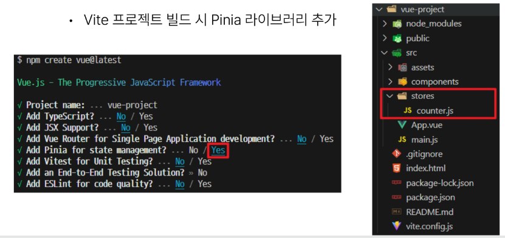
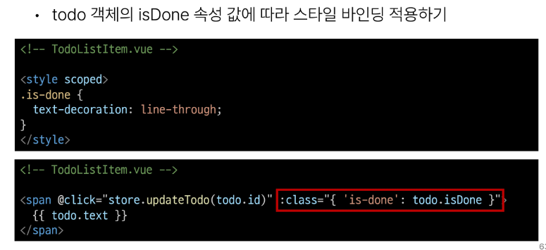
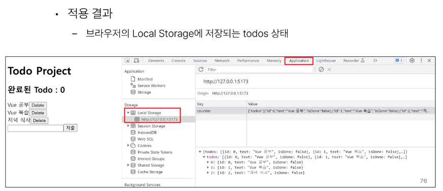

# 1113 TIL

## 잡다한 것

- [Array.prototype.splice() - JavaScript | MDN](https://developer.mozilla.org/ko/docs/Web/JavaScript/Reference/Global_Objects/Array/splice)
  
  - 다른 곳에 할당하지 않고 원본 배열을 변경.

- Pinia는 전역변수 느낌, 그 전에 배운 Props는 지역변수 느낌

- [Home | pinia-plugin-persistedstate](https://prazdevs.github.io/pinia-plugin-persistedstate/)

- 참조(꽤 중요할지도?)
  

- 참고
  
  

## State Management

### State Management

#### 개요

- 컴포넌트 구조의 단순화
  
  

- 상태 관리의 단순성이 무너지는 시점
  
  
  

- 해결책
  

### State management library (Pinia)

#### Pinia

- Pinia 설치
  

#### Pinia 구조

- Pinia 구성 요소
  

- Pinia 구성 요소 - 'store'
  

- Pinia 구성 요소 - 'state'
  

- Pinia 구성 요소 - 'getters'
  

- Pinia 구성 요소 - 'actions'
  

- Pinia 구성 요소-'plugin'
  

- Pinia 구성 요소 종합
  

#### Pinia 구성 요소 활용

- State
  

- Getters
  

- Actions
  

- Vue devtools로 Pinia  구성 요소 확인하기
  

### Pinia 실습

#### 개요

- Pinia를 활용한 Todo 프로젝트 구현
  

- 컴포넌트 구성
  

#### 사전 준비

- 사전 준비
  
  
  
  
  
  

#### Read Todo

- Todo 조회
  
  
  

#### Create Todo

- Todo 생성
  
  
  
  
  

#### Delete Todo

- Todo 삭제
  
  
  
  

#### Update Todo

- Todo 수정
  
  
  
  
  

#### Computed Todo

- 완료된 todo 개수 계산
  
  
  - 여기에서  리턴 값에 .length 달아줘야 됨!!(빠진부분.)
    
    

#### Local Storage

- Local Storage 특징
  

- Local Storage 사용 목적
  

- pinia-plugin-persistedstate
  

- pinia-plugin-persistedstate 설정
  
  
  
  

### 참고

