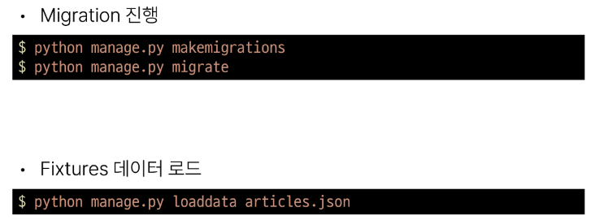
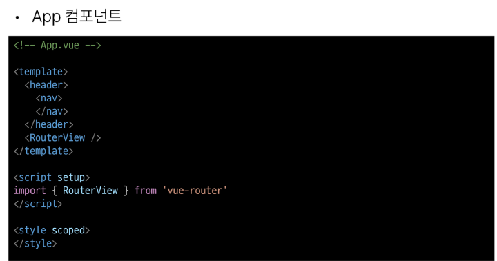
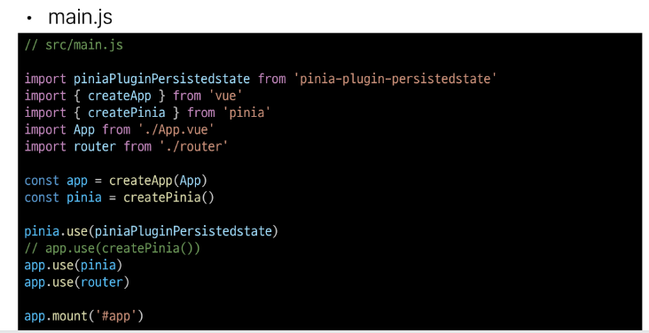
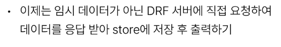

# 1114 TIL

## 잡다한 것

- 만약에 서버를 하나 더 연다면 1씩 올라감을 주의.

## Vue with DRF 1

### 프로젝트 개요

#### DRF 프로젝트 안내

- DRF 프로젝트 안내
  

- Skeleton code 살펴보기
  
  
  
  
  
  
  
  
  
  
  

#### Vue 프로젝트 안내

- Vue 프로젝트 안내
  
  
  

- Skeleton code 살펴보기
  
  
  
  
  
  
  
  

### 메인 페이지 구현

- 시작하기 전에..
  

#### state 참조 및 출력

- 개요
  

- state 참조 및 출력
  
  
  
  
  
  
  

#### state with DRF

- 개요
  

- state with DRF
  
  
  
  
  
  

### CORS Policy

#### CORS

- SOP (동일 출처 정책)
  

- Origin (출처)
  
  

- CORS policy의 등장
  

- CORS (교차 출처 리소스 공유)
  

- CORS policy (교차 출처 리소스 공유 정책)
  

- CORS 적용 방법
  

#### CORS Headers 설정

- CORS Headers 설정하기
  

- django-cors-headers 사용하기
  
  
  

- CORS 처리 결과
  
  
  

### Article CR 구현

#### 전체 게시글 조회

- 전체 게시글 목록 저장 및 출력
  
  
  

#### 단일 게시글 조회

- 단일 게시글 데이터 출력
  
  
  
  
  
  
  

#### 게시글 작성

